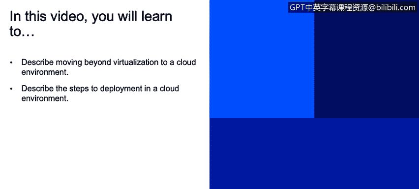
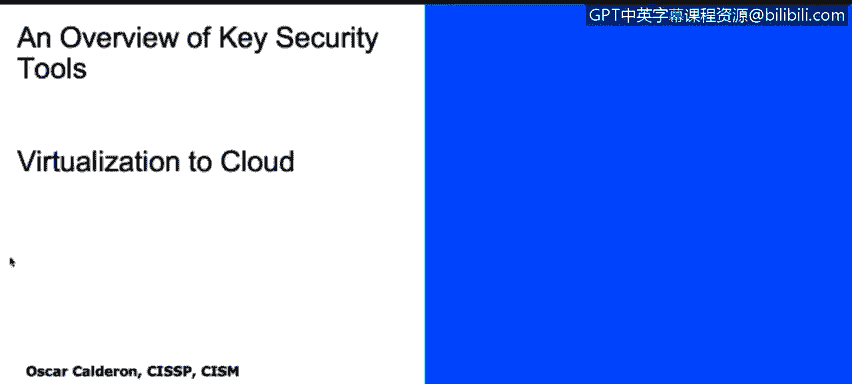
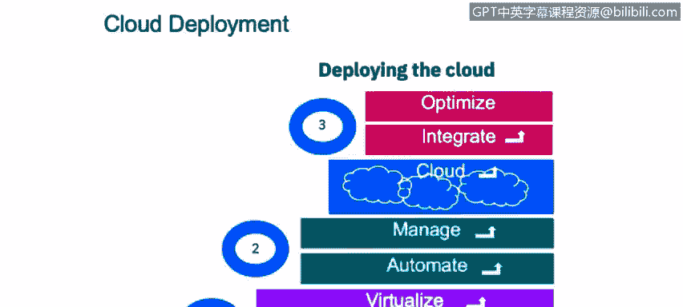
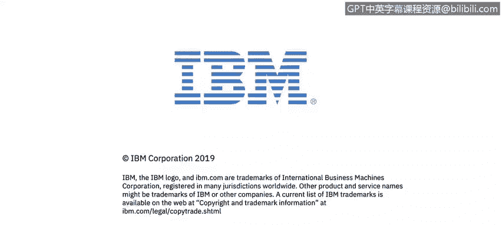

# IBM网络安全分析师专业证书课程2：《网络安全角色、流程与操作系统安全》roles-processes-operating-system-security - P73：34_03_virtualization-to-cloud.en_subtitled - GPT中英字幕课程资源 - BV1G44y1F7oo

In this video， you will learn to describe moving beyond virtualization to a cloud environment and describe the steps to deployment in a cloud environment。

Welcome， I'm going to talk to you about an overview of key security tools。

 particularly about virtualization and cloud。

So how is it that we jumped from having virtualized environments to this whole cloud systems we need to talk about first what virtualization is。

 so virtualization allows you to run software resources with less physical resources so for example。

 you can have a server of physical server that is run in different virtual machines within that server。

 so that makes you have different environments within or running just a few physical resources。Now。

 what if we put together several virtualized resources， right。

 That's one of the questions that people asked a few years ago when this whole cloud thing started。

 So you jump from a virtualization management then the whole service delivery automation needed to happen。

 that align to business service catalog， right， you cannot build a virtualized environment without knowing what you're gonna use it for。

 right， So once you have that business goal you want to achieve， then。You can implement this。

 this model into into your business needs or to fulfill your business needs。

 Then we had an end to end real time monitoring and optimization and。

Conumption based marrying and dynamic capacity optimization。

 right So this is just a chart that tell us how is it that we jump from those virtualized environments to have this whole cloud environments。

 right， we jumped from having single resources and single virtual resources to have a whole level of interacting devices fulfilling a service need。

Now let's talk about a cloud deployment and how it looks like right and in the previous slide we talk about how we jump from having just virtualized environments to a whole cloud providing services now in order to understand how a cloud deployment looks like and you can guide it yourself with this chart in this slide。

You have three steps you need to follow right several interim steps within within those steps right so you need to first to consolidate the operations you have and with consolidation we mean what is it that you want to move to the cloud right what is it do you want to serve and what services you need there then you need to virtualize that list of items that you did in step one。

 you need to virtualize those， then you need to have resources to do the whole virtualization。

On step 2， you need to automate that， right By automation， we。

 we mean like the services and and the items you're going to use。To。

Manage those items you consolidate in step1 once you have all the structure and how you're going manage this。

 then you're going to start moving to the cloud and within the cloud you're going to integrate and optimize it because you need to measure how it's behaving and how it's performing you need to make sure that the business needs are integrated to the cloud and the services you're providing actually fulfilling what you want for the business and of course the optimization you need to make sure that the resources that you have in place are actually working for what you want right you don't want to have if what you want is just an email a cloud email solution。

 then you need100 service you don' need to have it colocated in a different places right and this point is where you need to give it some size you need to do some Sson exercise so you can optimize your resource and under。

And if what you have currently and what you've built currently it's enough。

 or if you at the future well need more resources to keep growing and this is something you will only know by knowing your business and to know what is it that you want to achieve with cloud computing。

