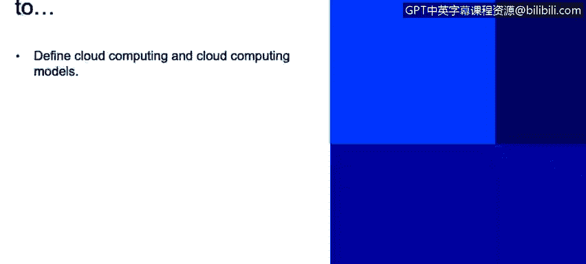

# IBM网络安全分析师专业证书课程2：《网络安全角色、流程与操作系统安全》roles-processes-operating-system-security - P74：35_04_what-is-cloud-computing.en_subtitled - GPT中英字幕课程资源 - BV1G44y1F7oo

In this video， you will learn to define cloud computing and cloud computing models。

Now we're going to talk about what is cloud computing。

 We talk about how we end up from just virtualization to have entire cloud environments。

 but what is it a cloud computing。

Cloud computing is a nondemand availability of system resources right so this means that you will have an environment that has virtualized devices that will serve a business purpose right and this could be anywhere from storage up to computing power and the chart you have on your screen you will see some of the positives and negatives of cloud computing now I have to say that some of the negatives are just perceptions right there are facts that could contradict us。

 but anyways so let's go into plus side so you have choice and agility of business right since you have several virtualized resources。

 you have flexibility， you can grow in any place around the world。

 you have integration that's what it means you have a scale and costs so as as you may think having virtualized resources sometimes its cheaper。

Than having boxes for each individual server or servers you want to deliver。 And obviously。

 this allow us to scale the business as we need。 Since we don't need to add hardware to the solution。

We can pay our provider to have more resources as we're growing。

Then we have a encapsulated change management， so this means that the whole management of the system。

 regardless of how big or how small it is， we can have the single place where we can manage everything。

 we don't need to be onite in Indian one day and we don't need to be on site in the United States and the other day to be able to manage it。

 there should be single point or single place where you can manage all the environment and of course as technology moves on cloud moves on as well。

 that means that we will have next generation architecture。

Every new single technology out there that will be implemented in clouds and will make it more effective and more efficient。

 providerss usually apply those technologies to the service， making it better day to day now。

Let's talk to the negatives right so there's a perception out there that since you're sharing resources with other people。

 security gets compromised right and this is not true but I can see how that perception can fly right so for example you have let's talk about an email of service let's talk about Gmail for example so you have different accounts or hosted within the same physical resources or the same cloud environment right so there are countermeasures and there are things and elements that you need to consider for cloud computing that usually this big companies and providers give us we will copy that a little bit later in this session but it is in fact a perception that security kit could be not that proper within a cloud computing environment now the other thing is a lock-in and this is actually true。

L in we mean that if you have a provider if you have。A whole service based in the cloud。

 and you hired a cloud provider to do this。Usually that takes a lot of work right so this means that if this provider out of the blue decides to uprize their fees or the fees that you're paying。

 you might be hard to move away from that provider depending on how much services you have and how much time you have invested。

So this could be a drawback for4 cloud computing， of course， if this is properly planned。

 you can do some maintenance and movements to be able to move provider right it's not that you cannot do that。

 but definitely it requires some work。Now， of control lack of control。

 so this means that people has the perception that probably since you don't have the devices on site。

 you're not really controlling them it's proven that's not the case right even though you hire the service。

 you still have control now depending the service that you have and this is something that we will cover later on。

 you might not be responsible of doing patching activities for example or provide maintenance to the devices because you're not managing them so you could have lack of control for sure。

 and also the reliability and we go back to the same point as you don't have control of the devices。

 how can rely something that item control， but it is part of the service and of the cloud computing environment。

Now let's talk about the different K computer types that you can have out there。

So the first one being the public cloud， so a public cloud is the most common type of cloud computing you can find out there pretty much you own it's own and operated by a third party。

 so you don't need to do pretty much anything other than provide instructions and how do you want to manage it。

You share hardware and processing resources with other organizations。

 This is usually called a tenant。 So this means that there's a group of physical resources that is assigned to serve different customer。

 So you can be sharing those resources with another company。

 That's what it's called a public a public cloud。 Of course。

 you don't need to purchase anything of everything it's provided by by the。By the carrier， which。

That used to lower the cost。 You don't need to provide maintenance。

 You can scale the environment as much as you like， And it is very reliable。

 hence being one of the most common options for companies now。

Let's talk about the other type or the second type。

 which is a private cloud and and this comes when you're talking about security， right。

 What if I don't really want to share those resources with another company right so this is going to be the option for you So in private cloud。

 you're going to share resources， have the dedicated resources for your cloud。

 So this means that you're not going to be part of a tenant anymore。

 but you're going to have dedicated resources， this allows you for more flexibility to meet specific business needs right。

 So if if there's a portion of your business that is critical that you don't really want to to have the risk。

Of sharing physical resources with other organizations you can have。

 or you can achieve this by having a private cloud。

And this allows you also more secure because you have higher level of controls， meaning that again。

 you won't share anything with anyone so you could have a bit more of control of what you have on your private cloud。

Now。And as you will think， the third option is going to be a hybrid cloud where you pretty much going to have the best of both worlds。

 right， You can control your private infrastructure for sensitive assets。

 It's kind of cost effective because。Obviously， it's going to be cheaper to grow in the public side than in the private side because private is are going to be resources dedicated to you。

 hence are going to be expensive， right So if you on a hybrid cloud option。

 you could grow if you have a portion of your business that is going to grow you can make grow in the public side or in the public cloud and that is going to be cheaper than growing the whole private thing。

 So it can get cost effectiveness there。Now， let's talk about the cloud computing reference model。

 This is just。An abstract chart that describes the functions of a cloud computing environment。

 It's just a reference to understand how the cloud computing works right on your left。

 you have the consumer， which will be the person hiring the service or implementing the service。

The security side is managed by a figure of a cloud auditor right is going to make sure that the security is the proper one。

 that the privacy is there and of course doing control audits to make sure that the information is reliable and it is in good hands the big box in the middle is the cloud provider which will provide different service services which might be software as a service platform as a service and infrastructure as a service we will cover this in the next slide。

And at the right you have the cloud broker， which is the people who aren't in a way reselling the services of the cloud to the cloud consumer。

 and at the bottom you can see the cloud carrier， which is the organization who is actually managing the cloud and doing patching of the systems and maintaining everything in order for the service to be effective。

Now let's talk about the models of cloud computing and this is you probably have seen this in different places right so first we have the software as a service。

 So the software as a service says thirdpart hosting an application and makes it available on the Internet right you can have Salforce。

 Google Apps， Facebook， you have mail services like Homail and Gmail。

 is pretty much the most common use of a cloud computing service， which is the software as a service。

 there's a lot of software as a service applications out there anywhere from web applications that you can find on the Internet to to do charts or to do graphic on pictures and and file editing and a lot of information about software as a service。

 So what I wanted to take away with this is that software as a service。

Is based on the cloud and is the fact that you can use an application。

 an actual application that you could get benefit from online， right。

 You don't need it in your computer。 You don't need to install anything。

 You can just it is house host out there， and you can use it。Then we have the platform as a service。

 And as you may in fear here， you're actually getting your own platform。

 You're not getting any more an application， but it's a whole platform that allows you to develop or run or manage applications without the complexity of maintaining your own infrastructure。

 right you don't need to have。Your infrastructure there， so you will purchase from a vendor。

 the environment where you will run your task， right， this could be from middleware。

 from a database environment， a Java sandbox where you can develop applications where you can have developers working in there。

 you don't really need to have the whole platform to do that。

 but you will purchase that from a vendor that will give you that service。

 that's the whole spirit of the platform as a service。Then last but not least。

 you will have infrastructure as a service， which delivers a whole computer infrastructure anywhere from storage servers。

 network divides， etc ceter， right you can have a whole data center as a service and this will be your infrastructure if you don't want to purchase network devices if you don't want to have routers or switches you don't want to if you don't have space for them。

 you could actually get those in an infrastructure as a service model where you can purchase the right to use or the networking device。

 and you could use the remotely and it will serve all of your needs。

 but you don't have the actual device in there。

