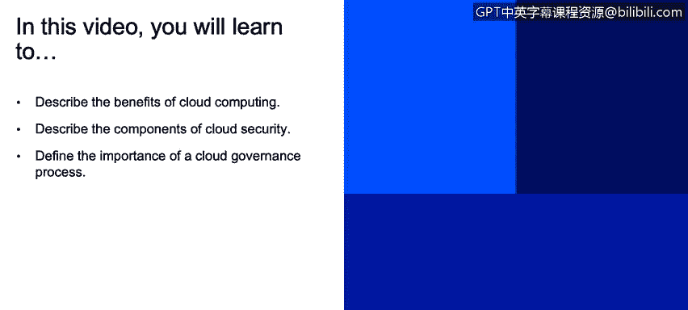
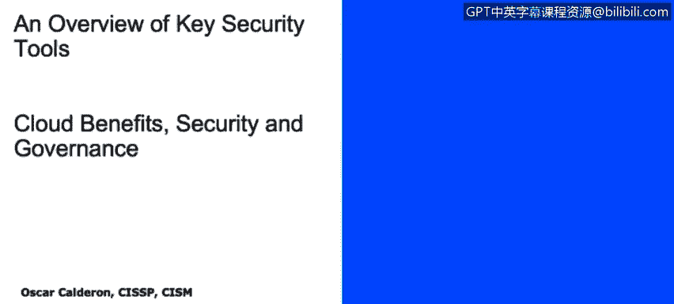
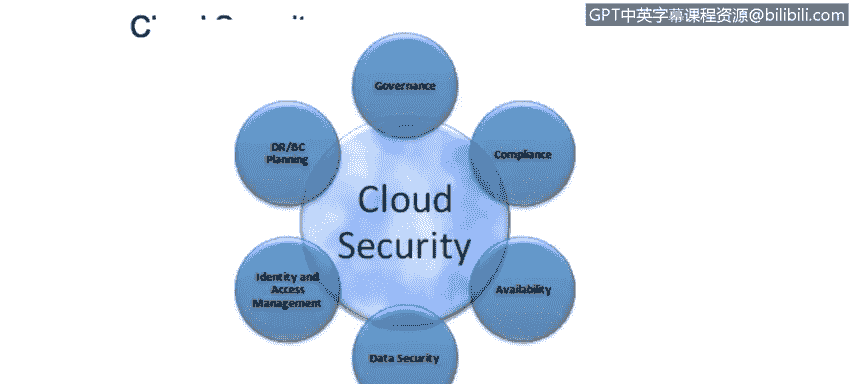
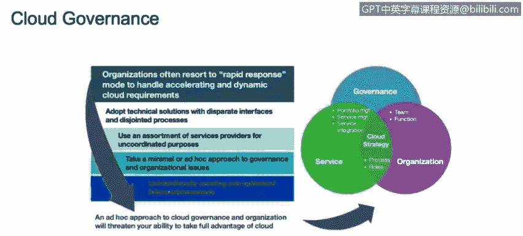
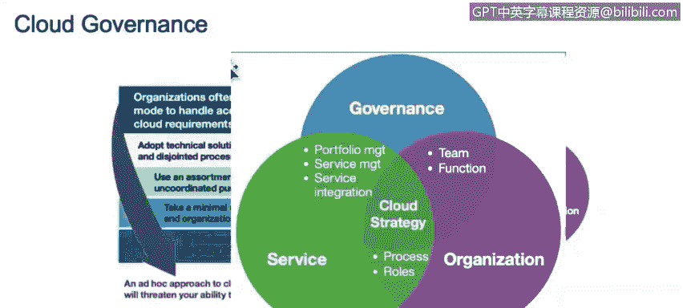

# IBM网络安全分析师专业证书课程2：《网络安全角色、流程与操作系统安全》roles-processes-operating-system-security - P75：36_05_cloud-benefits-security-and-governance.en_subtitled - GPT中英字幕课程资源 - BV1G44y1F7oo

In this video， you will learn to describe the benefits of cloud computing。

 describe the components of cloud security， and define the importance of a cloud governance process。

Now we're going to talk about the cloud benefits a little bit about cloud security and the importance of have proper governance around。

About around your cloud computing environment。 So what are the benefits of cloud computing based on everything that we have covered so far。

 So first of all， you have flexibility， right， you have the capability to grow an environment according to your business needs。

 you're not attached to a single place， you can have access to the resources from wherever you are in the world and you have limitations about it。

 So cloud computing， as you may as， comes very handy and very flexible。

The second one is efficiency right， the fact that you can add you can join a meeting， use some WebEx。

 whatever you are and at the time whatever time in the world that you are right and the fact that you can add more resources to make speeds more efficient。

 that's what we call efficiency and cloud computing。And of course。

 and the most important thing is the strategic value。

 fact the same flexibility that we talked about a few seconds ago allow us to guide the strategic items about cloud computing with a strategic goals or on our organizational goals right so the fact that you can guide those in the same direction makes a lot for the strategic value of a business。

Now let's talk about cloud security When you have a cloud remember then in the first slide we mentioned that one of the perceptions about cloud computing is that you don't really have security well that's not true at 100% you do have cloud security and this are just some of the items that you have to consider when you want to establish or you want to have proper controls in terms of security around cloud so first of all you need to have a disaster recovery and business continuity planning in place right so you want to think about what happens if my vendor its under an attack or what happens if my vendor has a power outage that can provide more services you need you need to think about another disaster right so do I need to have another provider do I need to have a backup just in case。

Do I need to have copies of my backups and run books about how I did the whole implementation of the cloud in case I need to go and run look for for another vendor。

 all of that needs to be well established and plan in the disaster recovery and business continuity。

Then governance， and we're going to talk a little bit more about governance in the last slide。

 which is the next one， but you definitely need to want to you definitely need to have some governance around cloud computing。

 right， who's going to be in charge， what parties need to be involved。

 what is going to be the communication plan， what are going to be the flows。

 do what I'm going to expect out of the cloud environment。

 all of that needs to be properly established。Of course compliance and with compliance we mean for how long for example I need to have the locks from a cloud computing is that cloud computing compliant against any regulations that I might have in my organization right is a compliant with the policies I have and the country that I'm based that right let's talk about for example GDPR right in Europe is my cloud computing environment compliant with GDPR isn't going to violate any information from my vendors of my customers across the world that's something that we need to really consider about cloud computing。

Of course， availability and this tie into the disaster recovery plan as well。

 What happens if my vendor is out of service， do I have another vendor。

 the information that is within the cloud， What happens if it's if it's not available anymore。

 do I have a website， do I have a server that a server on on site that can host the website that I have hosted and the cloud。

 all of that is information that I want to have in mind when when put my security。

Framework around the cloud security。Of course data security is information encrypted。

 how is it going to travel from my company to my cloud vendor。

 what safeguards my cloud vendor has in place right that's something really important。

 we want to make sure we have periodic audits in our cloud or within our cloud provider to make sure that our data is safe out there。

 particularly if we have that， or if we have an infrastructure based on a public cloud。

And something really， really important is the identity and access management。

 we want to make sure and we want to have a record of who is accessing what， where。

 how and why right that's really important We need to make sure that access management is a must。

 the fact that we have a thirdpart managing the cloud environment doesn't mean that we still need to track and need to have access to those logs and visibility to those logs So all of this item all of this items we just talk about in conjunction made for a good cloud security strategy。

Now let's talk about cloud governance and this is going to finish the cloud security portion of the slides in order to have a an effective cloud strategy。

 you need to have a very good cloud governance and the only way you need to you can have good governance around cloud is that this governance is aligned with the service and with the organization。

 which is the little circles you see on your right side。

And as you see there。The three of them， the governance。

 the service and the organization need to overlap in different places right you cannot have governance if it's not aligned to your service or the service you're providing in the cloud。

And of course， the service you're providing on the cloud needs to be aligned with the organization goals right and the organization goals of course。

 need to have or need to be involved with the governance so as you see it's a little triangle。

 you cannot really sacrifice any of the points on the triangle all the three need to be there and need to be aligned as I said。

 with the service with the organization with the governance in order to have an effective cloud security strategy。

