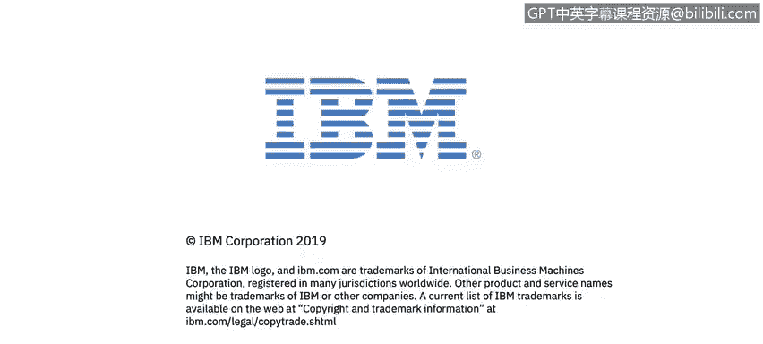

# IBM网络安全分析师专业证书课程2：《网络安全角色、流程与操作系统安全》roles-processes-operating-system-security - P76：37_01_wrap-up.en_subtitled - GPT中英字幕课程资源 - BV1G44y1F7oo

Thank you for attending this course。If you're interested in acquiring additional skills in cybersecurity。

 we hope to see you again。

