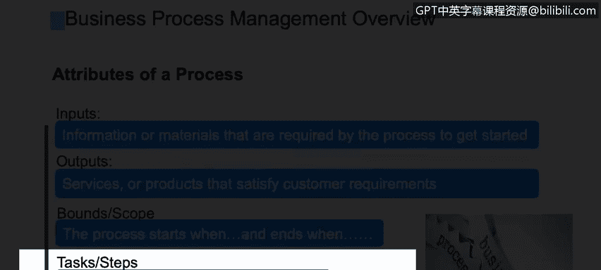

# IBM网络安全分析师专业证书课程2：《网络安全角色、流程与操作系统安全》roles-processes-operating-system-security - P7：6_业务流程管理概述.zh - GPT中英字幕课程资源 - BV1G44y1F7oo

In this video， you will learn to define a process and its attributes。

 describe standard process roles， Ex what makes a process successful and describe process performance metrics。

I wanted to take us through just an overview on business process management or commonly referred to as BPPM。

Now there are varying definitions of a process。Depending on the author or the source。

And I should say some may call it BPPM business process management in your company。

 it might be called QPM quality process， there's Six Sigma， there's agile。Ile， CP。Different names。

 but underneath it should have the common elements that we're striving for。

So a process is basically a set of defined， repeatable steps。That take inputs。

 as you can see in the chart here。Add some value， there's some processing。

 there's some knowledge applied， skills applied。Resources。Within the process。

That produce a required output。And an output that meets customer requirements。

 whether that be internal or external clients， customers。

Attributes of a process。Every process should have inputs。That is some information， some data。

 or even raw materials that come into to the process that are used by the process and many times are a way to kick off the process。

In my simple example， it was me putting my debit card in the ATM machine， that was the input。

Every process should have a start and an end as well， outputs。Are what the process produces。

 whether it be services， or it be support or an actual physical product， a widget。

And it has to satisfy。The original customer requirements。Each process should be bounded。

 it should have a front and a back， it should have， it begins here， it starts here。You know。

 we do these tasks and it ends here， they can't just go on infinite them we've got to have a bound。

So inputs， outputs start stop。Tasks。Steps。Some call them actions performed。

 it's the doing part of a process。That will lead to an output。

Another key aspect I don't have listed on the chart， but documentation is critical。In what we do。

 we have to have our processes documented。For training purposes。

 just for a common understanding of how it works， for auditing purposes。For compliance。

And in my experience at IBM， I've always liked to use kind of a threefold approach to documentation。

 first is a high level， a one page， a very high level， here's where it starts， here's where it ends。

 and here's a couple of boxes that shows what happens in the middle of the process。

So just a one page of then a mid level。Which is more what we call swim lanes。

 process flows left to right。 it looks like an Olympic swimming pool。

 Each role in the process will have its own lane。And we list the tasks and the handoffs between the lanes。

That's called a swim lane。And that describes。Vers the last level I like to describe as。

The how or the death procedure。This is how I complete test， A， B and C。 this is what I sign into。

 and this is how I complete this。So high level， mid level， the what， and low level， the how。Now。

 this is certainly very high level， but each process。

Unless it's fully automated in all system generated， like my bank example， most of that was system。

Behind the scenes。No people involved other than myself。

But you could have a supplier that's providing。Something to the process team。

You could have a requester that is requesting something of the process team that most of the time kicks off the process。

And then within the process， you might have and we see that a lot within IBM， we have a team leader。

 very experienced。Person that oversees。A group of folks that are executing the process and is there to lend support to help when issues come up。

That person is often an SME， a subject matter expert。It could be the same person， a team lead SME。

 and then you have some type of processor or person it's really the person executing a step or steps in the process and more often than not you have。

Some tasks or some actions need to be approved by management or another function before you can proceed in the process。

 so you need an approver and a reviewer。A reviewer might be a quality assurance person。

The one critical item to know for any role in a process team that there should be a separation of duties such that。

An approver is not the requester because that that would not be good sound business practice for me to request something。

 And then， oh， by the way， I approved my own request。 that would be。Less than desirable。

 so I would suggest a separation of those duties。So what makes a process successful and there's certainly more than six？

But a charter is really describes- it's kind of like the menu。

 it describes what the process is in place to do， why does it exist？

What are the goals of the process， Who are the stakeholders in the process？

It can be from one page to 30 pages I've seen very long ones with charter。

 but it basically just if anyone comes along and says what I don't understand what this process does。

 what it's for。Here， read the charter。ProPro should also have very clear objectives that when met fully。

That leads to you meeting your overall goals。Governance ownership。

I always suggest a process owner that is not a doer in the process。Rather。

 they have accountability for the success of the process。

 They are the focal point to upper management that says。

Let's go talk to Joe about how the process is performing。

So they've got a name of the accountable person。It could be a manager or a non manager。

 but just some of that is assign the ownership of the success of that process。

Repeatability is so important。Because that output， we want the outputs to be the same every time we don't want them to vary。

If we're producing brakes for a car， we want them to be the same every time they come off the assembly line。

And variation is bad。If our steps in the process are。Hand a little differently every time。

Based on if person A does it this way and person B likes to do it a little bit different。

 just by preference， that could lead to variation which could affect that output and we don't want that。

Automation is important too， because if we can reduce manual keystrokes。

 which are prone to finger error。It'll save time and money as well。And then lastly。

 but not all inclusive is performance indicators。Tangible metrics that we collect。

We look at as a team， monthly， quarterly to say， how's our process doing？

I wanted to give just a very simplistic example。Of how it's important to reduce variability。

If we look at just a ficitious company and our manufacturing， that makes rivets。

That go into the assembling of the skins on commercial jet wings。

We've all seen examples of where there has been breakage。

 catastrophic failure of some of the skins because of rivets， which is an awful thing。

But in this example， this fictitious example of the RRNR Quality assurance team reviews data on a defect。

Great， stress testing， rework and costs on a monthly basis。 So they they collect metrics。

 They're interpreting。 What are the metrics telling us。They're trending them out they're looking at。

Comparison of two different things。For example。Process costs。

The cost to produce these is going down month to month。However， if they look at。

That if they look at that solely， it looks great， that's a good thing， costs are going down。

But if we take into consideration the quality and the defect rate， if the defect rate is going up。

In other words。If I produce a million rivets and two are defective。

That's two opportunities for failure of a skin on a commercial jet wing。So in this industry。

 I would imagine they have very strict tolerances widget has to be produced within very strict guidelines because we want zero failures of a rivet。

At 30，000 feet。In the air。So just a very simple example of。

How important it is to reduce variability so that that rivet is the same quality。

 high quality every time it comes off the line。Process performance metrics。

We need to measure our process so we can understand。And improve our processes。Here are just some。

Common examples。 I'm sure there are many more， and many other types might fit under the umbrella of these cycle time。

Is。Is basically the timing of。An event， a series of steps or end to end process。

My process starts here， the clock starts。Two days later it ends and I have an output。

 so my cycle time is 48 hours to produce this one object item and cycle time can be many different variations it could be start to finish of a process。

 it can be a sub process within a bigger process。We've measured delays before how you know I'm in the process。

 I go from step A to B， and I'm waiting to get to step C because I need information from another role。

And I had a wait on average 24 hours。So we want to measure delays。Bottlenecks。

And those type of things， put the clock on it。We also want to measure quality。Input quality。

 you know we get inputs from a source。It's good to check them。

Someone provides pricing to us to start our process。

 We want to make sure those prices are right before we get too far down into our process。

So it's good to measure inputs， the quality of those， the quality of our outputs。

 like in the rivet example。And in process， just meaning within the tests that we're performing。

Measure the quality。A lot of companies do sampling too。

 they'll sample every so many orders or processing items， they will sample them。

Cost is just as it says， what are the cost delays of defects of overtime for the staff having to work。

 those type of things？The last category is rework。Which I just simply see our do overs。

 I've gotten from step A to P。 And I've all of a sudden realized。Something is off。

 I need to go all the way back to step D and start over。 so I've got all that wasted time。Of my time。

 maybe system operation time， maybe I need new materials。In manufacturing。

 I might have to scrap materials and start over， that's costly， so there's a cost to rework。

And we want to measure it and find out why there is rework。

And then go upstream and eliminate that root cause。

Continual process improvement refer to a lot as CPI。Is critical。 It's just the ongoing。

Cycle of always reviewing your process performance。Metrics。

 what are your customers telling you feedback wise？You could do maturity assessments。

 which are pre developed checklists， questions that you can self administer。

That will give you a score at the end to say， on a five point scale， my process is a 3。5 in maturity。

Maybe I want to get to a four in a year and here's how I get there。And it's financial performance。

Small improvement teams are critical too， because I always think the smaller the better if you've got the right key individuals and SMEs。

To get together from a department。With the process owner and just review this stuff on a regular basis。

Folks that are actually executing the process many times have great solutions and ideas。

And in a small group forum， those ideas will come out。

