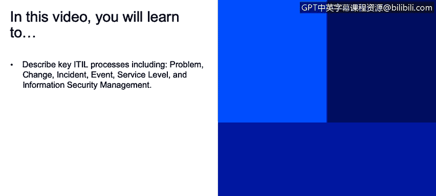

# IBM网络安全分析师专业证书课程2：《网络安全角色、流程与操作系统安全》roles-processes-operating-system-security - P9：8_关键ITIL流程.zh - GPT中英字幕课程资源 - BV1G44y1F7oo

In this video， you will learn to describe key Ile processes， including problem， change， incident。

 event， service level and information security management。

 The last section I wanted to just drill down a little bit more into。😊。

Some of the processes that I talked about at a high level。

And there are so many resources available you can Google and find wkiis that really go into a deep depth on all the ITL processes。

There's a lot of organizations that do consulting on it。But really。

 there's a lot at your fingertips just by going in and Google searching on ITIL。

So this is not by any means exhaustive what I'm conveying here， this is just a high overview。

So problem management。Responsible for managing the life cycle of all problems。

And that's how ITL defines a problem。An unknown cause of one or more incidents。

And problem management really aims to resolve not just the one problem that came up。

 but what's the root cause of incidents？So we can minimize this happening again。

Or the impact of a further incident。So it's really seeking to find and resolve the root cause of the problem。

Whereas incident management is getting things back to a returned state of the service。

 to normal levels。Change management is just as it sounds。 It's changes to baseline service assets。

Or our processes， really。And configuration items across the Il IL lifecycle， those five phases。

aimiming to ensure that standardized methods and procedures are used for changing。

For effectively making changes。It could be changes to configuration items。Process steps， tasks。

Systems。Communication， again， is critical。To reduce disruption of service。And back activities。

Some of the phases within ITL change。Management include identification of the change。

 planning the change。Assessing the impact of the change。And then getting approvals。

 scheduling those type of things， and then implementing it。

And post implementation will do a change review。What went wrong， What could have gone better。

 Could we have done something differently those type of things， and then a closure。And again。

 this is all documented in much， much more detail by ITL that you can find online。

Incident management， we talked about this briefly earlier。

But this is aimed at restoring normal service op as quickly as possible and minimizing adverse effect on business operations。

And this directly correlates to service level agreements we have。In place。

So an incident is an unplanned interruption to an IT service or reduction degradation of quality of an IT service。

Some common。Phas it talks about in IT。In incident management in the life cycle manage incident management life cycle would be to log it。

Assign it。To someone that is going to resolve， track it， categorize it。There are different ways。

 but different organizations as to how they categorize an incident。ItTilL has its perspective。

Prioritize， resolve， and then close。Event management。

An event may indicate that something is not function correctly。

 Event are any detectable or discernible occurrence that has significance for the management of an I infrastructure or the delivery of an I service。

Within event management。We create and detect notifications。Monitoring。

The monitoring function is key as well， for checking。Service level management。This involves planning。

 coordinating， drafting， monitoring， and reporting on SLAs。We talked about that earlier。

 how we will have。 We should have SLAs with our internal customers or external。

And have an objective set a bar that says， here's how we're going to perform。And as we measure。

 if we're not performing to that level， we know we need to make some adjustments。

The last one that I wanted to just outline is information security management。

This describes the structured fitting of information security in the management organization。

 So this is really the crux。Of what we， as I security professionals， are involved with。

It's having and maintaining ISps and specific policies that address each aspect of strategy。

 objectives and regulations。Some of the goals of IT security。The instrument。Our authenticity。

Accountability。Nonreudiation and reliability。I would urge you to look more into Iil and business process management。

 because it is a great framework for our IT security organization。

