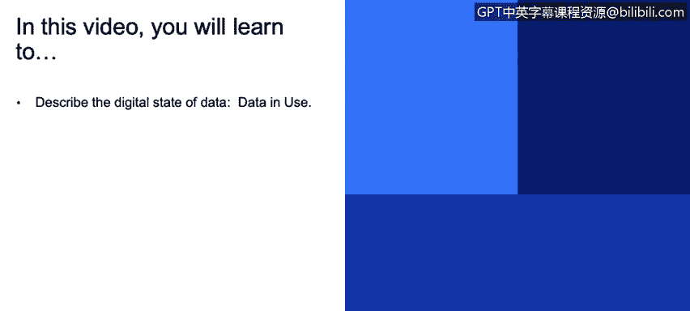

# IBM网络安全分析师专业证书课程3：《网络安全合规框架与系统管理》compliance-framework-system-administration - P101：46_02_encrypting-data-in-use.en_subtitled - GPT中英字幕课程资源 - BV1cj411z7Li

In this video， you will learn to。Describe the digital state of data。😡。

Data in use。Enncrypting data and use， unfortunately， is not。

Very often followed， usually product loads data from disk decrypt it and then just works with it。

 Unfortunately， it's very dangerous because some classes of vulnerabilities could expose portions of memory of the product exam。

Very famous vulnerability called Hartlit got from a couple of years ago and actually leaked memory of the processes that were using open SSL protocol and leaked them over the internet so had those products。

Been keeping the data encrypted in memory then that this would wouldn't have happened。

 It wouldn't have been as dangerous。 So the idea is to keep data encrypted。

 even when you load from disk， then decryed for a brief period of time when you actually need it。

 and then erase it。 And that way。There' is less opportunity for it to be leak and another thing to consider。

 it may or may not apply to your product， but there is something called homomorphic encryption。

And it's a class of algorithms which allow you to operate on data。Without decryptting it。

 theres a lot of very complex math involved， but some users allow for that so you could at all times keep the data secure and at the same time do some analysis on it and it's just something to keep in mind maybe your product could make use of it。

