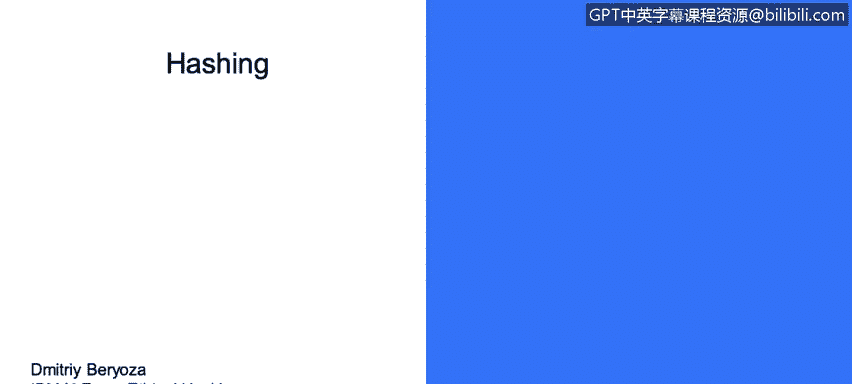
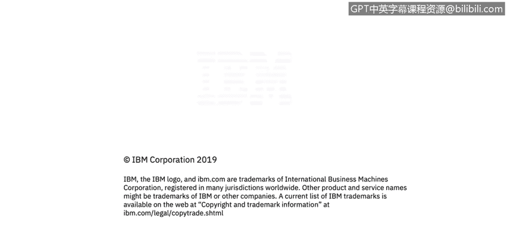

# IBM网络安全分析师专业证书课程3：《网络安全合规框架与系统管理》compliance-framework-system-administration - P103：48_01_hashing.en_subtitled - GPT中英字幕课程资源 - BV1cj411z7Li

In this video， you will learn to。Describe hashing and its purpose in encryption。

Describe common pitfalls of using hashing。Describe additional considerations when using hashing。

Deffinine message， authentication codes， Max let's talk about hashing Hahing is used for a variety of uses they're used to validate passwords。

And we use salt attachs for that， I'll talk about that in a moment。

They're used for verifying data and code integrity and used in message authenticated codes， key hass。

 key hashes。And verifying data code integrity and authenticity in digital certificates。

The recommended。Hash functions these days are Shah 2， sweet and Shah 3。

And there are a number of problems with using hashing incorrectly first of all。

 there are a number of old obsolete hash functions that are now considered broken。

Please phase them off。The hash function usually considered。

Insecure when it's practical to generate collisions for it。

 so collision is two or more different inputs that correspond to the same hash value and if it's fairly easy to come up with that。

 then your hash function is is no longer secure there are two very common hash functions that should be phased out。

 MD5。It's been broken for more than 10 years。Colllisions are fairly easily generated Shawa was recently proven to be unreliable。

 it's not recommended for use anymore， and you can actually go to the website called shatter。

o to see it a demonstration of that there are two different files shared there that have the same Shahwa hash。

Using predictable plain text that you're hashing is problematic。

 it's not quite a cryptography problem， but if let's say you hash。

A password and that password is easily guessed because somebody uses a list of commonly used passwords and that password just happens to be there。

So when they use brute forcing， they could go through all possible combinations and come up with a hash that corresponds to this password。

The fix for that is using something called。Assault hass。

Another actually problem with here aside from from this list is is the rainbow tables there a variation of。

Of lists used for bru forcing， and they're basically just gigantic tables as somebody else precomputed。

Of all possible combination of characters and the hashes corresponding to that。 Well， of course。

 it it's impossible to to do it for well， maybe not impossible。

 very hard to do it for the entire problem space， but for reasonably large。Inputs。

It it's possible to generate rainbow tables and there is one that you can actually visit called hashkiller。

 you can input some common name or a small number in there and it'll probably give you a hash for that。

I assume that nation states。arere able to generate just gigantic rain tables and defeat hashing that way and the way to prevent that is to use a salt and salt is a random byte sequence we recommend at least eight bytes that you add to the plain text when before you calculate the hash and you also share that salt in public and as a result the hash will be wildly different for the same password but different different salt use so you can see an example here to users they have their passwords encoded。

Hat but hashed with salt and the password is the same for both users， but because the salt is used。

 you see in blue the hash value is completely different and if hash is used。

 then reb tables become practical。There areSome additional considerations when using hashing use key stretching functions together with hashing。

With a large number of iterations， and that they are deliberately slow。

And that's controlled by the number of iterations and they make brute forcing attacks impractical。

 both online and offline and you have to aim for maybe  750 milliseconds to complete the operation so it slows down the calculation of the hash and if you're trying to brute force on a large list of passwords。

 it just becomes impractical it takes too long so here there's an example of PBKDF to use。

And you can also future proof your hashes， include the algorithm ID。W when you store the hash。

That way， if algorithm later becomes discovered to be insecure， then you can react and let's say。

 change to a different algorithm and just store a different algorithm might in there。

There's also something related to hashs called message authentication codes。

 and they confirmed that the data block came from the state center and has not been changed there is a small diagram here so basically。

The hash based max or H Max are based on crypto hash functions， such as Sha2 56 and Sha3。

They generate the hash of the message that youre transmitting with the help of a secret key。

 and if the key is not known to the attacker，They cannot alter the message。

 generate a new hash and come up with the same hash because that's the problem when let's say you're sending a message and just a plain hash with it。

 somebody can modify it and transit， recompute the hash and store the new hash with it and just send it on the destination with HMac it's not possible because the hash is actually generated using a secret key。

 and that key is not known so there is no way to generate a corresponding hash。

So these types well the writtens。Probably shouldn't be used everywhere。

 but only in scenarios where there's a chance that data may be maliciously altered while under attackers control。

 so let's say you are storing cookies in the client browser， you are transmitting messages。

 That's where H Maxax will be very useful。And as I mentioned。

Even encrypted data should be protected by E because there's something called a bitflipping attack where attacker could play with the bits in the encrypted message。

 not know what's there， but they could play with it enough so that let's say they could change the amount of the money transfer that's being sent so let's say you're sending 100 to someone attacker could play with encrypted representation of that to change it to a million dollars without actually decrypting the data so that predicts about bit fliplipping attacks。

