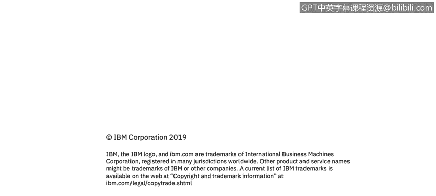

# IBM网络安全分析师专业证书课程3：《网络安全合规框架与系统管理》compliance-framework-system-administration - P105：50_03_safeguarding-encryption-keys.en_subtitled - GPT中英字幕课程资源 - BV1cj411z7Li

In this video， you will learn to。Describe how to safeguard encryption keys。

Describe how to secure the key encryption key。

So as I mentioned before， safeguarding encryption keys is extremely important。

 your solution is only as safe as the safety of your。

Keys do not store them in new code in plain text and configure files and databases and plain text。

 unfortunately we see that from time to time it's just not safe。

Proper way to store them is in secure cryptographic storage， something called key storess。

 those for you working with Java probably know about Java Key stores， but they're corresponding。

Key stores for could be used in other languages。 There's also like if if you're。

 if you're paying attention， there's also a question of。

How do we secure the cryptographic store because it has to be secured with a key of its own。

 something called key encryptrypton key？Actually it's kind of a tricky problem and we see that a lot of products are struggling with that so how do we secure that key that protects all other keys and there are a number of recommendations that we have first of all there's something called hardware security modules。

 there's a hardware modules that customer buys ands in the machine and they safely keep track of all encryption keys and digital certificates。

You could also use something called virtual HM it's a software solution that apparently has similar guarantees as hardware security modules。

 Another way is to derive key encryption key from the password that user enters if that applies to your product if your product runs standalone you probably won't be able to do that but in some products it's a viable option so for example a lot of us have semantic encryption desktop software running on our laptops and when you log in when you start your laptop。

 you enter a password so that's your key encryption key then the other keys are derived from that and you can decry the。

The contents of the hard drive。There's yet another way of securing key encrypting keys that we recommend it's to derive it from data that's in some way unique to the machine the product is running on。

 but that's hard for the attacker to discover and some of these could be file let if file system metadata such as random file names。

 file timestamps so something that attacker cannot easily steal is quite often there is a chance to steal a particular file but to figure out。

The file that you don't know the name of on the file system or to figure out the timestamp of that file is much higher。

 so you could use that information。To derive your key cryto key from。

