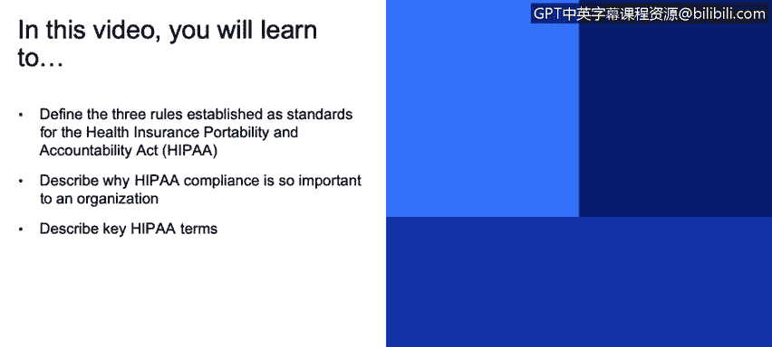
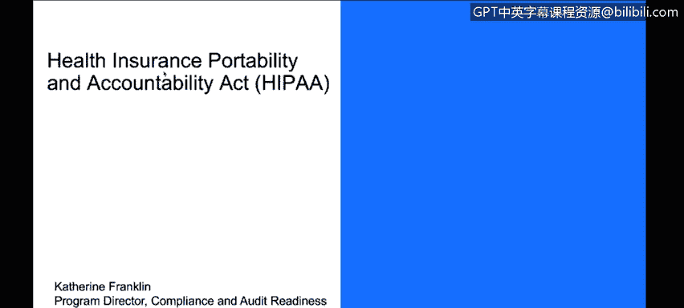
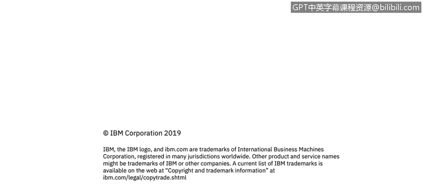

# IBM网络安全分析师专业证书课程3：《网络安全合规框架与系统管理》compliance-framework-system-administration - P11：10_健康保险便携和责任法案(HIPAA).zh - GPT中英字幕课程资源 - BV1cj411z7Li

In this video， you will learn to。Define the three rules established as standards for the Health Insurance Portability and Accountability Act。

 HIPAA。Describe why HIPAA compliance is so important to an organization。

Describe key HIPAters。I'm going to focus now on some more industry specific types of auditing。

So the HIPAA or the Health Insurance Portability Accountability Act is a US Federal Act for healthcare Information。

The note 1 P2 A's， it is a dead giveaway if somebody actually does two P's and an A that they are new to this process。

So healthcare organizations are using cloud services to achieve savings and scalability and there's a lot of concern about putting sensitive data in the cloud。

Is that a good thing it's under risk？Well， that's why it's important to understand security and understand the provider that you're working with and making sure that they've understood that this is important to ensure that we have the integrity in place to provide the security and the safety and so on。

 but certainly our customers are looking at cloud more than ever to increase resource utilization。

 reduce costs， increase response time。So HIA is the US federal law。

That identifies the control of personal healthcare information， so PHI。

 personal healthcare information， and it's also related to the other law in this space called highT。

你诶。The privacy rules associated with。HIA identify the right to an individual's medical。

Records and health information and that it is accessed again。

 very strictly access to those who need to know。It applies to health insurance companies。

 to healthcare providers， and anyone who might have access or need to share healthcare records。

The security rule establishes a set of standards for protecting that data。And they must be in place。

For both the covered entity and the business associate。

 which are similar to what we would have defined those a minute。

 but they're similar to what we saw in GDPR。So the HIPAA is defined and managed and overseen by the US Department of Health and Human Services。

 the Office of Civil Rights。And they identify two main actors in this space。

 there's the covered entity， so this is the company that manages the healthcare data for the customer。

 so it would be a hospital， it would be an insurance company， could be your doctor's office。

A business associate is any vendor that supports the covered entity。

 so if you are providing an application， if you are providing a cloud environment to the hospital to the。

 then you are a business associate of that covered entity。

The protected health information is any information about health status of the individual。

And it is the responsibility of the covered entity or on their behalf for the business associate to ensure its safety and confidentiality。

嗯。Now in the case of GDPR we talked about large fines。

 there absolutely are large fines here for violations of HIPAA， there's also a wall of shame。

 you can go to the website there and they will produce。But。Okay， so why is compliance here essential？

There are laws， the US。 federal laws and they have teeth and the HHS will come in and do unannounced audit either on the BA or the CE。

 so the covered NT or the business associateoc， one。

 the other or both could find themselves under under an audit situation。

The fines can be in the millions of dollars。You can face criminal prosecution， some serious stuff。

So although it's a US regulation， the other thing to be aware of is that many other countries will have a similar law。

 we talked about GDPR in Canada， there's the Personal Information Protection Environment Documents Act。

 so just about every geography is going to have a similar law or regulation on the books。

Many states in the US will have even more strict laws or additional requirements that are laid out on top of the US federal law for HIPAA。

 and so you need to be aware of that as you're choosing your jurisdictions you're doing business in and the types of compliances that you're aligning with。

Some international companies will also require HIPAA， whether or not they。

They do business with US data or US customers or US， or they just see it as a valuable standard。

 and they have confidence in it。 so you'll see that being required internationally too。

HIPAA security rules will cover physical entities， technical controls， administrative safeguards。

 all with that focus on protecting health information， they look at confidentiality， integrity。

 availability， and they want to ensure that we've taken all steps and actions to reasonably anticipate threats to the security。

 integrity of the information， you want to protect against inermissible uses， accidental disclosures。

 and ensure compliance by all of the workforce。Administrative safeguards。

 they take the form of the these are the non technical or operational controls。

 they're looking at your management process， your personnel process， theyll look at hiring practices。

 workforce training， background checks，Things that you're doing to ensure the integrity of the people and the processes you're performing。

Technical safeguards， again like the general term， technical， they're looking at access control。

 audit control， integrity control， transmission， encryption at odd at rest and transit and use different physical controls to make sure technical controls to make sure that the software is performing as it's expected。

And then the physical safeguards are around the facility access that where the devices are。

 so if your data is stored on disk somewhere where are those disks are they appropriately under access control and are they secure they're also looking at access points so workstation and device security as they do it so if you're in a hospital thing that all those computers that are sitting on people's desks out in the public area。

Workstation device security。Is focused on all of those access points and making sure those access points are properly secured timeouts on workstations。

 for example， to make sure that if you got up and left your workstation for an extended period of time。

 nobody could just swoop in and start using it。

