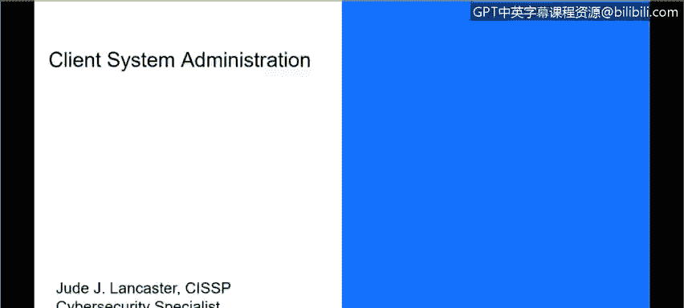
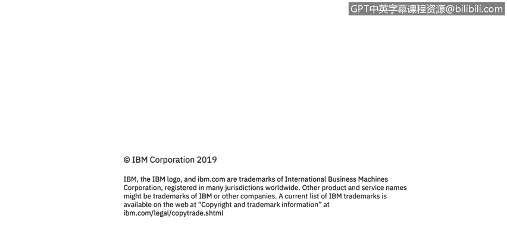

# IBM网络安全分析师专业证书课程3：《网络安全合规框架与系统管理》compliance-framework-system-administration - P15：14_客户端系统管理.zh - GPT中英字幕课程资源 - BV1cj411z7Li

In this video， you will learn to。Define a client as it relates to a computer system。

Define the characteristics of client system administration。

Describe why effective client system administration is important to cybersecurity。

Hi there。 Today， we're going to talk about client system administration。

 And when we talk about a client， it really is in the context of a client accessing a server。

 So a client will be anything that really accesses a server application like a web server。

 a mail server， a file server and a client can be anything like a desktop computer， a laptop tablet。

 even smartphones， anything that is used to access resources that sit on a server is really considered a client from an It perspective。

 and a single server can really have many， many clients that talk to it and many clients can access that one server at one time。

 So it's not a one to one。

Relationship， it's typically a many to one server relationship。

 And one client can also access multiple servers that have different purposes。

 So for the purpose of this discussion， that's really what we're talking to when we talk about a client。

 It's any system that will access resources on a server。

So when we talk about the context of client system administration and cybersecurity。

 we're really looking at it in a couple different ways。

 And you're all going to be familiar with cloud and mobile computing。

 We all have our smartphones that we access apps and most of those apps will operating a typical client server methodology where the app is actually accessing some kind of server resources that are hosted somewhere else。

 typicallyyp in the cloud on an AWS or an Azure or an IBM cloud or any of the other myriad of cloud hosting providers that there are。

New devices and new applications and new services are coming into the organizations all the time as people load applications as new business line of business applications are coming online。

 It's really an on demand kind of world that we live in。 And that leads to lots of potential threats。

that could be present as those new applications come online。 And really。

 endpoint devices are the front line of attack。 That's how most bad actors or hackers will try to get into an organization is by accessing。

An endpoint or at clients。 And then branching out from there。

 So malware will be installed based on a website that someone goes to or a fishingishing attack or a spearfishing attack or ransomware。

 Any of those kind of attacks can lead to large problems within an organization。

Let's talk a little bit about the common types of endpoint attacks and this is just a very small list there are lots of endpoint attacks。

 but fishingish where spearfishing is an email which imitates a trusted source designed to target a specific person that's spearfish so think of a spear adds in a very sharp point and that sharp point refers to the specific person that you're trying to attack I've also heard the term whale hunting where you a person will try to attack a very specific person in an organization like a sea level executive and that's what we refer to when we talk about whale hunting when we're talking about a spearfish attack versus just a normal fishing attack。

 spearfish is going after a particular a particular person in an organization again that pointed attack or a specific department versus a fishing attack which is a mass email。

That would go out to everybody within an organization and anybody who clicks on it would be the target of that attack。

A watering hole is malware that would be placed on a site frequently visited by an employee or a group of employees。

 So we're trying to just get anybody who would。Would go to that site。

 They click on a bad link that installs some malware on the endpoint。

 And then in the I'm in the organization and can branch out from there and try to get the information that I want。

And then these ad network attacks， so using ad networks to place malware on a machine through ad software。

 so I click on a link on a website that again goes to download some malware on an endpoints and then again I'm in the organization to to do whatever activity I want to install malware ransomware we've all heard about these ransomware attacks that are focusing on public sector entities like the city of Atlanta I had a very large one last year。

 the city of Lake Florida had one earlier this year so they're becoming much more prevalent and really are becoming a big deal for organizations Island hopping is a supply chain infiltration。

 I'm really not as familiar as that with as I am with some of the other ones but I'm assuming that would be where we tried to infiltrate someone supply chain to disrupt。

Business operations or to get information about the organization supply chain in order to cause problems or to get information that we could potentially sell。

 and really when we're talking about endpoint attacks and malware。

 the whole goal of this is to make money right I mean， whether it is to disrupt a competitors。

 business operations or it's to directly blackmail。

 the company to get money from them to not release that information or to decrypt information that we've encrypted through the malware and that's really what ransomware is but the whole goal of this is to make money that's why people do it。

 it used to be when you talk about hacking， you know when we talk about movies and I'm going to date myself here like war games。

 it wishes to get in to see if I could get something now what we're seeing or organized attacks。

To specific organizations for the sole purpose of getting money from that organization。

 either in the way， in the form of disrupting their business activities or direct。 you pay me。

 And I'll give you back your information。 So that's really what we're seeing in the threat landscape when organizations are trying to pack other organizations and disruptive business activities。

