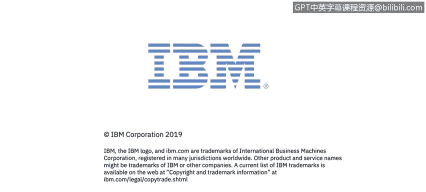

# IBM网络安全分析师专业证书课程3：《网络安全合规框架与系统管理》compliance-framework-system-administration - P16：15_端点保护.zh - GPT中英字幕课程资源 - BV1cj411z7Li

In this video， you will learn to。Define endpoint protection。

Describe the basics of endpoint protection。 So let's talk a little bit about how we protect from those attacks。

 So when we talk about endpoint protection， it's really a policy based approach to network security because we're really securing the network to prevent the endpoints from being attacked or to to minimize the number of attacks that that are going against our endpoints。

 And we do that through network protection。 So network。

Policy network security， it really requires that endpoint devices comply with specific criteria before theyre granted access to network resources。

 so those endpoint resources need to be at a particular patch level。

 they need to have specific software installed， such as antivirus and endpoint detection and response software。

 each organization is different in what they require for endpoint sta to be installed in order for them to access network resources。

 but it is a policybased approach and typically the security organization within within a company or public entity will establish those policies in order to best。

Protect the network and therefore， endpoints from being infiltrated。

 endpoint security management systems。 Security management systems are typically a software or a dedicated appliance。

 And they discover， manage and control those computing devices that request access to the corporate networks。

 So really what that means in layman's terms are The security management systems are tools that help。

On a mass scale， protect your endpoint。 So it's things like antivirus。

 It's things like patching solutions so that we can end mass。

 patch endpoints and bring them up to the current level to reduce vulnerabilities。

 It's anything that protects the endpoint that is managed by the company's It organization。

And endpoint security systems typically work in a client server model。

 so you'd have a centrally managed server or centrally managed appliance that would provide that policy to the endpoint in the organization that we're protecting so like I said。

 most it could be an antivirus， it could be an EVR solution。

 but all of those solutions are going to have an application that typically resides on the endpoint or an agent that resides on the endpoint。

 and then that is centrally managed either through some kind of website or a console application。

 any way that I can centrally manage and see all the endpoints in my environment。

To manage them and to provide protection around them to minimize hacks and minimize infiltration into the system and to prevent those bad actors。

So one of the concepts that has really gotten a lot oppress lately is the concept of unified endpoint management as we continue to broaden how we're accessing resources on the network。

 things like smartphones and tablets。And laptops and desktops。

 We want to have a single pane of glass， if you will， in which we can see all of our devices。

 And that's really what unified endpoint management is all about。 is it's a platform that。

woWould converge traditional client management techniques like a big fix or like SECM or any of the solutions that are out on the market and combine those with what we call an MDM application MDM stands for mobile device management and typically manufacturings of your mobile devices like Apple and Android the two largest ones。

 will provide APIs， which are what are called application programming interfaces。

 so APIs into the operating system so that I can protect them and the unified endpointin management solution。

 will combine those traditional client server management techniques with those MDN APIs so that I can manage my entire environment mobile device management or enterprise mobile management both terms can be used really really provide solution around mobile devices but not so much around typical client server。

Devices， now that being said。Newer operating systems， like。Like Mac O and Windows 10。

Do have some MDM APIs built in so many MDM providers like IBMs Ma 360。

 like Airwatch and mobilele Iron will have some capability to manage both traditional MDM applications。

 so manage typical mobile devices like like Apple and Android as well as some management capabilities around Windows 10 and Mac devices but a true unified endpoint management platform we be able to manage all of the resources in Uni environment not only mobile devices。

 but also endpoints like desktops and laptops as well as servers， Uni devices， Linux devices。

 and that's really what we're talking about when we talk about MDM is the convergence of all those management platforms into a single。

Paine of glass， if you would。

