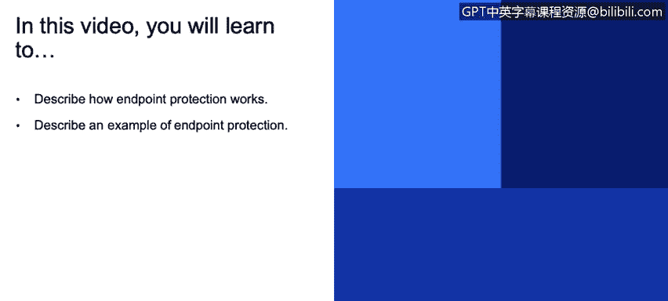
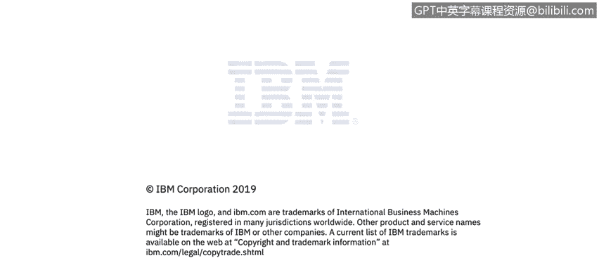

# IBM网络安全分析师专业证书课程3：《网络安全合规框架与系统管理》compliance-framework-system-administration - P17：16_端点保护和响应.zh - GPT中英字幕课程资源 - BV1cj411z7Li

In this video， you will learn to。Describe how endpoint protection works。😡。

Describe an example of endpoint protection。

So let's talk about endpoint detection and response。

 So endpoint detection response or EDR is kind of a newer term that has come up。

 It is protecting the endpoint and responding to attacks in addition to or on top of more traditional antivirus solution。

 So you may you're probably familiar with antivirus and how that works and the things that we're trying to protect on a specific endpoint and。

Prevent viruses from causing problems to the endpoint， but EDR goes a step further than that。

 so it has some capabilities associated with it， which are deploying devices with network configurations it will also do things like automatically quarantine or block non-compliant endpoint so if my EDR solutions sees that I don't have a particular patch level or I don't have particular software installed。

 then that EDR solution would block me from being able to to get to anything on the network on the corporate network until I get to that patch level or get the requirements or they should say a prerequisites that are needed in order for me to do that and typically when we quarantine an endpoint the only thing that we're going to get access to is the actual EDR solution for those patches or those applications to be downloaded and put on that end。

Point in order to make it compliant with policy。 It will also have the ability to manage lots of devices at once。

 So my EdDr solution will have the ability to distribute patches to all of the endpoints in my environment so that I can keep them compliance and give them the requirements they need to access。

Resources on my network。Endpoint detection and response has those kind of things we talked about before。

 like automatically atmatic。Policy creation for endpoints。

 so I can create policies that will tell me what the requirements are or set the requirements are for endpoints。

 to access things on the network。 They will also be able to do things like zero day Os updates。

 You probably heard of zero day vulnerabilities where there weren't any really any heads up to those vulnerabilities。

 And there're very quickly patched and。And remediated by an Edr solution。

 And then it provides also continuous monitoring and patching。

 as well as enforcement of security policies across all the endpoints in my environment。

 So it's giving me that ability to manage every device in the environment in order to keep them up to date and minimize the vulnerabilities that can be exploited by someone who wants to get in my network。

So when you're talking about an endpoint security solution there really are several facts to consider when we're evaluating them。

 one is threat hunting， my ability to go and see what threats are present in my network and minimize them or find out what happened when a threat has been has been detected and do some investigation around that。

 how am I going to respond once I found a threat， so am I going to quarantine。

 am I going to segregate that machine from the rest of the network。

 what am I going to do to investigate to minimize the。😡。

What's going to happen to the rest of the environment when I do find something that's going on。

 So how am I going to respond to that， And then also user education is really important。

 What you'll find or is that about 50% of events， security events are actually insider events。

 And when we say an insider event， It doesn't necessarily mean that it was malicious。

 It could be an accident， but it was caused by an employee going to a bad website or clicking on a link in in a phishing attack or some other way that that I have been infiltrated。

 and it was it was through an employee's ignorance or malicious behavior。 Like I said。

 it doesn't necessarily have to be malicious behavior。 although of that is something to think about。

 So user education is really important because of the amount of threat。

