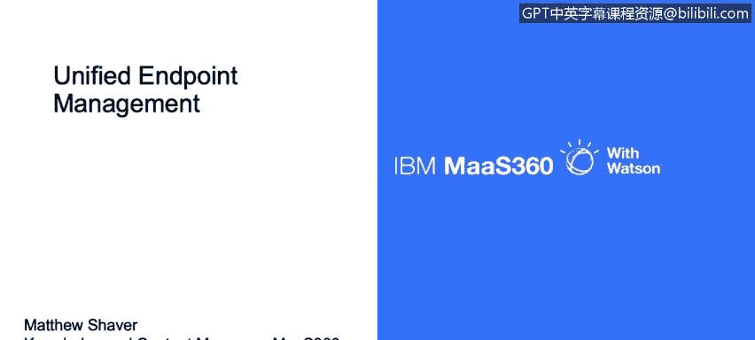
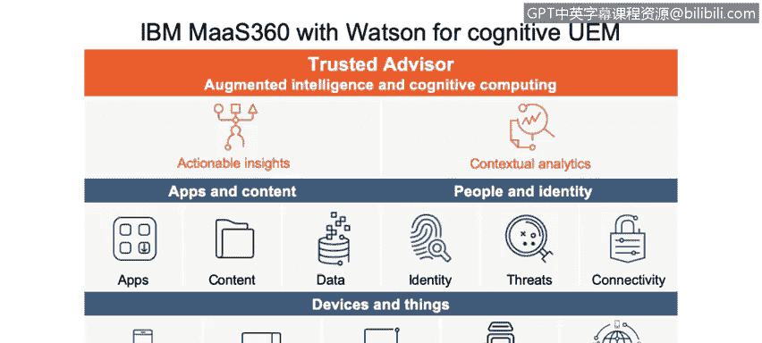
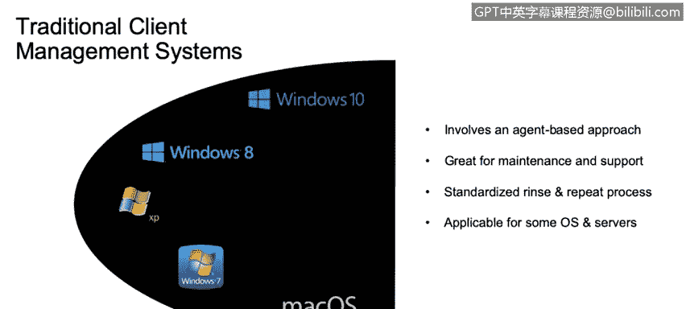
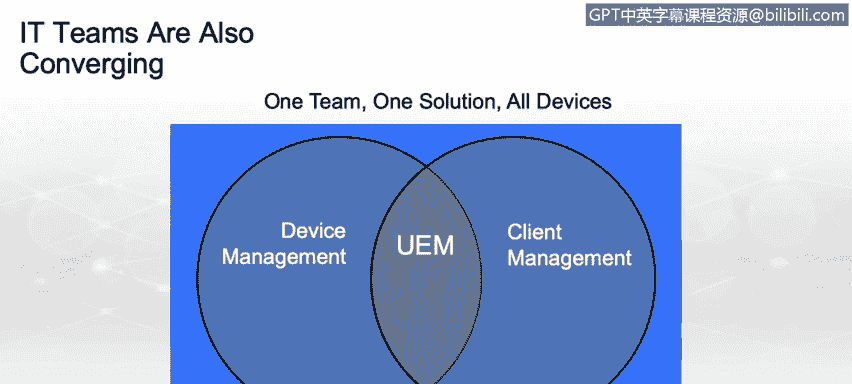

# IBM网络安全分析师专业证书课程3：《网络安全合规框架与系统管理》compliance-framework-system-administration - P18：17_统一端点管理.zh - GPT中英字幕课程资源 - BV1cj411z7Li

My name is Matthew Shaver， knowledgeled and content manager here at IBM。

 And today I' am going to be talking a little bit about unified endpoint management or U。

 what it is and where it fits into the modern enterprise ecosystem。

While device management is not a new idea。 It has evolved quite a bit over the past decade or so to reach the point that we are now at called Unified endpoint management。

 Tradal mobile device management solutions were built for a simpler time。

 relatively straightforward when smartphones hit the market。

 there was this really loose set of Apis that could be used and their impact on the device could be critical。

 but the number of them was relatively few， for example， wiping a device was a pretty standard idea。

 If a organization felt that there was a security breach they could do so through an MM solution。

 or even via an active sync command from the mail server。

 Blackberry came along in the flip phone era， and brought this idea of enterprise management over mobile devices specifically mobile phones。

 there would be leveraged in the enterprise。 It consisted of an onpre solution that was placed into the environment and could speak directly to the Blackberry devices。

However， when we started to get more and more device types out there， namely ios and Android。

 there became a need for a kind of centralized management solution that could handle everything。

 And that's when MM solutions started popping up， such as mastery 60。

 and they could handle these devices through Apis that were embedded in the actual operating system。

 Well as time went on， there is an increasing demand to be able to manage all devices under a single umbrella。

 no matter what they were， where there are desktop， laptop， smartphone or tablet。

 So where unified endpoint management really starts， the foundations of it。

 are the devices themselves。 and now Internet of things。 So smartphones and tablets。

PC desktops and laptops and servers， smart connectivity devices。

It's not just the devices that need to be secured。 However。

 there's a lot of content floatinging on or around there。

 It's not only important that we secure existing enterprise content。

 but that we be able to separate it from the personal data and remove it， if necessary。

 without impacting any of that user's personal information。

 The next layer is the people and identity。 the people that handle the devices themselves and what they use to authenticate into these various systems that are supported on mobile devices。

 So all these layers really come together as unified end point management。

What does this journey look like， So we have the devices， the things， the apps and the content。

 the people and the identity。 Well， let's say I come into a new organization。

 and I have my personal smartphone with me When I start my job， They issue me a company owned laptop。

Via these systems， I get my devices enrolled。 One is marked specifically as B Y O D。

 The other is marked as a corporate owned asset。 And because of that。

Different compliance rules are held over these devices， Different sets of monitoring。

  different actions will be taken if I fall out a step with the enterprise guidelines。Not only that。

 but now I can receive corporate apps and content on my personal mobile device。

 and the company retains the ability to remove just those apps and just that content without impacting any of my personal features。

And in order to get enrolled in all of this， I am provided a set of credentials by the company that sinks across these platforms。

 So I have the potential to enter credentials just one time on my mobile device。

 and that not only enrolls it within the mastery 60 solution。

 but also pushes down all of my email configurations， corporate document access。

 intranet resources without me having to authenticate subsequent times。 And， of course。

 management is crucial to all of this， but also insight being able to see into my environment。

 understand what's out there， understand where threats might lie。 what happened。

 what can happen and what should be done as something happens。 So the policy engine。

 the compliance engine and device monitoring things like malware antivirus are all encapsulated by this unified and point management in the context of this environment。

 taking a new approach， going from digging through old news articles and blogs randomly scouring Twitter。

 trying to find out the newest threat。that are on the market being proactively alerted on this information。

 asking questions and getting answers is becoming more and more important So unified endpoint management isn't just about giving you a platform to manage devices。

 but also educating you on what is out there in the market。

 getting knowledge directly to the admins that are managing these devices on a daily basis as well as the end users。

Understand that best practices can change across verticals and even depending on the specific devices you're deploying。

 as well as company size。 So there isn't a general set of best practices that works for everybody。

 We can make recommendations， but those recommendations are much better if they're suited to your environment。

Developing an action plan can also be replaced with taking immediate action within context。

 If a threat hits the market that impacts the devices inside your environment。

 you don't want to have to go through weeks and weeks of meetings to decide how to resolve it。

 You want immediate action。 Unified endpoint management can take that action for you。

A lot of this comes through admin setup at the very top of our pyramid here is cognitive。

 Mastery 60 with Watson， that's our cognitive piece here， provides a trusted adviser。

 augmented intelligence and cognitive computing。 What this means is that we can provide you with automatic。

 actionable insights and contextual analytics。

We can show you app ratings to understand that if an application is on the market just because it's past the play store or the iTunes store security checks。

 doesn't mean it's 100% right to be inside your environment。 So app ratings。

 contextual analytics can provide additional insights there。

 We can also group devices together automatically as new threats hit the market。

 If there is a security vulnerability in a particular version of an operating system Once an insights can gather those devices into a group set them up for you display them So the admins are aware of it。

 and provide you with a method to provide automatic action over those devices。

 whether it's a simple removing them from the environment or something more stringent。

 like a complete wipe of the device。 And on top of this again， we can provide the apps。

 the content and the data。 The people and the identity security to connect these devices。

 as well as the devices themselves。

3 chins， reshaping mobility， platform convergence， the Internet of things and identity management bring this idea of unified endpoint management to a close。

Traditional clients had agent based approaches。 install an agent that takes over device management。

 installs patches， takes care of maintenance， rinse and repeat process， new device， new employee。

 IT A and takes it， images it and provides it to the employee。

Mobile device management was an API based approach。 The solution is already embedded in the device。

 You just need a certificate or an agent installed to unlock those capabilities and manage them。

Security and management of corporate mobile assets also became important。

 containerized dock retainers， email， secure access to information that can be removed without impacting the user's personal assets。

Specialize for over the air configuration， you don't have to be hands on with these devices。

 there's deployment programs so you can ship them directly to your users and they will be forced to enroll them before they can ever get started working on the devices。

So modern unified end point management brings all of these ideas together under a single umbrella。

 Tra client management and MDM API， sometimes working together on the very same devices。

 but covering all the major platforms that are out there today。

So there we have it， that's the basics of unified end point management， device management。

 client management coming together， one team， one solution， all devices。

 U or unified end point management。

