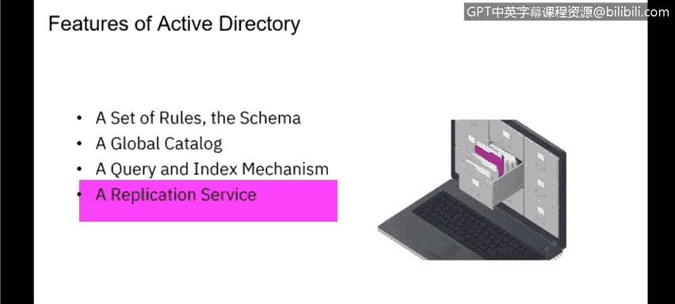
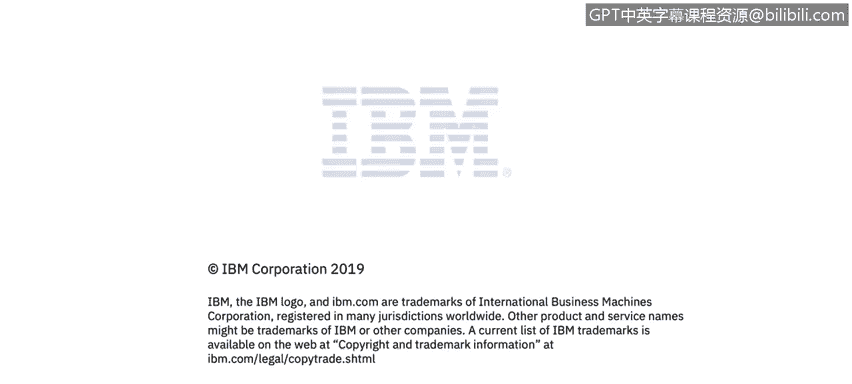

# IBM网络安全分析师专业证书课程3：《网络安全合规框架与系统管理》compliance-framework-system-administration - P28：27_Active Directory的功能.zh - GPT中英字幕课程资源 - BV1cj411z7Li

In this video， you will learn to describe active directory。

Describe active directory features。Okay， so we're going to talk about active directory and active directory is really the predominant directory system that you will see that most enterprises use if they don't have a homegrown directory。

 they're probably using active directory to control users and and permissions and those kind of things。

 Act directory or AD is really a system that stores information about things on the network and makes that information easy for administrators to and users to find。

 so it will control things like your network folders。

 network printers anything that a user may need to be able to get to to do their job can be controlled by AD and AD stores those information about those resources as well and permissions and controls the permissions as to what you can get to what we're seeing now is many organizationss IBM and。

I moving to what we call Azure active directory so instead of having physical servers on site。

 they're moving to a cloudbased directory service and Azure Act directory is Microsoft cloudbased directory service so when I log into my laptop it's actually logging into an active directory that sits on Microsoft cloud and pro permissions that have been set by the A administrators within IBM that are logging into their AD console through the cloud so there's nothing onprem for IBM with active directory and many organizations are moving to that because it's more convenient the objects that are that are included in active directory are things like servers volumes so when we see volumes that a driver folder printers and network and computer accounts。

 so active directory will have both a computer account as well。

A network account so really what this gives active director the ability to do is control both of those things so even if I have an AD account if the computer that I am logging into does not belong to AD does not have an entry into the AD I will not be able to log into active directory and vice versa so if I have computer account that is on AD but not a user account obviously I won't be able to log into AD and I won't be able to log into that computer either because that computer belongs to active directory a nice thing about active directory security is really integrated into it through authentication so when I type in my password or use my fingerprint I'm accessing the active directory which tells resource that I'm logging into in this case a laptop or a desktop it tells it tells that machine what things I have access to。

Can I get to this server， Can I get to this directory， Can I get to this printer。

 and that's all done through that policy based administration。

 which is part of active directory and which is controlled by your active directory administrator。

There are some features of active directory that might be interesting to discuss and really the features of Act directory and what Active directory really is is a set of rules or a schema and that really controls what end users have access to so the rules are these things that are controlled by the AD administrator which tells groups or users what they can get to。

 it has multiple hundreds， frankly， of settings that can really provide granular control of what users can do in an AD environment。

 it also controls things like your password policy， your password complexity。

 anything security related is controlled through active directory it also has a global catalog so as a user I can look at what things are in global catalog and that will tell me if I have access to it。

 what other user。What other machines， what servers I have access to what printers might be available for me to print to and those kind of things。

It also has a query mechanism so you can go in and search active directory for things like servers and printers and other resources that you might need。

 And then it also has a replication service。 So if you have a large active directory or if you want to protect your active directory。

 that replication can go to multiple servers。 So you may have AD servers placed geographically within your environment to spread out the load between A servers。

 Now， as I mentioned before， many organizations are moving to a cloud based A， Azure A。

 and then that requirement for replication goes away because it's all done on the back end by Microsoft。

