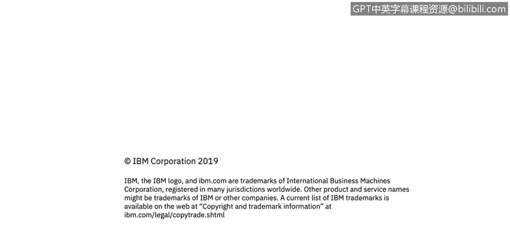

# IBM网络安全分析师专业证书课程3：《网络安全合规框架与系统管理》compliance-framework-system-administration - P32：31_Windows审计概述.zh - GPT中英字幕课程资源 - BV1cj411z7Li

In this video， you will learn to。Describe auditing and access control for Windows Ser So another facet of cybersecurity is around auditing and when we talk about auditing it's establishing a policy and looking at monitoring the creation or modification of objects to track potential security problems we talk about monitoring objects we're talking about typically files or folders and in this context on a Windows system and it does really a couple things it helps ensure user accountability and it can help provide events evidence in the event of a security breach so let's dig into that a little bit when we talk about user accountability 50% or about 50% of cybersecur events are internal meaning that it was caused by someone within the organization now that doesn't mean that every single security event that is internal was caused by a bad actor it could very well be that someone clicked on a link。

Accidentally or didn't know any better。 So it's user for lack of a better term ignorance that may cause a lot of security events because cybersecurity bad actors are getting very sophisticated in what they can do。

 You know， you'll get emails that say， click on this link that'll take you somewhere that downloads a file or to your computer and then helpbreaks loose within the environment。

 So looking at。Things on a machine or on an endpoint or a server for monitoring that auditing of those objects is really。

 really important because when you look at a cybersecurity event。

 it is mostly how they start mostly is a file is either dropped onto a system or is modified in order to start a chain of events that will cause some problems in the environment。

 some malicious activity in the environment and from a Windows perspective there are nine kinds of events that you can audit and those events are in the security log which we talked about a little bit earlier which is parsed into the Windows event log or I should say the Windows Even viewer and that's what most people will monitor in their Windows environment to check on these kind of events and we talked a little bit earlier about how folks will use an event。

eror a log parser and or a SIM to look at those events so the nine kinds of events you can talk on are account log on events。

 so this is somebody logging into a system and and logging in remotely is really what we want to make sure that that we're auditing because if someone if you look into a system and see that someone has tried to log into it a thousand times within a second you're maybe an example of a brute force attack if someone just trying to check random passwords to see if they can log into the environment you can also look at account management so this can be auditing with someone has changed an account name enabled or disabled an account or created or deleted an account or change a password so if you notice that a ton of accounts being created in a very short amount of time that may be something that has to be investigated from an account management。

And then directory service access。 So when someone accesses an active directory service object。

 that has its own access control list as well。 So if someone is trying to get into a particular system in the environment。

 like I said multiple times in a very short amount of time。

 that might be an example of an event that needs to be investigated。

 And there are other events as well， log on events。

 So when someone has is trying to log on or off of a computer either while physically at the computer or trying to log on over a network。

 and then again， looking at how often that is occurring， if it's the same person。

 where that log on is being attempted from because with seeing the IP address。

 we can 99% of the time determine where that person is。 at least within a specific geography。

 obviously we can't get to the exact desk where they are。 but you can know this is from a cafe。

In Somalia trying to log into a system that's located in Kentucky we probably want to investigate that。

 We can also look at object access so if someone has used a file folder or a printer or another object and you can also so anything that can can be accessed within an active directory can be audited to see who access it and when and for how long you can also audit policy change so if attempts to change the local security policies and change user rights assignments those will be tracked within Windows and can be audited so if I am a local admin on my machine and I go in and try to change local security policy to disable the password or to make the password less secure that will all be tracked by Windows and an organization can audit that to make sure that it's not being of use and privileged use so when someone performs a user right that will also be。

Be tracked and also track processes on the endpoint such as when a program is activated or process exit occurs。

 so as an example， I'm an admin on my machine and I go into the task manager and stop the AV process because it's slowing down my machine or I should say。

ca I feel like it's flowing down my machine that will be tracked within within security center and then I can audit that and ask you know and investigate that why someone turning off their AV and take appropriate action and that's just an example of the kind of thing that could be audited within process tracking and then system events。

 so when someone shuts down or restarts the computer when I more importantly when an application or a program or even a process tries to do something that it doesn't have permission to do。

this could be an example of a security event where someone is trying to do something malicious in the environment。

 they're trying to have a process， do something to access a remote computer or access a remote database or anything that it doesn't have the rights to do with the purpose of causing doing something malicious in the environment。

