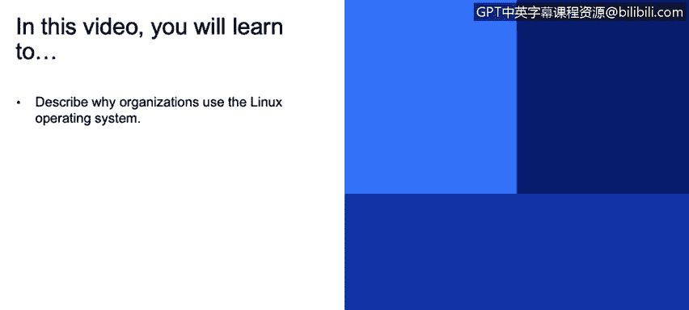
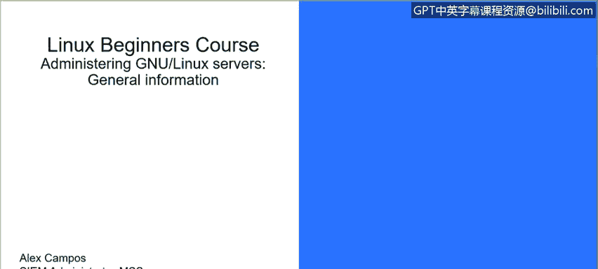

# IBM网络安全分析师专业证书课程3：《网络安全合规框架与系统管理》compliance-framework-system-administration - P33：32_Linux简介.zh - GPT中英字幕课程资源 - BV1cj411z7Li

In this video， you will learn to。Describe why organizations use the Linux operating system。

 Hello everyone。 My name is Alex Camps， I'm C I'm an administrator in MSS IPBM Security。

 and today we are going to start with the Linux course for beginners。

So Linux is a multius multitasking operating system which provide a number of facilities including management of software resources。

 directories and file systems， and allowed in execution of programs。

The Uniux of Perth system got started in 1969 at Bell Lava Atatories。

And was written in assembly language。Then in 1973， Thompson and Richie succeeded in rewriting Euchs in the new language that was C。

In September of 1991， Lenuus tour balls。Release the first version of what it was to become the Linux kernel。

Troubs greatly enhance the open source community by releasing his license。Under the G N new license。

The GNU license is a widely used for free software license。

 which guarantees the end users the freedom to run a study share and modify the software。Now。

 why Linux， well， this system is flexible enough to allow users to build applications。

With a wide variety of support tools， social compilers， scientific libraries， debuers。

 and enabled monitors。Lleenux has also four essential properties。

 which make it an excellent operating system for science community。Performance， function。

 flexibility and portability， Per of the burden system can be optimized for a specific task。

 such as a run small portable devices or large supercomputers。Now。

 how does the Linux work Well there are two major components of Linux， the kernel on the shell。

The kernel is the core of the Linuxux operating system。

 which includes the processes and interfaces directly with the hardware。

 It manages the system and users。Processes， devices and files and memory。

The shell is an interface to the kernel users input command。

Through the shell and the colonel receives the task from the shell and performs them。

 The shell tends to do four jobs repeatedly。One， display the prompt。2， read the command，3。

 process and give the command and4。Excuting command。

