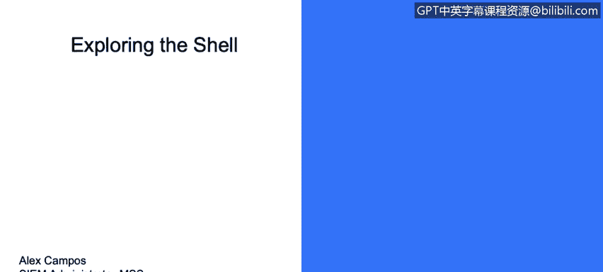
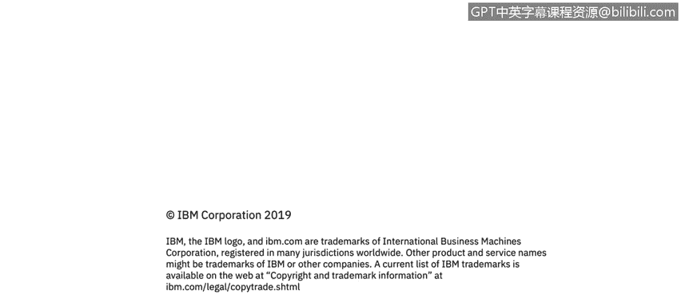

# IBM网络安全分析师专业证书课程3：《网络安全合规框架与系统管理》compliance-framework-system-administration - P36：35_探索Shell.zh - GPT中英字幕课程资源 - BV1cj411z7Li

In this video， you will learn to。Describe the common shell choices within Linux。

Now we have the different shells here but what is a shell well the shell is a program that takes commands from the keyboard and gives them to the operating system to perform in the old days it was the only user interface available on Linux operating system but nowadays we have a graphical user interfaces like De in addition to the command interfaces such as the shell we have here。

2 shells， that is the bash， which is the most common default shell for user accounts。

 And we have the S H。 It is not often used in Linux。

 but it points to the bash shell or other shells as well。Part of that， we also include。TC。chll。

The TC。This shell is based on the earlier seahell。 It was fairly popular。

 but not major Linux distributions take it as they fall shellll。 Then we have the CsH。

 that is the original seashell， but it isn't used much on Linux， but it。

If a user is similar with familiar， see。S， H and T C， S， H takes a good substitute。

 It is basically used for program programs based on C language。

Then we have the corn shell that is known also as key。

S H that was designed to take the best pressures for of the burnish shellll and the seahell。

And extend them。 So it has a small but dedicated following among Linux users。

 Then we have the Z shell that takes shell evolution for an identity core shell。

 incorporating fixture from the early shells and adding steel more。

