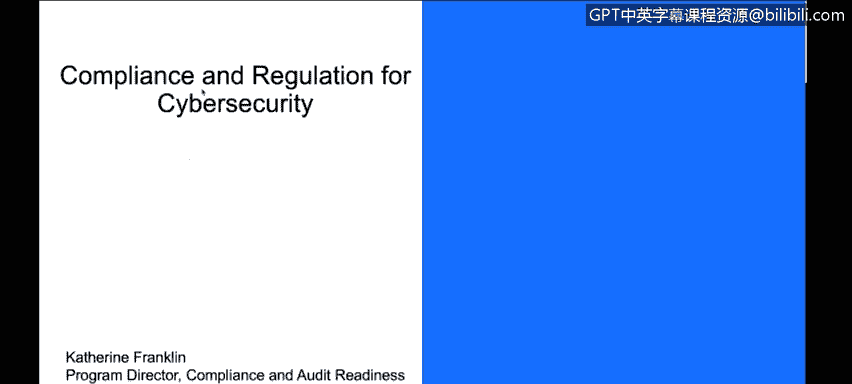

# IBM网络安全分析师专业证书课程3：《网络安全合规框架与系统管理》compliance-framework-system-administration - P3：2_组织面临的网络安全挑战.zh - GPT中英字幕课程资源 - BV1cj411z7Li

In this video， you will learn to。Describe the challenges organizations face which require compliance and regulation welcome My name is Catherine Franklin Im program director for Comp and Audit Readiness at IBM and the cloud and cognitiveognitive So Division。

So today we're going to be talking about different topics associated with compliance and regulation for cybersecurity。

 there are a number of different compliances and standards and laws and we'll try to detangle some of that for you and give you some places to start as you consider these topics for your own purposes。

So first off， let's get some definitions set。We have different types of security definitions。

 we have security eventss， attacks and incidents。And they are all they're all related。

 but they're different A security event is a system or network detected by a security device or an application。

 so this can be any normal activity from you know entering a password。

 that's a security event it can be a firewall rule check that's a security event it's not the same as an attack an attack of course is a subset of the event and that's when you actually have some entity or tool or person attempting to do something malicious or untoward with your system it can be trying to collect data。

 corrupt your system， create a denial of service， destroy your system anything like that that any attempt of that as an attack。

An incident then is when IBM and the world at large would consider it something worthy of deeper investigations。

 so we think that possibly something bad actually happened。

 so we had the attack which was the attempt and we had the incident which means we think maybe something actually had happened and we need to go and figure out what happened and what we're going to do about it。

So the challenge for security is that of course there's so many of these events right you're always entering your passwords。

 there's always something that's checking something else this is a report from the 2015 fiber intelligencetelence Inex from IBM and they identified in the cloud space that there are roughly 82 million events and in 2014 of which。

1wel，000 ish represented an actual attack and 100 represented an incident。

 and this would be for an individual system。I think a big misnomer that our big misconception people have is that their systems are somehow safe because they're not seeing things well probably you're not seeing things because you have firewall rules and other activities that are in place and they block a lot of that for you so what you're really seeing is the distilled things that you're actually concerned about but the main objective is how to put in。

The security controls that you need to for all of these events so that you can find， prevent。

And protect against the attacks and the incidences。Well。

 there's no one way that you protect the system， there's hundreds of different ways that people will attempt to maliciously attack your system。

 there are so you need multiple different facets and approaches if you again look at the same study。

 2014， they look at the different sources or types of security attacks that were identified。

 we have unauthorized access， malicious code， sustained probes and scans。Acs credentials。

 denial service， right so you can see a whole list there of different ways that people are that attacks tax breakdown into different categories。

And even who your bad guys are， that breaks down into main categories。

 you can see about 45% of all bad guys are outsiders， they are not part of your business。

 they are not part of your environment， but they are trying to get in。

These are the hackers of the world， these are the they can be individuals。

 they can be organized crime， they can be a number of different sources the other 55% represent insiders these are people that may be working in your own organization you know you think okay I know and I trust everybody。

But the truth of the matter is that some folks are in your organization may become dissatisfied over time and so you'll see a number of malicious insiders。

 you can also see inadvertent actors on the inside right so these inadvertent actors are people that have access to your systems as part of their normal days and functions and we're human。

 they make mistakes so we need security protocols and controls and tooling and processes in place。

To try to address the different types of。Security incidences we can have。

 as well as the different sources they can come from。

You get tired of entering your password every day all day all the time well it's there for a reason it's there to make sure that you have they all have a purpose each one of these things and it's not about having any one security protocol in place to help you。

 but about having a set of them to address the different scenarios。So think about this。

 you've got an outsider， he wants to get in， the outsider wants to get in。

 they want to steal your data， they want to steal your compute time。

 they want to disruptstruct your legitimate use of your products of your services。

You've got to look at different techniques specifically addressed for them。

 you're looking at encryption， you're looking at。You're looking at firewalls。

 you want to validate these through reviews， through tests， through threat models。

 penetration testing， there's lots of different ways you're going to deal with that particular actor。

The inadvertent actor are on the inside but are human， They're making mistakes。

 You want to want to make sure there that you have systems in place and procedures to reduce error related related controls。

 You're going to be prompting for confirmation of things。

 You're going to be looking for automation to reduce human data entry errors。

 And so you're going to look at different sorts of。

Automation and reports and things like that to try to prevent those things from happening。

The malicious insider they're inside but they're deliberately behaving badly。

 so there you want to make sure you focus on things like separation of duties。

 you want to make sure you have limited privileged IDs。

 you want to limit the access to your critical systems。

 your critical data to just the fewest people possible。

 reduces the risk that those people are malicious。And you want to make sure you have individual accountability so no shared user IDs and you're logging and monitoring whatever that those limited IDs are actually performing and you're reviewing that on a regular basis。

