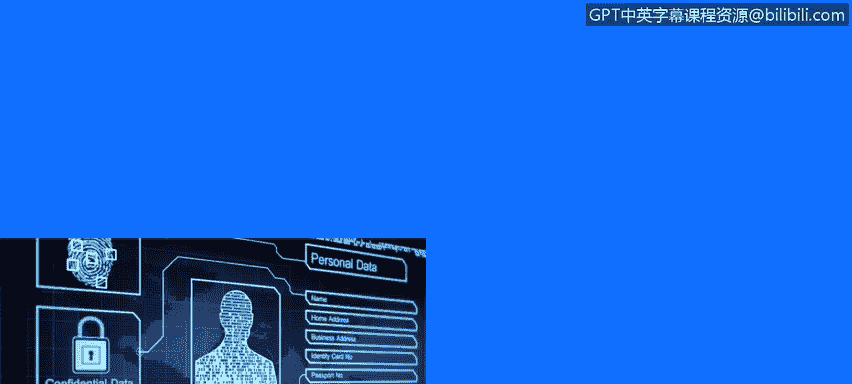
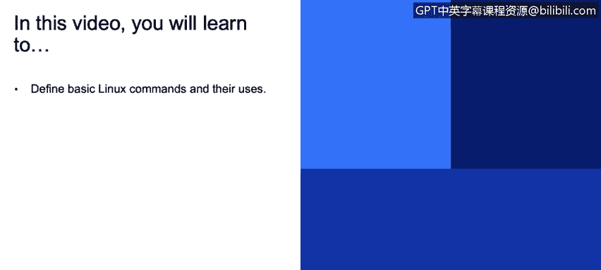
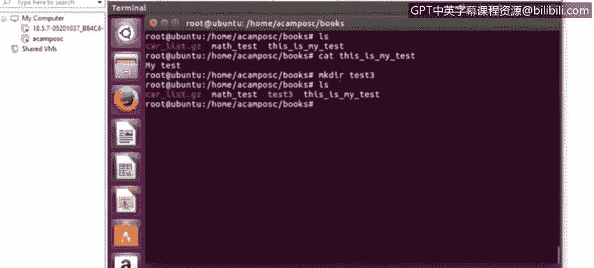
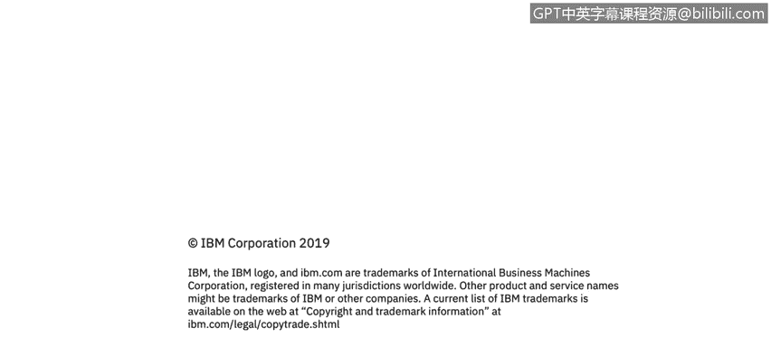

# IBM网络安全分析师专业证书课程3：《网络安全合规框架与系统管理》compliance-framework-system-administration - P40：39_Linux基本命令(3).zh - GPT中英字幕课程资源 - BV1cj411z7Li

In this video， you will learn to。Define basic Linux commands and their uses。

Now， we have the remove。Command that is represented by Rm。It will， if。

 if we use R M to the remove a file。If we use the flag dash。

I and the name of the text for file that we。When I remove。

 it will display the confirmation before removing the file， so。This is very useful。

In case you don't want to delete or remove that specific file。

Sometimes you have a directory that contains subdirecties。

 and you w to delete all the folder with all the information in there。

But the system will dont allow to delete。Until you add the flag dash R that will remove all the files in there。

If you， if you don't add the。Dash R。 it won't。Let you delete all the information。

 So you just need to go delete one by one。 So in order to avoid that， it is just simple than adding。

Dash or。In the command。In order to remove a directory that is empty。

 we just need to use the R MD command and then the name of the directory there you w to delete。

Then we have the copy command that is used to copy files or directories。The command is Cp。If。

 if we use the， the flag。Tash P， it we will preserve the ownership any time step。

 But if we use the dash I， it will override the。Information。

 so it is really important to make sure we're using the correct flag here。

 So in order to use the Cp command， we just need to use Cp。

 then the flag that we are going to be using。They found that we are。

When I copy and then the the file that will be overred as well。

Then we have the move command that is represented by MV。It's basically the same of the copy command。

If we use the Fl dash I， it will overwrite the existing file。But if we use the dash V。

 it will be explaining what is being done during the movement of the file。So basically。

 we just need to use MV and then the flag and then the file that we are going to be moving and the location of the file that will be saved or move。

File。Then we have the CAD command that will display the content of the text files。

And also we have the MK De。That is used to create directories。

And the different path locations in our distribution。So if when to， if we want to see。

If we want to use CA。Let's， let's see。The information that we have on the books directory we want to see what is the information that this is my test file contained。

 so if we use CAAT and in the name of the file， it will display the information that is in that specific file。

Then if we want to create directory， we just need to。Type， De Mca dear。

And then the name of the directory that we want to create。I'm gonna grade test， free。

And if we run Ls to see what is the。Information in there we will be seeing the test3。

Created as a folder。

Now， maybe you're wondering， what about if we want to create a directory with some subdirecties？Well。

 in this case， we just need to use the flag dashP and it will be creating all the subdirecties。

That you want to create as well。Uing emca dear。Now we have the if Comp command that will display all the information about the network interface on the Linuxux system。

If you want to see all the interfaces along with the status， you just need to use the flag dash A。

If you want to start or stop a specific interface。You just need to use up or down command along with the iPhonefig。

And the interface。So in this case， we're using ifcomP。It's the our zero。An app。

 this means that this interface will be。Going up， if you just want to shoot down this interface。

 you just need to use down。Then we have what is command， that it is very useful command。

 It will display a description about a command。 So if you really don't know what。

That committee is useful。 You can use what is。And then the command name。

 and it will display the description of that command。

So it is basically same the same of the man command， but it will just display in the description。

 the man command will display all the information and the flags that you can use with that command。

Then we have locate command that it will help you to quickly search for the location of a specific file or maybe a group of files。

 So you just need to use locate and then the name of the folder file that you are looking for。

 and it will display all the pad。Fileles that contain the name that you are looking for。

Then we just have detailed command that will be used for view the end of our text file， for example。

 the last 10 lines by default file。You can print a number of files。OrOr from a specific file。

 for example， tell D end and then the for example， we can use4。

5 or any number of lines that you want to see。Of file name that T X T。

And it will just display that information from the last。Andng。Number of lines you wanna see。

Then we have the last command that is very useful for huge log files when you're doing a trouble shooting。

 for example， or investigation and you have a very big logs。Fileles。

 and you just need to see all the information with less， you will be seeing。The information needed。

 And it wont display all the information at the same time。 So if you hit。The space key。

 it will be showing。Theform。As soon as you hate Dicky。So it won't display all the information。

At the same time。 So it is really useful for investigations with big log files。Also。

 you can use control F or control B to forward one window or backward one window。

 They are very useful keys and command that you can use for investigations。Then， we have the。

S command， it is used to switch to a different user account。

So you can execute a single command from a different account name。So， for example。

 in the glow example， yen。Can execute the LS command as Rash username Once the command is executed。

 it will come back to John's account。Also， you can use Z to just switch to， for example， my user。

 a campus2 route user， so you just need to use SU space dash。You， and in the user account， you wna。

Switch。Then we have the W get command that is very useful to download software music videos from Internet。

 sometimes。We have our environment and we need to do an operate。

 and instead of downloading the file from the internet， then copying the file to our environment。

It is just simple to use WGt and the URL where the software is located。

 and it will just start to load it the file directly to our system。 So WG， it is very useful。

For downloading software to our environment。Without doing the copy and the loading。

The defile in different way。So those were some basic commands that we can use in our distribution。

 Of course there are a lot of more commands that we can use。

 Well those are the basic command that we can use。

