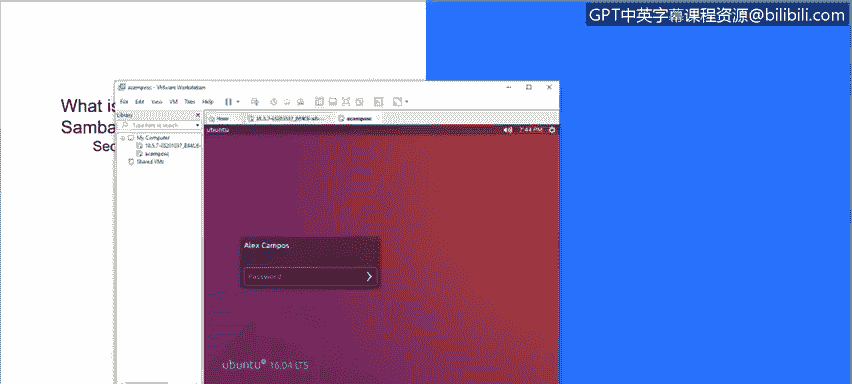
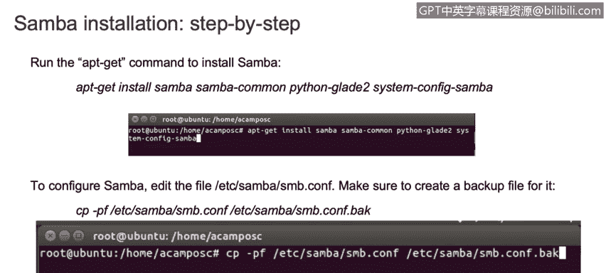
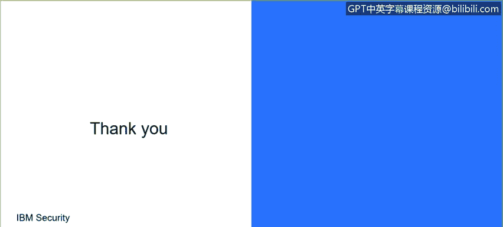
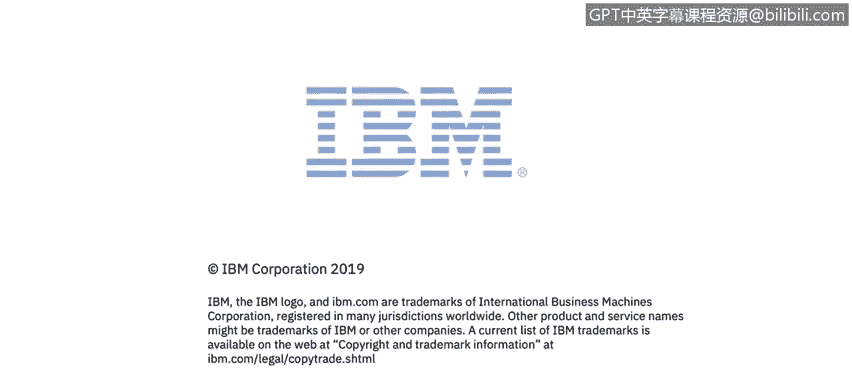

# IBM网络安全分析师专业证书课程3：《网络安全合规框架与系统管理》compliance-framework-system-administration - P41：40_Samba安装和配置演示.zh - GPT中英字幕课程资源 - BV1cj411z7Li

In this video， you will learn to。Describe the installation steps necessary to use on。

Now we are going to talk about Sammba and the step by step installation。

 So let's suppose that we already have our Bto machine and we have our Linux distribution install in my case。

 I'm using divbutu distribution。 you can use send OS or Linux。

But what is Samba。

So Sba is an open source of free software suite that provides seamlesslies file and print services。

 It uses CCPTP protocol that is installed on the host server。

If you configure correctly this software， it allows you to interact with the Microsoft Windows Cloud or server。

As if it is a Windows file alarm print server。 So it allows for。

Establish communication between Linux and your server。 So for example。

 I have a year my Linux distribution， and I just want to share files or information between my Windows host and my Linux。

Sver。So we're going to learn how to do that。 So basically。

 we just just need to run the following comments。

On our Linux。Distribution。And we will get the installation then。As soon as it is installed。

We will see the following file that is under ETC Sammba。

And we just need to do a backup of these file because we need to add some lines in there。

 So in order to do that with the CP command， we're going copy the ETC samba SMB do co file on the ETC saba SMB adding the dot back。

Station that represents a backup。So as you can see here。

 I already did the the backup of my SB config file。 Now， we just need to edit。

Deefile。And we can just use nanono or VI to edit this file and add the following lines。

We just need to copy this information and paste this into this file。It doesn't matter the order。

But we just need to make sure that we have all the lines。In that file。

Then we just need to create a directory。With the emca your command。Our directory is under Samba。

 and the name is Ananimous。Then we just need to set up the permissions for this specific folder。

And then restart this service to allow us to establish the communication。

 The name of the server is Amba， so we just need to use service。SMBD resort。As soon as we do that。

 we just need to jump to the Windows host。 In this case， our computer and on the network。Folder。

 we just need to to add the I P of our。Linux box。In order to see the I， we just can use I config。

And it will display all this information。 the I， the interface and everything。

If you want to create a folder。But with a password or secure。Bulder。

We just need to edit the same folder， the same file， but we just need to add。The user。And also。

 the following lines to create a folder with a specific password。In this case。

 we are creating this folder。With secured name under December。

And then we are providing the permissions to that specific folder。

And also we are adding the following lines on the ETC SAmba SMB config file that was created during the of SAMba。

 then we just need to restart the service。And we will be able to see the secure folder in our Windows computer。

 And if you try to double click and access this folder， you will be requesting the user and password。

So thank you guys for your attention。 This was the basic Linux training。

We just saw few commands that we can run in different distributions on Linux， also。

We saw the the way to establish communication between N environment and Windows host environment。

So hope you can try to run some comments on your side and。And practice a little bit more about Linux。

