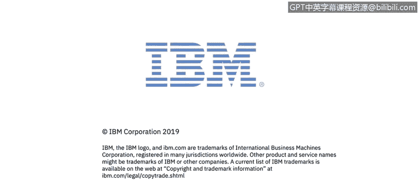

# IBM网络安全分析师专业证书课程3：《网络安全合规框架与系统管理》compliance-framework-system-administration - P45：44_常见密码学陷阱.zh - GPT中英字幕课程资源 - BV1cj411z7Li

In this video， you will learn to。Describe common pitfalls of cryptography。

So let's talk about。Some common problems associated with the use of cryptography in the products that we see。

So the first very obvious one is missing encryption of data and communications。

Products handle all kinds of sensitive business and personal data。And very often， data is。

One of the most or the most valuable asset that the business has。

So when you store it or transmit it in clear text， it can be easily leaked or stolen。

So that's a huge danger and in this day and age there no excuse for。

Not encrypting data thats stored or transmitted there was less focus on it， let's say 10 years ago。

 15 years ago， but these days it's absolutely vital that this is done and we also have the very mature cry cryptographic technology it's well tested and it's available for all environments and programming languages so it's really you basically you don't have the excuse not to use it in your products so our recommendation is to encrypt all sensitive data you are handling and and also ensure its integrity because as I mentioned。

 encryption provides confidentially but not necessarily the integrity。Product owners that we talk to。

Choose not to encrypt certain data because they say that users of their products don't have access to the file system。

The product is running on。Unfortunately， that's not。

Not a good excuse because there are plenty of vulnerabilities out there。

That may allow exposure of files stored on the file systems， such as config files， databases。

 key stores， and these vulnerabilities are， for example， batch reversal， local file inclusion。

XML external entity attacks so the attacker what they could do is they could have what we call a kill chain。

 they could have a set of vulnerabilities that would abuse and they're attacking a particular business and let's see path reversal could be one of them they could steal a database that contains sensitive customer data and then rely on the fact that weak cryptography was used or no cryptography was used and decrypt the data and use it so actually another danger is that a physical machine that the product is running on could be stolen。

Hard disk could be accessed directly。So if the data is not encrypted， it will be leaked and abused。

The general rule of thumb is that you have to assume that the files containing sensitive information may be stolen。

 may be exposed and analyzed by the attacker。It's just just something you have to go on that has to be a basic assumption。

Another problem that we sometimes see is implementing your own cryptography。

Often developers use obfuscation and not cryptography。

 So you may be familiar with something called base 64 encoding or Xor encoding and similar obfuscation schemes。

 Unfortunately， they do nothing for keeping the data secure。

 They're very trivially analyzed and reversed。 So it's not to say that you shouldn't use those schemes。

 but never think that because let's say you base 64 encode at something that makes it secure。

 it won't。 And we sometimes we even see products implement their own cryptographic algorithms。

 and it's just。Very dangerous practice that you definitely shouldn't do。

The such algorithms never stand chance against a serious attacker。And interestingly。

 there's something called Schneer's Law Bill Schneer is a renowned crytographer and coincidentally an IBM resilient CTO。

And what he wrote was anyone from the most clues amateur to the besttographer can create an algorithm that he himself can't break。

 it's not even hard， what is hard。Is creating an algorithm that no one else can break even after years of analysis。

So it's very possible that the algorithm you yourself come up with。

 you cannot figure out how to break it and your colleagues couldn't either， but if you， let's say。

 if your product product you're developing that you're putting that algorithm in is securing。

Data that some， let's say nation state is after those guys have very qualified people。

 brilliant mathematicians and cryptographers， and they'll probably easily be able to break the algorithm that you came up with。

So please don't do that， do rely on proven cryptography。

 the one that was scrutinized by thousands of professionals， mathematicians and crypttographers。

 and theres a National Institute of Standards and Technology in the US and it provides guidance on what。

🤢，Algorithms are currently considered as secure。 so check it out。 It's something。

 it's a good idea to use it in your work， those recommendations。

Another thing that we see is some products rely on their algorithms being secret that they just say well we have compiled application it's all machine code the attacker will never know how internal algorithms Well if you think that well I have bad news for you they can and they will be discovered it's only a question of how motivated the attacker is There is actually a whole branch of hacking cold reverse engineering and it's devoted to discovering hidden algorithms and data。

So there actually are contests out there ongoing where hackers compete on who can reverse a particular application。

The fastest， so people do this for fun， if you can imagine。

 and just imagine if there is some financial incentive there to discover your secret algorithm。

So again， it doesn't stand the chats even if your application is only shipped in compiled form。

 it can be quote unquote， decompiled。🤢，Languages such as Java and Scala and others that go against Java virtual machine。

 languages such as C sharpharp that go that are compiled for donett virtual machine。

 Python and other languages， they're trivially decompiled。

 you can basically recreate the original source code from the compiled representation so if you give me a Jified file for example if you're a Java developer。

 I can most likely decompil it for you and give you back your original source code。It's that bad。

 and even four languages that are harder to the compiles such as CNC++。

Because there are all kinds of optimizations down on the machine code。

 still special tools exist that sort of recreate a C code that resembles your original source code。

 so it's all easily reversible。Atters also like if you rely on your product being expensive。

 an attacker not getting hold of it。It's possible that they would get a trial version that they will analyze or just get a stolen copy somewhere in the dark web。

And also， unfortunately， the reality is that sometimes there are rogue employees that may reveal company secrets。

 there was research done recently that found that more than a third of employees when asked。

What were' willing to sell。Private company data proprietary information agreed to do so。

 and some of them agreed to do it for as little as $155。So you can imagine。

You could have a very secret algorithm that's only kept on company premises。

 not shared outside the company。It really only takes， you know， some， you know， loggue employee。

 so to speak that's financially motivated to steal it and and sell it to the。

To the bad guys out there so relying on algorithms being secret is not a good Japanese mechanism something called security biocurity and it's not no security at all and actually the country is being proven all the time all algorithms that keep us safe today are open source and very well studied so AES RA Sha and all others like all our you know banking communications。

 everything we use technologically today relies on open source algorithms that are very well known and actually that's their strength because so many people have looked at them and scrutinized them。

So all the bugs have already or most of the bugs have already been worked out。

 so bottom line do not rely on your algorithms being secret。

Assume that they'll be known to the adversary and there is also a great guiding rule here called Krkhov's principle。

 August Krkho was a Dutch crytographer in the 19th century。

 what you said was a crypto system should be secure even if everything about it except the key is public knowledge I think it's a great。

Prncciple to use in your work。 Another fitfall that we see is using of hard coded。

 predictableable or weak keys。Not safeguarding your keys is。

It can pretty much render your cryptographic mechanisms useless。Basically。

 the keys to the kingdom so if you don't。Control them， if you expose them。

 then somebody can just use them and use the algorithm that you use to encrypt the data to to encryptrypt it。

When the passwords and keys are hardcode in the product。

 and unfortunately we do see that from time to time， or they are stored in plain textext。

In the config file， they're easily discoverable。If you have。An encryption key that maybe is not on。

Encod in a plain text somewhere， but it's easy to guess。

Atackcker could discover by just trying commonly known passwords。

 there is something called RockQ list out there and there are many other similar lists and it can currently contains 14 million different common passwords so let's say if you're using your email account and you have some password that's not truly random there are high chances that it is actually on this list already so attacker could just try all the passwords on this list one by one and then be able。

 let's say to get into your email account or to cr some data that you encrypted with a common password。

Also， when the keys are generated randomly， they have to be generated carefully from a cryptographically secure source of randomness。

You'll say if you're a Java programme， but the situation is similar in other programming languages。

There is something called Java Uil random and it's a random up pseudo random number generator that unfortunately the numbers that it generates are very predictable。

 so if you generated your encryption key using that source，They can discover your key。

 just bruteforcing so instead if you're generating encryption keys。

 you should use something called Java。security。 secureure random in case of Java and there are similar variants for other languages。

 it's a cryptographically secure source of randomness and should be used when generating encryption keys。

The recommendation is to rely on hard to guess randomly generated keys and passwords that are stored secure。

Proble that we sometimes see is that encryption is expert controlled。

 so any code that either contains encryption algorithms calls encryption algorithms from other libraries or components。

 or directs encryption functionalityity in other products。

 all of them must be classified for expert before being released。

