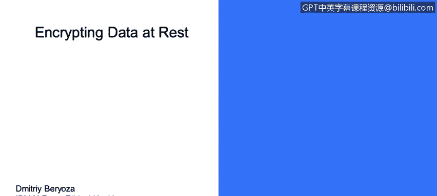

# IBM网络安全分析师专业证书课程3：《网络安全合规框架与系统管理》compliance-framework-system-administration - P46：45_数据静态加密.zh - GPT中英字幕课程资源 - BV1cj411z7Li

In this video， you will learn to。Describe the digital state of data。😡。

Data at rest。So let's go through different types of encryption so as I mentioned rule of thumb is to encrypt all sensitive data addressed files confi files。

 databases， backups， anything of value and sematic key encryption is the most commonly used for that you can follow these guidelines that's the National Centers Institute guidelines for selecting appropriate algorithm currently its AES with the CBC mode and tripleD those are the ones that were approved unfortunately there is number of ways of doing it incorrect first of all some algorithms are outdated and no longer considered secure you have to phase them out。

For example， GES， RC4， and there are some others。So you have to be very careful as time goes on。

 someions， sometime encryption algorithms become inseccurure because vulnerabilities are discovered in them or computing power becomes such that it's now possible or now with there you can probably break an algorithm within a reasonable time given sufficient computing power。

 so watch out for that and migrate to more secure modern algorithms。As I mentioned， using hard coded。

 easily guessed and sufficiently random keys is a huge problem because your encryption is as secure as the key that you chose and how well you safeguarded。

 so you have to select cryptoographict random keys and also do not reuse keys for different installs because let's say you have two customers。

But see you somehow embed the same encryption key in both of them。

 one of the customers has a rogue employee that steals that key， sells it on the dark web。

 and then an attacker could attack the second customer because they now know the common cryptographic key that's used in the product。

 so don't do that。Another problem is storing keys and clear text in proximity to the data they protect。

 something like you could be likened to key under the doormat。

Keys the only proper way of doing it is storing them in cryptographically secure key stores。Also。

 some cryptographic algorithms require something called initialization vectors。

And those have to be chosen at random。Every time you apply the algorithm。

If you reuse the initialization vector， that's another weakness that could be exploited。

And it's preferable to select the biggest key size you can handle。

