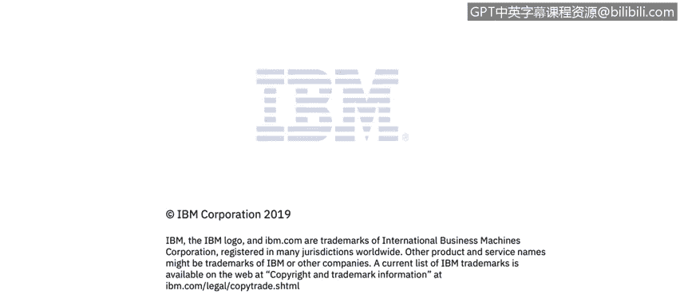

# IBM网络安全分析师专业证书课程3：《网络安全合规框架与系统管理》compliance-framework-system-administration - P48：47_数据传输加密.zh - GPT中英字幕课程资源 - BV1cj411z7Li

In this video， you will learn to。Describe the digital state of data。

Data in transit。So encrypting data in transit is something we're familiar with。

In this day and age there is absolutely no excuse for communicating in clear text， just don't do it。

 there is an industry consensus about it。Recently， Firefs and Chrome started to mark HTP sites as insecure。

 so you know like the sites they use。Encryption for communications。

 the proper prefix for that is HTPS， so the sites that communicate in clear text。

 somebody can very easily snoop on those conversations and discover sensitive information。

So all communications should be encrypted， it's not just HTP that goes in clear text。

 sometimes remote procedure calls， database connections and others go over the wire in clear text and that's just not recommended all please avoid that。

 make sure you encrypt all your communication。TTS SSL。

Algorithms are is the most commonly used protocol， they use a variety of crypto primitives internal。

 public cryptography for authentication， key exchange。

 symmetric key cryptography for actual data encryption and a server presents to the client。

 something called digital，Certificate that references the public key that's to be used in the communications and the C Author。

 and we'll talk more about that a little later。Sometimes some products choose to only use symmetric key encryption and that's fine if it's done securely。

 the big problem with that is how do you securely share the keys between the different nodes。

 so let's say you have different nodes， two different nodes in your application that you' communicating。

 how do you securely share the private keys so that it's not revealed in transmission。

So what are some of the pitfalls， we see self side certificates being used quite often。

 it's basically a certificate that you generate yourself。

It's less problematic for internal communications， it's a much bigger problem if your product communicates over the internet。

And the proper way of doing it is actually to use certificates that are verified by established certificate authority。

 that way you can actually be sure that this is a certificate that comes from the party that claims to have created it。

Some products unfortunately accept arbitrary certificates without validation。

 if you look at this code snippet you may recognize that if you're a Java developer。

 unfortunately we see these from time to time in the code。A deckcker's。

Basically can issue their own certificates， sit in the middle of communication between the client and the server。

 it's something called men in the middle attack。🤢，And if your code contains this pattern。

 you're basically accepting any certificate that comes down the wire。

 so the attacker can give you their own， they can talk to the server on your behalf and they will just basically be listening on all your communications and capture all the private data。

 so do not accept certificates without validation。Unfortunately。

 validation is not enough because in these days attackers could actually create valid certificates。

 they could use some certificate authority and get a valid certificate from it。

And it will be validated correctly when you go to validate it。

The way to deal with that is to use something called certificate binning。And in that mechanism。

The certificate that's presented is actually checked against a set of certificates that you expect to see。

 so you wouldn't just accept any arbitrary valid certificate out there。

 but only the one that let's say one of your nodes expects from another node in your product and that in that case the middle attacks are much higher to do。

What are some other problems sometimes products use outdated versions of the protocol or insecure Cy speeds and old versions of SSL and TLS are vulnerable。

 you can look out there are all kinds of very famous attacks against them， drown， poodle， beast。

 crime， breach and there are others they all have fence names， but basically with over time。

older versions of SSL and TLS were found to be insecure， they had problems with them。

Those problems were subsequently rectified， and today we recommend。TLS version 1。

1 and up so actually 1。1 is still considered secure 1。

2 is the recommended one if you use anything below that you may be in danger so review your the versions of TLS you support and there are a number of tools that can help you with automated tools there is NASA there is Q S server test on version2 it only works on publicly exposed sites there is S scan and SSLs on Linux so use that and see if you re secure。

Another problem is allowing。Downgrade of strength to insecure versions or even to HTTP so to deal with that。

 you have to lock down the versions of teleQ support and don't support any others to not allow downgrade and as I mentioned before。

 using HTP is just not a good idea anymore。Of course you have to safeguard your private keys。

 if you lose control of that， attackers can decrypt your communications。

There are some other recommendations， consider implementing something called forward secrecy。

 some cipher suites protect past sessions against future compromises of secret keys and passwords。

 so look into that。There have been a number of problems with using compression under TLS if you use HPTP compression。

 and that goes over a secure channel。Sometimes attackers can actually figure out your data because it's compressed so there's actually a crime at breach set of attacks that。

That dealt with that so it's it's something to be aware of and the recommendation is if you encrypt something so do not compress statically served pages。

 but try not to compress。Pages that change on slide another administration is implements HTPs strict transport security header。

On all of your communications and also stay informed of late security use from time to time。

 vulnerability is discovered in a certain protocol and you have to react to that in a timely fashion。

