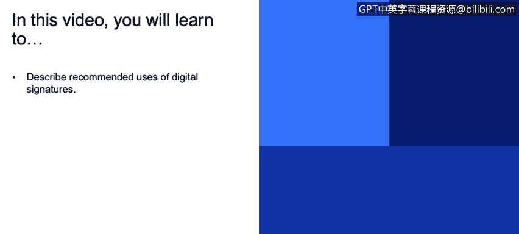
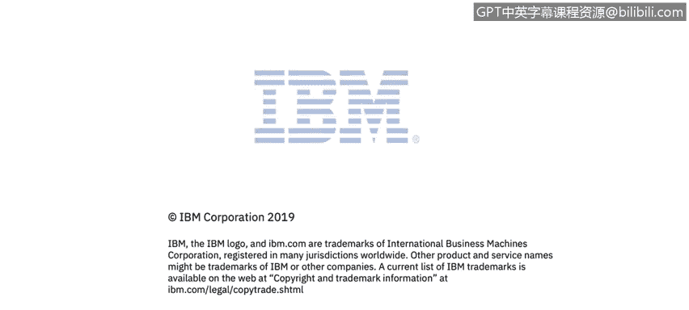

# IBM网络安全分析师专业证书课程3：《网络安全合规框架与系统管理》compliance-framework-system-administration - P50：49_数字签名.zh - GPT中英字幕课程资源 - BV1cj411z7Li

In this video， you will learn to。Describe recommended uses of digital signatures。

There's also something called digital signatures， they ensure that messages and doctrines come from authentic source。

 they will not modify in transit。

Some recommend users for that are verifying integrity of data exchanges between nodes。

codeode transmitted over the network for execution。

 so applets or JavaScript or Android or iOS applications。

 theyre all digitally signed to verify authenticity and integrity。

Service packs and fixed packs that a customer installs。

 so that has to be protected by digital signature to make sure that somebody didn't play with it。

 didn't put something malicious in a server pack they applying to the product data temporarily saved to the customer machine。

 for example backups。And to be useful， they have to be verified if you create a digital signature。

 but never verified， itss useless is for nothing。

