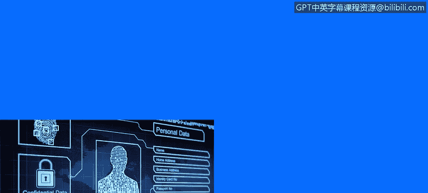

# IBM网络安全分析师专业证书课程3：《网络安全合规框架与系统管理》compliance-framework-system-administration - P53：52_密码学和加密要点.zh - GPT中英字幕课程资源 - BV1cj411z7Li

In this video， you will learn to。Describe the key takeaways from the module on cryptography。

So to wrap up the key takeaways from this presentation。

Do encrypt all sensitive data doesn't matter whether it's addressed in use or in transit。

Rely on proven algorithms and use them correctly， it's very easy to make a mistake that renders your cryptographic algorithm insecure。

Do not write your own algorithms or rely on your algorithms being hidden。

Security biosecurity is no security at all。Use hard to guess keys， store them securely。

And also follow security and news because from time to time。Things do come up。

 algorithms become insecure， and you have to be ready to react if something like that happens in your product。

