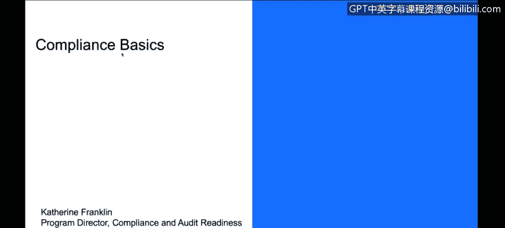
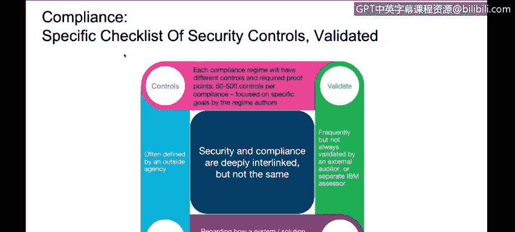
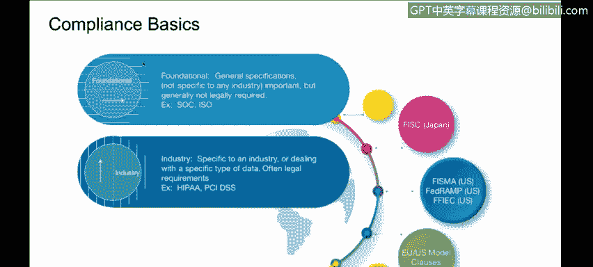
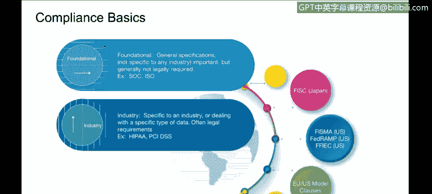
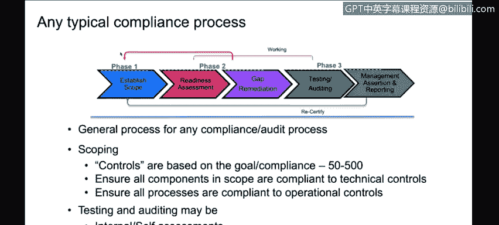

# IBM网络安全分析师专业证书课程3：《网络安全合规框架与系统管理》compliance-framework-system-administration - P58：3_03_compliance-basics.en_subtitled - GPT中英字幕课程资源 - BV1cj411z7Li

In this video， you will learn to。Describe the difference between security and compliance。

Describe the specific checklist of security controls。

So we're going to go through some compliance basics。

 and the previous COC was mostly focused on security。

 but we're going to go through compliance basics at this point and what we're looking here is really understanding some of the differences between security and privacy and compliance and how that is going to unfold as we look at different compliance standards and regulations。

So security privacy compliance， they're all related。

 but they're not actually the same thing security is designed to focus on protecting your environment your systems from theft from damage from disruption from thisdirection comes in three main categories。

 there are physical control， so how do you physically keep your systems that you're operating your applications on contained right so there's servers and data centers and maybe be in the cloud。

 how do you ensure the physical security of the hardware。Then there's technical controls。

 technical controls are tooling or software or features and functions that restrict or control the security of the data or the processes。

 so you can think of encryption。You think of logging， you can think of password software。

 all of those are examples of technical controls。Operational controls are more the procedural these are how a server is configured what are your rules for how often you patch a system who's responsible for monitoring the logs and reviewing them how your staff are trained and what activities they perform these are operational or procedural controls so security of your system isn't going to be addressed with just one defense it's going to have many and they typically fall into one of those three categories。

Privacy。Is a little bit different。 Privacy is strongly focused on the data。

 so how the information is being used。Who has access to it， how is it stored， how is it transferred。

 is the what how that information may be used to track people or things and that is privacy about you as an individual。

 for example。Compliance。Fousees on。Testing the security measures are in place or the privacy measures are in place。

Compliance will typically identify a specific subset of all of the controls based on a particular goal。

 and then the idea is you validate those specific controls to that standard。

So this will it can also cover a lot of nonsecurity things that you wouldn't typically think of as security。

 so business practices， vendor agreements， you don't typically may think of vendor agreements as something related to security。

 but certainly if you don't build your product and run your product on your own。

 you have vendors that participate with you， you need to ensure that they're providing the security and privacy controls that you're expecting of them。

So it's related， but maybe indirectly for some people's perspective。

So compliance， when you think about compliance， that said， depending on。

How you articulate security requirements or individual requirements。

 there can be anywhere from 50 to 500 controls out there that are involved in securing your environment。

 your system， your product， your application。So depending on which compliance you're going after。

 you may be choosing a specific subset of that 500。So once you've identified that。

 you're going to want to validate。They would validate on a schedule。

 typically you would validate that with either an external auditor or another assessor inside your own company。

 we have assessors inside IBM who perform that function。嗯。😊。

And then we're looking at sort of proving out that those controls are being adhered to and are in place。

Sometimes depending on the nature of the particular compliance， it's。

It's worthwhile to consider having an external vendor who specializes in that particular compliance。

 they come in and they do an assessment， they can do it an audit。

 they can do the standards well each govern whether what they're doing as an assessment an audit or a report or certification。

 so that terminology is all kind of particular to the individual compliance。

 we're going to go through some of those in a little bit later。

Compliances there's really two main categories for compliances。

So what you'll see from compliance is the some are foundational， third general。

 they're not specific to any particular industry， they are broad spectrumtum。

 they go over a number of different topics， be it physical or the technical or the operational examples like that would be ISO 27001 SoC which we'll get into in a bit。

 and then there are other classifications that are more industry specific or governmental even and they are particular to specific subject matter。

 so in examples what we'll see here later today， we've got HIPAA， which focuses on US healthcare。

 we have PCI DSS， which focuses on payment card information， so credit card data storage。

And there's European standards， many jurisdictions will have the US。

 federal government has several standards， so we'll be going through some of those as part of this conversation and you as a security cyber specialist we want to understand kind of when and how each of these apply and what's appropriate for your business because that's where you're going to want to order up these are all some of these are very expensive to do。

 you have to choose the ones that are most appropriate to your industry。

 most appropriate to your business needs and focus on going after the ones that will provide you the greatest business value。

Typical compliance process for initially getting that certification or that compliance。

 you want to establish the scope， so if we want to go after ISO。

 I want to go after it for this particular set of systems， this particular application。

 there'st particular environments， you want to establish the scope very clear boundaries of what is in your compliance and what is not。

The readiness assessment， you go through all of the compliance requirements for that particular standard。

 you look at the controls， you look at the specific subset of the 50 to 500。

 you want to understand how each of those controls applies to your environment that you've established scope on。

Then you want to assess how well do you perform that function？I perform that function well。

 I don't perform that function at all， I perform it sort of and not great， so you'll identify gaps。😊。

As part of that readiness assessment， once you've identified the list of gaps。

 then you've got some homework to do right you want to go and you want to address those gaps。

 you want to remediate any findings that you've had so that you've made corrections so if you don't have encryption everywhere that you want to have encryption according to the standard well then you'll go and you'll add it if you haven't got the if you haven't got your user IDs。

 you haven't got the individual at least privilege maybe you want to go through and review who have access to your system and trim that up so you'll go through that gap remediation。

And then you'll enter a testing period if you're testing it through your self-asses or internal assessment。

 you'll work with experts in that area， you may also be engaging external auditors if that's the appropriate thing once the testing is completed。

 whatever certification or assertion or reporting is usually follows some period of time after that it can take some period of time to finish off the reports and testing。

Then you'll be recertifying。So depending on the nature of the certification。

 sometimes you're recertifying quarterly recertifying annually， bianly。

 it really is going to depend on the terms of the particular certification you're going after。

 but they all generally fit this mold if you found yourself partway through testing and found out maybe that you didn't complete your gaps appropriately enough。

 you may be circling back to the beginning。And reestablishing your scope for redoing your gapRA remediation。

 and basically though you'll be cycling in this for the lifetime that you intend to support that particular compliance。

