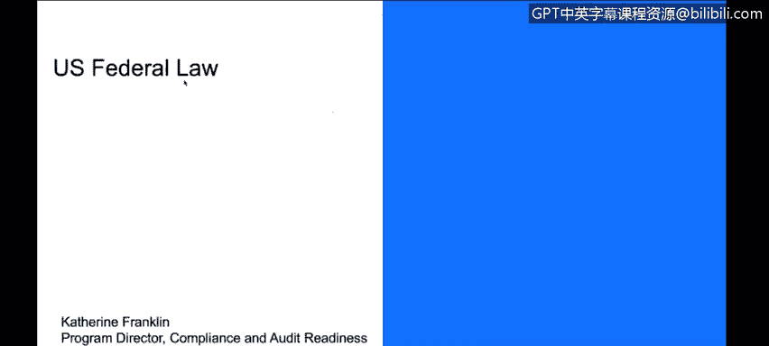
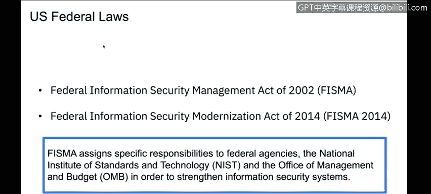
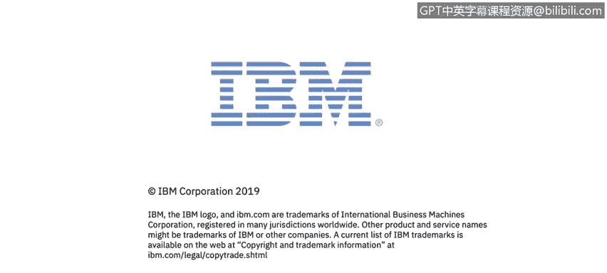

# IBM网络安全分析师专业证书课程3：《网络安全合规框架与系统管理》compliance-framework-system-administration - P59：4_04_overview-of-us-cybersecurity-federal-law.en_subtitled - GPT中英字幕课程资源 - BV1cj411z7Li

In this video， you will learn to。Describe the Computer Fud and Abuse Act。

 So we're going to talk now about a few specific。

Different。Topics in US federal law in different compliances going forward。

 So we'll get into some specific examples and talk a little bit about them。

 First one we're going to talk about is in the US Federal law space， the Comp F and Abuse Act。

So the Computer Fud and Abuse Act has been around since 1984。

 it's basically what makes it a crime to perform that makes cyber crime。A crime。

 so it is a law that identifies that access to a computer without authorization with or in excess of your authorization is against the law。

 it is against the law to interfere， it is against the law to acquire to disrupt。Your systems。

 and it's punishable。So it's a act that prior to 1984， computers were in use， of course。

 but they fell under the standard mail and wire fraud rules。

 but now since 1984 it's been a separate law。For other US。 federal laws。

 FISA and FedRAP that look at assigning specific responsibilities to federal agencies。

 if you do business with the US。S federal government。

 you will have to be supporting very strong physical requirements， technical requirements。

 each agency within the US。 federal government can have a different subset of standards that they need to have met。

As part of this。 And so you end up with a。This one is very complex。

 And my advice to you is if you're going down the US federal law base， like。

This will be a devoted topic in and of itself， an entire research project or from an education standpoint as well as acquiring it。

But they all these US federal laws will base their subset of their requirements off of something called NIST。

 the National Institute of Standard and Technology。

