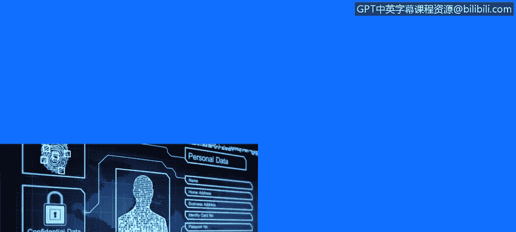
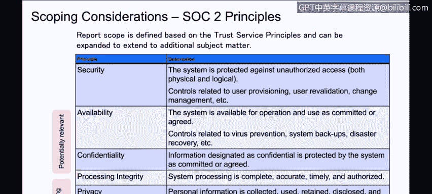
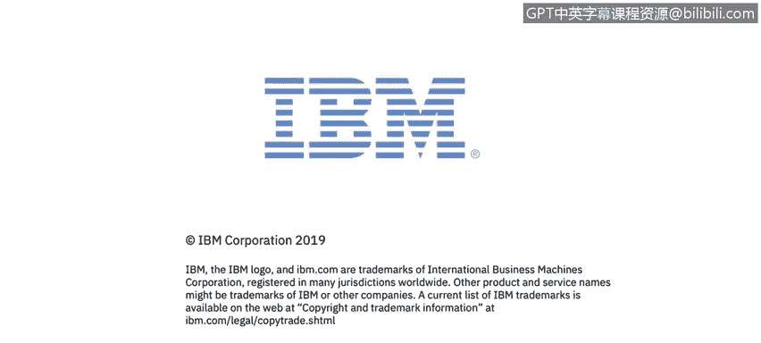

# IBM网络安全分析师专业证书课程3：《网络安全合规框架与系统管理》compliance-framework-system-administration - P63：8_01_soc-reports.en_subtitled - GPT中英字幕课程资源 - BV1cj411z7Li

In this video， you will learn to。Describe the differences between。SOC 1， SOC 2， and SOC3 controls。

Describe the benefits of SOC reports。

Sock reports。 so spend some time now looking at Sock reports。

 So SoC reports are secure the some industries will require it。

 just like we've mentioned earlier for ISO some jurisdictions or industries will require it and if you don't have it。

 they'll accept you have to perform some local compliance audit。

 So many organizations who know compliance actually prefer SoC2 over IO ISO is the point in time testing。

 whereas a SoC2 is a continuously monitor testing over a period of time。So and again。

 some organizations or some clients that some industries will accept SoC2 in lieu of the right to audit。

嗯。So if I could compare with ISO。And I look at the different types of things that they focus on just to compare and contrast is you'll find SoOC2 is focused on fiscal logical security and in specific。

 you know， do you do what you say you'll do， whereas the ISO1 is a little bit more focused on risk。

ISSO is internationally recognized， So2 has traditionally been more North American。

 but it is becoming more known internationally。😊，Purpose in the test for Soc 2 is that you achieve the。

Standards associated with the control， but also that you implement your own policies and perform them。

 And the IO one is a little more focused on best practices。 The IO is。

mananaageged by the ISO accreitted agency do the consulting and the certifying SoOC2 is almost always performed by CPA。

Because it's governed in Spto by the AICPAA。In the difference about design and the nature of scope。

 as I said earlier， ISO is focusing on the design effectiveness or point in time。

 whereas the SoC2 will also look at operating effectiveness over a period of time。

So type 2 would be six to 12 months and it would look at how effective you were performing those functions over that entire period of time。

You get a single page from an ISO certification。 There's a detailed report that's considered confidential and internal。

 but otherwise it's a。Single page and doesn't provide a lot of detail to the to the reader to your customer about what you're doing。

 In the case of So 2， you get a fairly detailed report。 It can be many pages long。

 It describes the controls。 It describes how they tested them and describes the results of the testing。

 So it's very， very detailed and can provide a lot of insight for your customers and confidence to your customers that of how you operate。

I gained personal opinion， I consider the SC2 a higher degree of difficulty over the ISO because of that operating effectiveness component to it。

So SoC2， there's actually， I called it SoOC2， but there's actually three SoC reports， SoC 1。

2 and three， the SoOC1， they're all used， they're all based on the same core set of controls。

 but they subset it out and report out differently。

So SockWN uses a subset of the controls and it specifically is looking at situations where your system is being used for financial reporting。

So if you are using your system to hold your sales ledger data and you then are going to turn around and use that data to generate reports for your financial reporting。

 for your SEC filings， things like that you will so it's going to focus on a very specific subset of reports and they're going to be slanting it towards that purpose of financial reporting not surprising when it comes from the AICPA。

SoC2 is a little more general and it's going to look at more controls。

 a superet of the ones that are looked at for SoOC1 and they're looking at it for general purpose use the report they produced is restricted because of the detail that is in there around the system。

 the security the processes and methodologies if you achieve this for your environment you would get to keep a copy of it yourself。

 you would only send it to clients or prospective clients under a nondisclosure agreement because of the level of detail in there if it fell into the wrong hands somebody could use that to try to mount a malicious attack。

For people who do want to have something short and sweet and something you can put on your webpage like the ISO certification。

 there is a SoC3 report， it is consider an executive summary of your SoOC2 and is used to provide it provides the opinion and the description of the system but it does not get into the details of the security practices or the testing methodology and results so it's just a high level one and so typically what you would do is you would commission at least a SoOC2 if you have the financial needs you would also commission the SoOC1 and the SoOC3 would come as well when you get into the type2 situation so you can do one audit and achieve all three certifications you just need to plan that out with your auditor in advance。

Soalk1， so 2 come in a type 1 and a type 2。 You to kind of keep a little chart。

 I'm gonna have to make a little handy chart to keep track of these。 but a type 1 report。

 consider that your starting line。 that is the closest equivalent to an ISO as well。

 So basically it tests the design effectiveness of your controls and has tested that you have performed those controls at least once。

 So think of that as the start type 1。And you would use that when your product is new or when you are first acquiring your certification for sock。

 it's not something you would ever repeat， You'd just do one type1 report。

After that you move into a type 2 scenario and the type 2 is now looking at operational effectiveness over a period of time。

 typically that's six months or 12 months， and so you the auditor will come in and they will test over the interval of that period of time so if you're doing a six monthth test and they've come in after three months and run tests on the first three months and then come in at the end of the six months and then do some more tests and basically they're looking that the control is operating effectively on day one。

 day 30 day， 180 etc。诶，The expectation there is that you're able to provide proof that you're maintaining your effectiveness of these controls over time and typically you will renew them either every six months or use them yearly we do rolling 12 month reports typically in our business so we would have every six months we would report out on the previous 12 months。

This is very helpful from our customers who are looking at using this for their businesses because then they have continuity for the entire period that they may be using our product。

On top of the complexity of type1s and type2s and SoC1s and SoC2s。

 there are different principles or chapters within SoOC2。

 and they each come with a set of controls or requirements。

 the most typical and sort of the foundational one that everybody would get would be security and they're looking specifically at how you're protecting your physical and logical access and systems。

 so they have controls related to user provisioning， change management， inventory management。

 things like that。And then we have other additional principles or chapters and you can determine which ones are most relevant for your business and of course increase your the scope。

 the number of controls and the scope of your audits and the reports。

 availability and confidentiality， processing integrity and privacy。

 we're starting to see we're definitely seeing availability and confidentiality。

 and we're starting to see more interest in processing integrity and privacy as well。

So you can see the industry shifting from having kind of entry level securities baseline。

 we're going to get that towards having these more complex and additional controls added on confidentiality and privacy have really useful as you also help to try to prove out your GDP at for your European customers。

