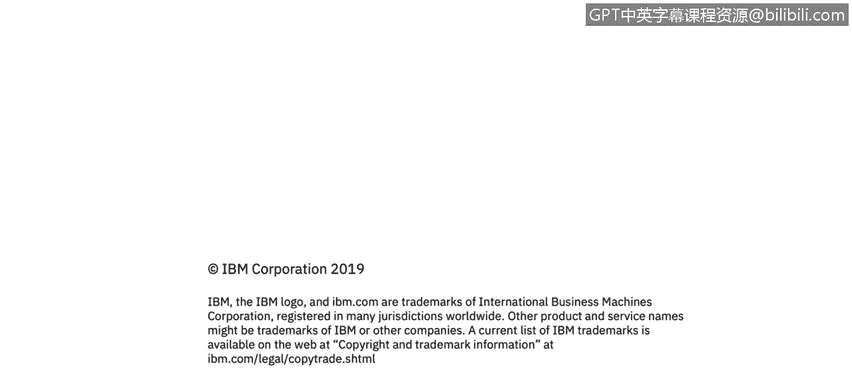

# IBM网络安全分析师专业证书课程3：《网络安全合规框架与系统管理》compliance-framework-system-administration - P64：9_02_soc-reports-auditor-process-overview.en_subtitled - GPT中英字幕课程资源 - BV1cj411z7Li

In this video， you will learn to。Describe the audit process for SOC reporting。

When auditors are testing， as I said they're looking at that continuity。

 they're testing for five main elements and these elements are they can be very particular right the SoC2 is not for the faint of heart。

 it's a very challenging compliance to achieve so they're looking at accuracy are all the controls being addressed looking for passes and fails and very clear distinction about whether or not the control is being completed。

Completeness do the control cover the entire offering so you know if you're in case of a control looking at your systems does it cover all your systems and all your inventory if you're looking at access management does it cover all personnel。

 all people。Looking at timeliness， timeliness is a really big challenge for some teams right making sure the controls performed on time or early and that there's no gaps in coverage so if you're supposed to apply your patches every week。

 you know being a day late creates a gap in your coverage area that could potentially be a risk for a malicious attack or something inadvertent to go wrong so they're looking at timeliness in particular。

If for any reason that you're unable to perform a function on time。

 there can be really logical reasons based on your customers' business needs that you would say I'm going to。

 you know I've got a peak period going on here， I'm not going to be patching during that peak period。

 So if the control can't be performed on time have you done an appropriate risk assessment before the control is considered late so if you were supposed to patch on Friday but your customer calls and said。

 hey， we've got a promotion thing going on I don't want to patch on Friday。

 I want to late to Saturday。If got you've got an appropriate reason。

 you've looked at the business risk， you know， the use case， you could say， A yeah。

 it's safe to wait till Saturday， you need to have had that all documented in advance。

 don't wait till Saturday to document it documented on Thursday so that you're not late。Resiliency。

 they're looking for checks and balances so that if a control did fail。Was there。

 is there some secondary way that you can ensure that that something happens on time and they're looking for consistency。

 So they want to ensure that there's no。Gaps introduced by having too much variability。

So often they'll look at a primary control， they'll test the primary control。

 they're looking to ensure that you provide features。

 functions of the control if for any reason that's not working。

 they're looking for support or backup to ensure that the primary control is effective so if you have access management approvals records in place。

 are you periodically reconciling those approvals with what's live in your system to make sure that no one has circumvented your access management system and created and somehow an access account on the side。

As an example。So this is a summary listing of the different controls that are used for audit。

 you can see they just could break down into different chapters。

 these are chapters by the way that we use for our own purposes。

 you can go from the raw set of requirements from the AICPAA。

What's really important regardless of which type of compliance you choose， whether it be ISO or SOC。

 is continuous monitoring between your audits。We talked a lot about the different ways that you could potentially fail a S2 audit。

 but you know even for ISO audits at our point in times。

 you want to know that you have the controls operating is designed。

 that they are performing their functions and that all the communication is going out to whomever they need to go out to you're looking to test your environment。

 your processes in your people to ensure that the continued execution of the controls。

 so we call that continuous monitoring， you're looking for any risk of deviation。

 any time where you have a temporary failure or delay and you'll want to try to identify those effectively because there's no point in having a standard if you're not making sure you're actually performing that standard。

 so this is an important aspect。

