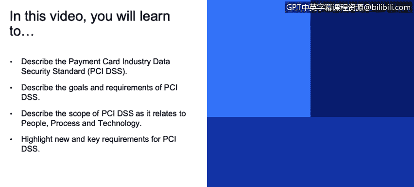
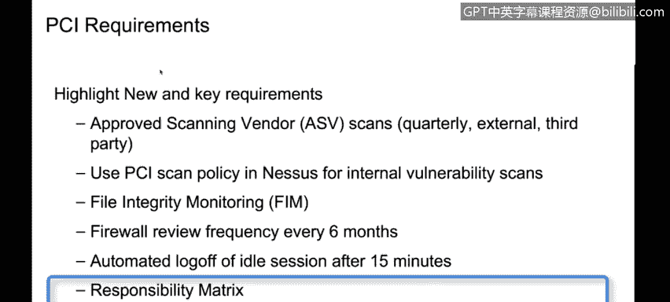

# IBM网络安全分析师专业证书课程3：《网络安全合规框架与系统管理》compliance-framework-system-administration - P66：11_03_payment-card-industry-data-security-standard-pci-dss.en_subtitled - GPT中英字幕课程资源 - BV1cj411z7Li

In this video， you will learn to。Describe the payment card industry data standard security。PC I。

 DS SS。Describe the goals and requirements of PCI DSS。

Describe the scope of PCI DSS as it relates to people， process， and technology。

Highlight new and key requirements for PCI DSS Payment card industry data security standards So one of the things that you see quite a lot in the public space and if you look at the you know latest data breachess around who gets access to somebody's credit cards they're an incredibly high value target for people who are looking for malicious access to your systems so back in 2014 2004 rather the set of high the largest credit card companies American Express Discovery MasterCar visaa they banded together to define a standard for data security the security standard gets revised periodically over the years is new standards and new technology become available。

And they require these companies will require if you're going to be engaged in any business that involves storage or transmission of credit card data that you secure that data to the standards。

So store process or transmit credit card holder data。That's credit card numbers。

 any of that sort of thing， the it covers both technical and operational practices。

 so the administrative as well as the technical controls。

For the systems and there are a total of 264 different individual requirements in 12 different groupings。

 so not if you're engaged in an audit for PCI。One of the first things they do remember I talked earlier about defining scope。

 these what is the scope of your environment and how many of these 264 applied to you。

So you'd go through the 12 different categories of these requirements from building and maintaining a secure network。

 protecting cardholderer data， managing a vulnerability management program， access control。

 monitoring and testing your networks and maintaining information security policy。

 you go through all of these different categories， you'll do an assessment。

 that's that whole readiness assessment that we talked about in the scope where you identify these different requirements and say how many of them are applicable to your environment。

So。😊，And they'll all do it in the context of understanding that the data that is at risk here。

 the data that they're protecting is cardholderer data。

So cardholderer data environment is the people process and technologies that store this。

 in particular looking at the primary count number our pan data， and it can be the cardholderer name。

 the expiry date， the service code。They're also looking at sensitive authentication data。

 so pins and pin blocks or anything else that is used to authenticate a credit card transaction。

And they're looking at， again， ensuring that anything that。Processes， transmits， or stores。

 this data is considered in scope。So they're particularly looking at people processes and technologies。

 so they look at everything from your human resource aspect to this to network device management。

 network segmentation， audit logging， there's a number of different topics that we're going to look at here for this and you can see as we're looking pasts over the last couple of requirements they're all sort of similar and overlapping and they just may have individual unique sls。

 one of the things that's unique about PCI。Is they have this concept of an approved scanning vendor that scans quarterly。

 usually quarterly， and it's usually an external third policy。

 to it's similar but not the same as a vulnerability scan。Or the penetration testing you might see。

But it is a very specific and improved nature and it's something that you're expected to perform uniquely one of the other things that we consider somewhat unique relative to other requirements are the details around NASA there's particular configurations if you're doing scanning for vulnerability for NASA and file integrity monitoring file integrity monitoring is when you ensure that all the files that are running on your system are the ones that you intended to be there and nobody's replaced and executable with a different executable same name that's also performing so they're checking for skimmers as an example here。

Firewall rule frequency review frequency is increased to six months。

 some other certifications might only require it once a year。

We've always taken something like this and said。If we want to make sure that it happens right at least once every six months。

 do it at least once every three months， then you have at least a couple times to do it。

 so you may want to do something more frequently than the spec requires to guarantee that you've got achieved at least once during that interval。

Automatic logoffs during idL sessions， they're set at 15 minutes。HIA， for example， is 30 minutes。

 so you can see some different things there one of the things one of the documents that gets produced from PCI is responsibility matrix。

 and that's a really good document for you to review because it clarifies。

What are the responsibilities of the entity providing the PCI support and the consumer。

 So in this case， and we talked about a hospital in a。And a cloud application in this case。

 we might be talking about。A bank or a business that is using credit card has a web portal for purchasing。

 And you're storing those credit cards for that purchasing arrangement。 So that。

What you do and what your consumers do is your responsibility matrix。

