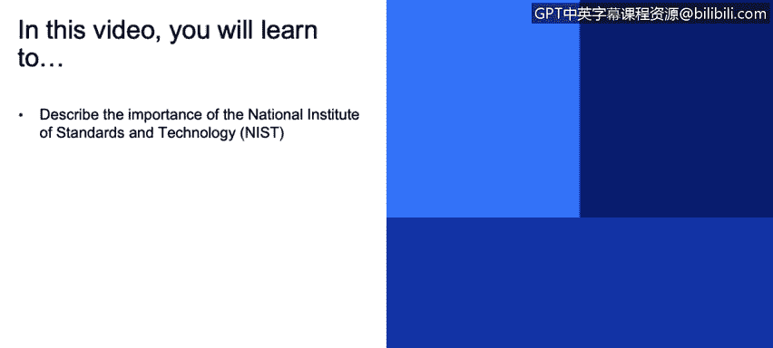
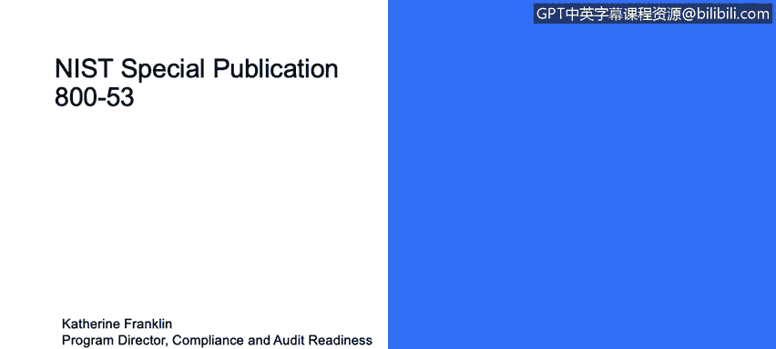

# IBM网络安全分析师专业证书课程3：《网络安全合规框架与系统管理》compliance-framework-system-administration - P6：5_国家标准与技术研究所(NIST)概述.zh - GPT中英字幕课程资源 - BV1cj411z7Li

In this video， you will learn to。Describe the importance of the National Institute of Standards and Technology。

N IT。

The National Institute of Standard and Technology is focused on cybersecurity and privacy。

They will identify literally hundreds of individual standards that are related。

 there'll be pages and pages of details on passwords on encryption on network communications and how to assure security and privacy。

 there's not generally an expectation that you will implement how many。

 many hundreds of these things。But that you'll institute a practice within your business to do as many of them as makes sense for your business。

 and as I said earlier， depending on which agency you're working with。

 they will have specific subsets that they'll be looking for。

