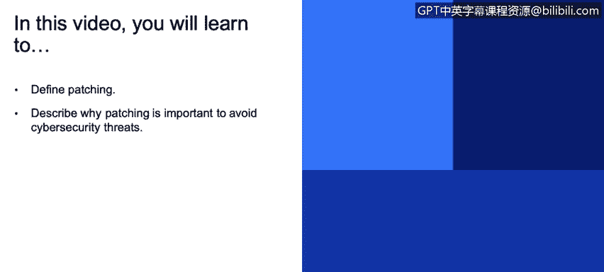
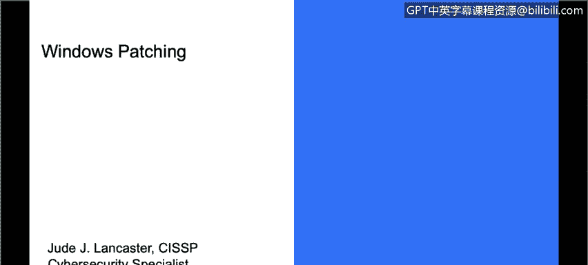
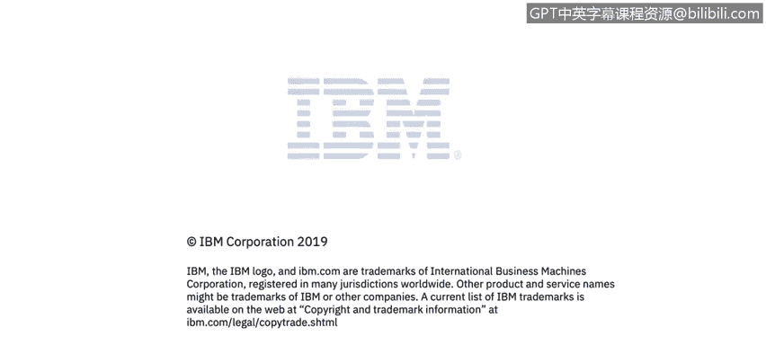

# IBM网络安全分析师专业证书课程3：《网络安全合规框架与系统管理》compliance-framework-system-administration - P73：18_01_overview-of-patching.en_subtitled - GPT中英字幕课程资源 - BV1cj411z7Li

In this video， you will learn to。Define patching。Describe why patching is important to avoid cybersecurity threats Now what we're going to talk about is patching and patching is really important regardless of the operating system you're talking about you know we hear about Windows patches because most of us use a Windows PC and we see that little notification in the right lower corner of our screen that says hey your machine needs to be rebooted we've installed some patches and we can't make them effective until until you reboot your computer but patching is really the same regardless of what the operating system is and it's really important and frankly the fundamental and most important thing that an organization can do in order to protect itself from malicious events occurring we've all heard the news about how company's got hacked we've all heard the news about ransomware there's lots of examples in the US of public institutions like cities。

 the city of Atlanta， the city of。

The more city of Lake City， Florida are recent ones that I can recall where they were subject to ransomware。

 they were asked to pay a ransom and when we talk about ransomware it is somebody gets into the system and it's usually a foreign entity and they will put some code on there that essentially will encrypt everything on that hard drive and that will propagate to all the machines in the environment rendering basically all of those files and folders useless unless you pay a ransom。

 hence the name ransomware and that ransom is usually in the form of Bitcoin and once that ransom has been delivered then you will be given the key to unencrypt all your files and get your files back now the folks who have paid are very successful in getting their files back but many organizations and。

ities have said no we're not going to pay and they've spent much more than the ransom on the cost of recovering those files。

 so the net of it is its just really important to patch and to keep your systems up to date and went off with a little tangent there but I think that's just important to talk about a real-word example so we talk about patching and as I said before this is whether you're talking about a Mac。

 whether you're talking about a Windows system and whether you're talking about a Linux or a Uni system。

 patching is really the same from from the concept of why we do it。

 the mechanisms of how we do it may a little bit different depending on the operating system。

 but why we do it is the same and a patch is really just a set of changes to a computer program or it' supporting data designed to update。

 fix or improve it prove it excuse me this includes things like security vulnerabilities other bugs and that's why some patches might be called bug fixes but we also when we talk about patching talk about patching the operate。

ystem。

