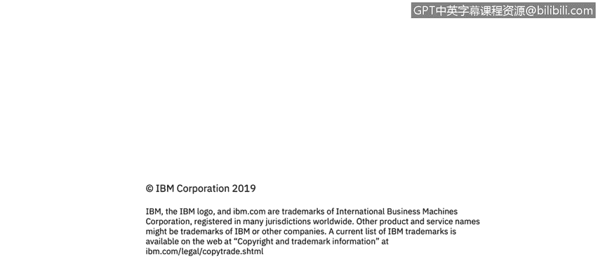

# IBM网络安全分析师专业证书课程3：《网络安全合规框架与系统管理》compliance-framework-system-administration - P74：19_02_windows-patching.en_subtitled - GPT中英字幕课程资源 - BV1cj411z7Li

In this video， you will learn to。Describe how patching works。😡。

Describe patch management best practices。

So in the context of Windows， Windows update， which we're all probably pretty familiar with allows to fix known flaws within Microsoft products and the operating systems。

 their modifications software and sometimes hardware because you may have hardware drivers that have a vulnerability in them and they help improve performance reliabilityability and most importantly security around that system Microsoft like I said。

 we're just using the concept of the context of Microsoft because that's what everyone's most familiar with。

 they release their patches in a monthly cycle and most people in the industry call that patch Tuesday because they do Microsoft releases as patches the second Tuesday of every month on patch Tuesday and they're really four types of updates for Windows OSs but these are also the same across other OSs Linux and Mac as well。

 and those are security updates which are really probably the most important updates and many organizations。

Will not。Deploy patches other than security updates。

 they feel that application updates and going to a newer version of a particular version of Microsoft Office just to expand features don't really make a lot of sense we're mostly concerned about security updates that patch vulnerabilities in the operating system those those security updates are classified as critical。

 important moderate low or they may not even be rated because they're not viewed as important and many organizations will only patch critical and important security updates。

 so it just depends on the organization of what their philosophy is around patching because sometimes this is not always the case but sometimes a patch may cause issues within other applications that are needed to do to do the organization's business and that's why they choose not to patch everything so there's a lot of testing that goes into place with patching within。

Large organizations or even small organizations because we need to make sure that the patches that are released will be compatible with our environment and that's why why patching even in 2019 is still a big challenge。

 I've been focusing on patching for the majority of my career so everybody has said for the last 20 years out patching is basic stuff and isn't important well。

 it's important and we find that it is actually more and more important as cybersecur events continue to occur second kind of updates are critical updates。

 these are high priority updates that may not be security updates so they may not be classified as a security update。

 but they are still considered critical， there may be a bug in an application that causes something and that critical updates needs to be applied。

 so as I mentioned before， many organizations will only apply security updates and critical updates to the operating system and then they justt worry about the other ones because they don't want to。

For compatibilitySoftware updates， which are released by Microsoft are not considered critical。

 They are things like feature upgrades or reliability upgrades over a particular software that don't have to do with the vulnerability。

 So if say Microsoft Office crashes every month and a half if I'm doing something know very odd。

 and they release an update to that。 that's not as important as a security update because that's not something that can be can be exploited by a bad actor。

 And then there are things like service pack。 Service packs are roll ups or a compilation of all the previous updates to ensure that you're up to date on all the patches。

 They also may include feature updates or feature enhancements to the operating system。

 but typically a service pack is or rollup with。The way that Microsoft has kind of changed their patching and their update strategy。

 service patchs are probably going to be a thing of the path。 If you talk about， say Windows 10。

 Microsoft has kind of placed a stake in the ground and said Windows 10 is going to be our only operating system。

 We're just going to add functionality onto that。 And then so service patch are really not something that is really as important as it used to be。

So let's also talk about patching applications。 And again， when we're talking about applications。

 it doesn't matter whether we're talking about Windows or we're talking about Linux or Uniix or Mac。

 And when I talk about patching applications。 I'm mostly talking about the third party applications that every end user has on their system or even most servers。

 So things like Java， things like Adobe flashlash， But and there are other ones， I。e。

 any web browser， those are。Things that really are as important or sometimes even more important to patch than the operating system itself。

 In fact， 80% of the vulnerabilities found in the top 50 cybersecurity programs were affected thirdpart applications such as flash playerer or reader or Java or Skype or media players and things that weren't part of the operating system。

 So when end users or I should say， when organizations talk about patching。

 the ones that take cybersecurity most seriously are ones that treat application patching as。

Seriously， as they do operating system patching。 and most organizations that I work。

 they patch on a monthly basis。 and for Windows it centers around patch Tuesday。

 so they will have a process where。The patch Tuesday patches are released and then they will go through a testing process or a vetting process if you will。

 where those patches and any thirdpart patches that came out that month will be distributed to endpoints within the organization to what they call a test group and that typically is folks in IT or virtual systems that are considered part of a test and then they will launch their day- to-day applications either custom applications or off the shelf applications that are needed to run the business and make sure that there are no compatibility issues with those patches that were released。

 and then once those compatibility issues have been highlighted or checked that there aren't any。

 then those patches will then be distributed to the broader organization to make sure that to make sure that the machines are are patch。

And are not you don't have vulnerabilities that can be exploited。

 so that's kind of a primer on patching， but it is a very important and time consuming process for many organizations。

 but as I said before， it's an important part of cybersecurity and something that needs to be done on a regular basis。

