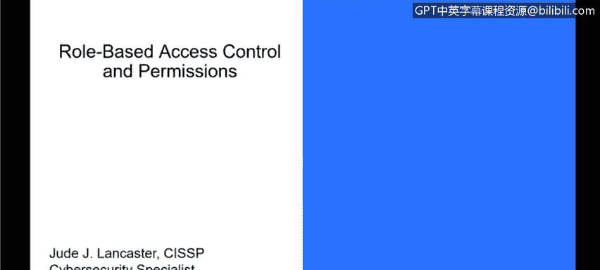
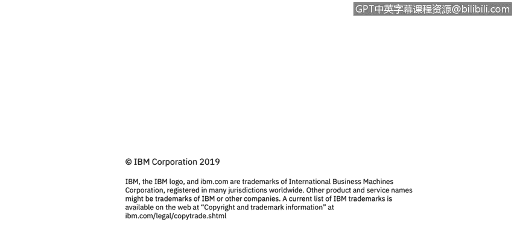

# IBM网络安全分析师专业证书课程3：《网络安全合规框架与系统管理》compliance-framework-system-administration - P79：24_01_role-based-access-control-and-permissions.en_subtitled - GPT中英字幕课程资源 - BV1cj411z7Li

In this video， you will learn to。Describe authentication and authorization within Windows access control。

Define Windows privileged accountss。Describe the principle of lease privileges we're going to talk about role-based access control and permissions in Windows and Windows really approaches access control and a couple different ways and those are really about authentication and authorization once a user is authenticated the operating system itself determines what permissions the end user has to access a resource and when we say a resource that could be something like a file on the system。

 a folder， anything that's on the system we'll talk a little bit later about active directory which really moves the authentication and access control to a server side so that once you're authenticated on a server you have access to network resources and those kind of things but for right now we're just talking about local access control and in that access control model we have what are called。

😡。

Users and groups which are security principles， so principal in the context a person as opposed to a principle like a guiding principle or something and those security principles have rights and permissions inform the OS what each user and group can do so when we're talking about the access control model you could have a user that is an administrator and they would have pretty much access to everything on the system you could have a user that is a guest user and they would have limited access or you could have some level of access in between that where they have access to some things but not other things and those can also be divided into group so as an example administrator is a group which can have multiple multiple people who sign on to a system as part of that group。

The security principles meaning the user perform actions on an object so they might save a file。

 they might create a file， they might delete something in a folder。

 those kind of things and those are really what are being dictated by the access control and security in the Windows operating system。

 resources that are shared by multiple security principles or multiple users use what we call ACLs or access control list to assign permissions and they enforce access control in a couple of different ways。

 they deny access to unauthorized users and group so if I have a folder that is only available to the administrator group。

 only those folks are going to be able to get in there and do things to it and other people who sign onto the system will not have access to it。

 they also set limits on the access that is provided to authorized users so I can really control what kind of access。

😡，Any user or group has within the system， whether it be the times that they can log in。

 what they can see when they log in that all can be controlled based on the permissions that are set within the operating system。

 So now let's talk about privileged accounts， privilege accounts our accounts that have direct or indirect access to all of the assets in an IT organization。

 as I said before we're going to talk a little bit more about ActM directory。

 which is really how that's controlled at a at an administrative level so that I can control all the machines that log into my network and I can control all the folks that log into those machines。

 but I can also have administrators。That will control only their systems。

 So administrators configure Windows operating system to manage control for multiple roles and uses。

And we go by the concept of the principle of least privileges so and as Wikipedia says the principle means giving a user account or process only privileges which are essential to perform their intended function。

 and this is really important when we talk about security。

 one of the main concepts of IT security is access control and making sure that people who don't have access to privileged information or let me say it a different way。

 making sure that people who need access to privileged information and just as HR records or customer data or whatever it is depending on the industry where you're working in those are the only people that can access that data。

 and it's really important because with user privacy laws and we have regulations like HIPAA and GDPR in Europe。

 it's really important that only people who have a need for particular data。😡。

Are able to see that data。 In addition to that， it also provides better system stability。

 So not only are you protecting the data， you're also making the operating system and the hardware itself more secure because you're not giving people access to things that they don't need to。

 like installing applications， installing drivers， anything that could potentially harm the system in the environment。

 And this leads to better system stability。 or I should say better system security。 Excuse me。

 It's because you are controlling not only what folks have access to and what they can do on the system that gives。

A much better， secure and better and more stable system。

 because there is less variance in the environment。 And this leads to easier deployments as well。

 meaning savings of time and money for the environment because you are not have a tremendous amount of variance。

 And everybody doesn't have access to do things on their own system。

 So it's all controlled from a central location and provides much more control。

From an administrative protection excuse me， from an administrative perspective。

 which leads to the three things we talked about， better system stability， better system security。

 and ease of deployment as well。So when you talk about access control。

 there's really four main concepts that we're talking about。 We're talking about permissions。

 We're talking about ownership of objects， the inheritance of those permissions。

 user rights and what we call object auditing。 And we'll go into a little bit more detail on each of these things。

