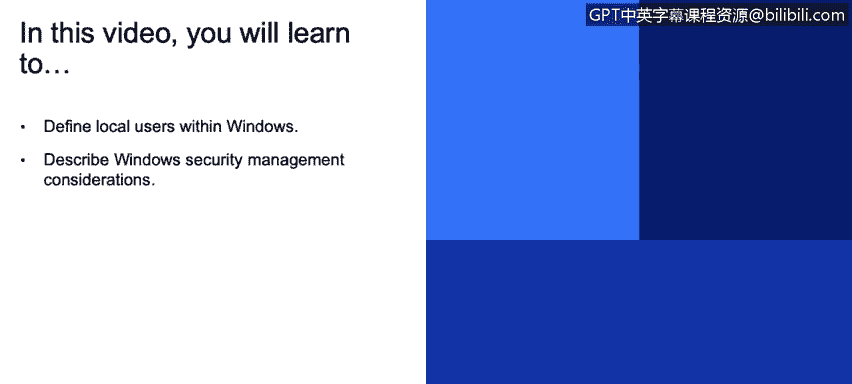
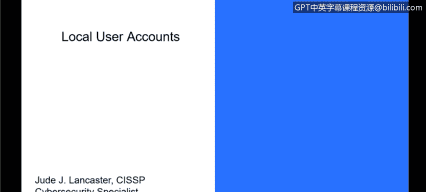

# IBM网络安全分析师专业证书课程3：《网络安全合规框架与系统管理》compliance-framework-system-administration - P80：25_02_local-user-accounts.en_subtitled - GPT中英字幕课程资源 - BV1cj411z7Li

In this video， you will learn to。Define local users within Windows。

Describe Windows security management considerations。

 We're going to talk about now our local user accounts and local user accounts are accounts that are stored locally on a Windows workstation or a server。

 So that's anybody who logs into the system。

But may not necessarily log in to get network resources。 So all they can really do is。

Access things that are local to that particular PC。

 So think of this as your home PC that may not be connected to anything other than the Internet。

 You're not connected to corporate resources。 You just have your own local resource that you are able to do things on。

There are several accounts that get created by default on a Windows account。

 and they're really divided into a couple different groups。 One is the default local user account。

 So that would be the administrator account which has full access to everything in the local environment。

 You have your guest account。 have what's called the help assistant account and your default account。

 Your help assistant account and your default account are really accounts that Windows just creates。

 but are really not used very much Most of your users that log into a system will be part of the administrator account or the guest account。

 And for the most part， that's what folks use。 by default on a local system。

You'reMost of the time going to log in as an administrator。 you have control over your own system。

 You're able to install applications and those kind of things。

 We also have a couple of accounts that get created that are called local system accounts。

 That's you're actually called the system account， the network service in your local service。

 These are accounts that are not visible in the environment So don you're not able to log into them as a user。

 These are things that are really under the covers for Windows and allow Windows to do things in the environment。

 So as an example， the system account will run services and run things on the local machine without you having to log in to do that。

 So it may run things in your task scheduler， it may do other things in the environment in the local system that don't need to be seen or just not part of the local user account and are just done under the covers。

So there's really some security considerations that you should think about for a local user account and all of that。

 those local user accounts are located in the user's folders。

 So if you look at it they would be in C colonlon users and that's where their data by default is stored theres still are security considerations that need to be taken into account when you're talking about local systems。

 nonad systems and as I said， we'll talk about AD a little bit more。

 but you want to restrict and protect local accounts with administrative rights so that people who。😡。

A can get into the the users' folder can only see their own thing。

 So you don't want if you have on a multiuser system me to be able to see your files and vice versa。

 you want to control access to those。 In addition， you want to， of course。

 use your password requirements， which we'll talk about as well。

 And you want to enforce local account restrictions for remote access。 So。

 if you're talking about just a local system。You want to turn off things like remote access or certainly control remote access so that someone can't get into your device and make changes to it。

 And you also want to deny network log on to all local administrator accounts。

 So if you're working in a corporate environment or a national environments。

 local administrator accounts should never have access to network resources。

 that should all be controlled by whatever your directory services。

 we'll talk about active directory in a little bit。 The other thing is。

 and this is probably the easiest thing is create unique passwords for local accounts with administrative rights。

 So you want to make sure that you enforce password complexity。

 you enforce password requirements for length and things like how often the password will expire。

 All those things will help make the local system more secure。

