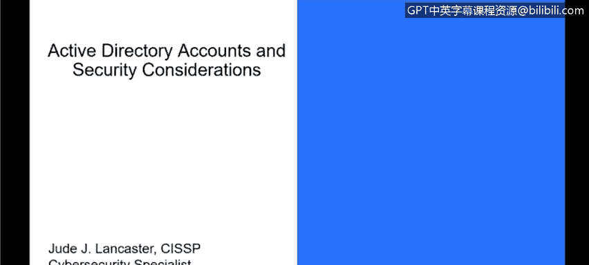
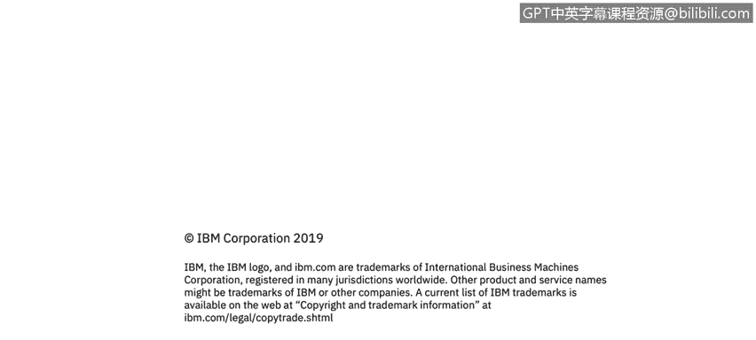

# IBM网络安全分析师专业证书课程3：《网络安全合规框架与系统管理》compliance-framework-system-administration - P83：28_02_active-directory-accounts-and-security-considerations.en_subtitled - GPT中英字幕课程资源 - BV1cj411z7Li

In this video， you will learn to。Describe and differentiate active directory account types。

Discuss security considerations for Windows account Se。

Okay， so now let's talk about active directory accounts and security considerations around active directory accounts。

 So there are several different active directory accounts and then they are similar to your accounts that we talked about earlier that are local account。

 So you have your administrator account， you have your guest account and you have your help assistant account and then a fourth one called your KRB target account or KRB TGT account the administrator account and guest account are very similar to the local account that would just control control access to things in the environment。

 help assistant account is an account that may be logged into if someone needs to remotely help your PC and the KRB TGT account。

Is really an account that is not one that is logged into。

s more of a It's more of a system account that may be used in the environment。

 But it's not something that end users are really going to log into。Also， with active directory。

Active directory allows for settings of local accounts within the active directory。 So when I。

 as an A administrator。Provide someone with a PC what happens is since that PC belongs to my active directory。

 those default local accounts will be managed in the active directory so when even if I'm an administrator or I should say if I'm a user in active directory I may not have administrator rights on my own machine because that's all controlled via active directory for my local machine so an end user may not have full control over their own PC once it resides in active directory and in fact most end users don't have full control because we want to frankly take as much control away from them as possible so that they can't do things that could be harmful to the environment and it also will manage those default local accounts in active directory as well so if I want to turn off the guest account I can do that if I want to add another account on a system。

 I can do that as well。I can do all those things remotely from active director the other thing that active directory accounts do is managed domain controllers so obviously you would have to be an AD admin to do that but that's someone who would control login credentials and how people log into the system so let's talk a little bit about protecting domain accounts and how you do that and again when we're talking about domain accounts。

 those are things that accounts that can access things on the network and one of the things you want to do is separate your administrator accounts from your user accounts so they're going to be in fact most people are going to log in as a standard user and not as what we call a privileged accounts or privileged account is administrator accounts or various levels of administrator account so if we talk about a privileged accounts you may have multiple levels of that even though someone belongs to an administrator group they may have。

Different administrative levels within that group so as an example。

 know you have three different three different levels of administrator accounts that you may want to do in your environment so at a minimum you want to create separate accounts for domain administrators enterprise administrators。

 or any other administrative that it needs to have access to systems and resources in AD that's the bare minimum you want to do so you have administrative accounts that have various levels of access better is to create separate accounts for administrators that may have more reduced administrative rights so I may have access to particular workstations or particular resources in the environment and not access to all the resources in the environment and those are usually those are usually segregated by what we call OU so within active director you will have Os or organizational units so I may have administrator access。

1 OU， but not another one。 So think of an OU as a department。

 And that's making it much more simplistic than it is。 But you could have a marketing OU。

 You could have a sales OU。 OUs can be set up for a variety of different functions within the organizations。

 But certainly when you're looking at protecting the environment。

 having administratives that don't have access to all your OUs is better than just having administrative accounts。

 And then ideally。If you're talking from a security perspective， you want to have multiple accounts。

 separate accounts for an administrator who has multiple job responsibilities when I go into organizations and talk to customers or see how customers do things。

 many customers have accounts that have or they should say one many customers have multiple account in their environment。

 so they may have an administrative account that has access to one thing。

 and then they'll have an administrative account that has access to other things。

 and this just protects the environments and makes things more secure。

And those different accounts will have different what we call trust levels within the environment to make things more secure。

 And then， of course， you have your standard user accounts。

 And are these are just your standard business user， such as email web browsing and using particular。

 what we call line of business application。 So if you either to use an HR application or something else。

 your account may have access to that。 but not be able to control things on your PC。

 And those are the majority of end users will just be standard users。Okay。

 so another way or a discussion around。Protecting your domain accounts and restricting those domain accounts to create workstation hosts without Internet and email access。

 So they can。 these are for folks who may need to manage job responsibilities。

 they require administrative rights from a particular workstation and they may not have access to they may not have physical access to server。

 So I may need to log into a server， But in order to protect that server。

 what customers might do is or what folks might do is create a terminal or a PC or have a PC there that can only access。

particular things on the network， so access particular servers。

 but not be able to access the internet as a whole and that way I'm protecting those particular environments because or those particular servers。

 those particular AD resources because the computer that I'm using to access them does not have internet access so I can't accidentally infect those servers by something when I'm surfing a website andadvertently move something to one of those servers。

😡，So and that's really a bare minimum。 So the minimum is to build those administrative workstations that don't have Internet access。

 including things like web browsing and email。And then even better。

 we want to make sure that administrators on that system。

Can't be part of the local administrator group so that they can manage the servers that we talked about。

 but they can't manage the local system they're logging into in order to bypass those restrictions because remember once you're an administrator on a local system。

 you have full control over and you can change settings so we want people to have access to the servers that they're managing。

 but but not be able to bypass the protections that we turn on and then ideal ideally you can restrict workstations from having any network connectivity except for the servers and domain controllers。

 the administrator accounts are used to manage now practically I've seen very few organizations that do anything that we would categorize as better I've never seen an organizations where they have to log into a target or a specific workstation that only has access to servers and domain controllers。

Most organizations will allow people to log in from their local system and they trust those people who manage their environments to not do dumb things and put their environment at risk。

 but these are just some of the things that we recommend as being a good security practices。

 certainly in high security environments like government or other。

Industries that require that level of security。 These are probably things that you want to think about。

Okay， so。One of the next step in protecting your sensitive domain account is to really restrict the administrator login access to servers and what we mean by this is you're going to restrict administrators from using their admin accounts to sign into what we call lower trust servers and workstation so let me put that in real worldorld context so if I'm a domain admin。

 I'm not going to log into my local system to check my email and to surf the web and to write my resume as as my domain admin。

 so that's what I talked about before about having multiple accounts。

 you'll have users that have their standard user account and then they'll have their domain admin account and that's really the best practice not have those people log in with their domain admin account when I come into work I'm going to log in as my standard user account。

Only when I mean to use my domain admin account will I use that account and so when I'm logging into the domain controller。

 when I'm logging into a server to do some work on it or to do anything like that。

 I would Ben and only then would I log in with my domain admin credentials。😡。

And there's some guidelines that are recommended to do that。 And the first one at a bare minimum is。

To restrict domain admins from having access to servers and workstations。 So what we mean by this is。

Computers that are not in particular OUs that are controlled back active directory。

 they're not able to log into， so it provides a layer of protection there to do that。

 And then even better than that is to restrict domain administrators from nondomain controller servers and workstation。

 So anyone who's a AD admin or a domain admin。 They won't be able to log into things that are not part of the domain as well。

 and that provides even more protection。And then we want to。

 as the ideal thing is if you have server administrators。

 do not allow them to sign into particular workstations。

 So if I'm a server admin and I control Windows servers。

 I don't want to be able to log into workstations other than my own。

 or the organization doesn't want me to be able to log into workstations other than my own。

 And the only reason I would log into my workstation is just to do my day to day job。

 And that's really the ideal security for domain accounts。Okay。

 so let's talk about the fourth thing we can do to restrict and protect sensitive domain accounts。

 So we one of the things that we want to do is disable the account delegation right for administrator accounts。

So what that means is because active directory accounts， user accounts can be trusted for delegation。

 meaning I can delegate someone to do another account to do something。

 that really gives the ability to impersonate an account that authenticates to other resources on the network。

 and in order to avoid that， you can configure sensitive accounts within active directory to not be delegated。

 meaning that I can't delegate that to a different account。

 I have to only log in with that account and that is the only way I can do things in the environment and that prevents it prevents things from potentially impersonating other accounts that would cause an issue and you only need to do this with sensitive。

Resources， so your domain controller， there's any servers that you deem a sensitive。

 that would require that you turn off delegation。 But for normal servers that people need to log into。

 delegation is fine。

