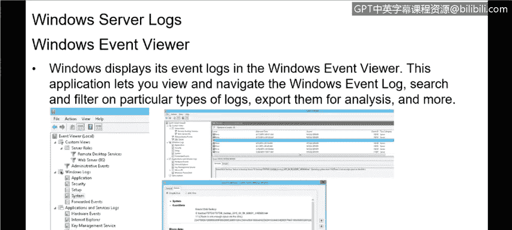

# IBM网络安全分析师专业证书课程3：《网络安全合规框架与系统管理》compliance-framework-system-administration - P85：30_01_kerberos-authentication-and-logs.en_subtitled - GPT中英字幕课程资源 - BV1cj411z7Li

In this video， you will learn to。Define Kberos authentication。

Describe the use of Windows server logs So we're going to talk about security and compliance and spend a little bit of time on that within the context of the Windows operating system and one of the things that we probably should become familiar with what's called Kberos authentication and it's an authentication protocol that it's used to verify the identity of a user or a host and Windows uses it mostly around AD so when someone logs into a system that is connected via AD。

 most AD systems will leverage Kberos as the authentication protocol。

That secures the AD or the active directory in order to authenticate that end user or that resource on the AD。

What's called the Kboose Key distribution Center， It's integrated with。Part of active directory。

 other Windows service security services。 And it uses the domain Act directory services database。

 You really don't need to get to that level of detail。

 What is really important is to understand that Kberos is the predominant。Mechanism。

 which is used within Windows for authentication and for securing the active directory environment。

 That's been around for a long time。 The key benefits really of Kbros so include things like delegated authentication。

 So authentication can be delegated to different resources in the active directory forest between other resources and other users within within the same AD。

Single sign on capabilities。 So when I sign on to A， anything that leverages that AD sign on。

 I've automatically signed on to as well。 So I don't need to then sign on multiple times to access resources within that active directory environment。

 which makes things a lot easier and a lot more convenient for the end user。

 but still maintains security。And then interoperability。 So when I'm leveraging Kbo。

 it really doesn't matter any of the characteristics of the resource that I'm going to。

 because as long as they are part of AD， and I've authenticated to AD。

 I can get to those resources within the AD， which makes things easier for the end user as well。

And then it's more efficient to have that authentication built in so by leveraging Kboose。

 which is built into AD， we don't have to have a separate authentication service。

 we don't have to have anything like that， although that being said。

 many organizations are looking at twofactor authentication or have already enabled twofactor authentication within their environment to provide another layer of security and twofactor authentication just real quickly is leveraging。

 say your AD password and then maybe a third thirdparty authentication service like Google authenticate or Microsoft has an authenticate or IBM has an identity and access management solution that provides those kind of capabilities to make things more secure but for the most part。

 AD leverages that Kroose and that single factor authentication。

 and then the final thing is mutual authentication， so again。

 providing that ability to log onto multiple things。

Within just leveraging that same username and password that's built into active directory and now we're going to switch topics real quick and talk about Windows logs。

 Windows server logs and server logs are important when you're talking about security when you're talking about managing Windows servers because that's really where all your information is held within a Windows environment。

 logs or records of events that happen in the computer and those logs and server logs are no different than logs that are held on a desktop or laptop just any Windows system or frankly any system regardless of the OS is going to have logs we're just talking about in the Windows context right now but are they are events that happen either by a person or a running process and the purpose of those is for you to track what happened and a troubleshoot problems but also it's to help to investigate security events。

We talk to customers about how to manage their environment logging is a very important component of that and one of the things that we do is help customers aggregate those logs and analyzed those logs to figure out what events may have occurred that led to a potential breach or a security event or anything that is out of the norm that needs to be investigated from a Windows perspective。

 the most common locations for those logs is what's called the Windows event logs and it contains logs from the operating system and lots of other Windows applications that may being run on that server such a SQL server or IIS internet information server。

 which is Microsoft's。Web hosting application and they use what's called a structured data format and it really makes them easy to search and analyze for other logs may be written in what's called text format so you can go in and actually just read those manually if you want to but many organizations will will leverage log aggregator to make sure that you can see things easily So if we look at this slide。

 this is kind of an example of what you would see what the Windows server log and these are contained in the Windows Even viewer the Windows event viewer lets you look at in a single place。

 the Windows event log and search or filter for a particular types of logs that you might be curious about and really when we talk about logging。

 we're talking about it in a broader context of just one machine we're talking about it from a perspective of an organization might have。

or even thousands of machines that they need to monitor and if you think about that it becomes very quickly a challenge as to as to how customers will do that or how organizations will do that and so many organizations look at a tool like a log aggregateator or even what's called a SIM a security incident and event management system that will gather all those logs from all the hundreds or thousands of the machines that they manage and pull them all into one place and then that log aggregator or SIM will analyze those logs automatically and point out anomalies so that they can then be investigated by security folks and that's really one of one of the cruxes of what cybersecurity is is looking at systems。

 looking at the logs on those systems and then getting automation to aggregate those logs as well as analyze those logs to look for。

Or events that may need further investigation。

