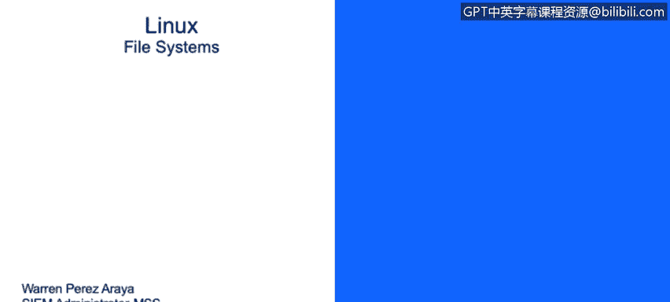

# IBM网络安全分析师专业证书课程3：《网络安全合规框架与系统管理》compliance-framework-system-administration - P88：33_01_linux-file-systems-and-directory-structure.en_subtitled - GPT中英字幕课程资源 - BV1cj411z7Li

In this video， you will learn to。Describe the Linux directory structure。Next。

 we're going to discuss how Linux and the file systems。

Was designed or is design Let's talk about first about files and directories。

Fileles file the a basic unique of storage for data。This unit。

 is's basically a store or pretty much a store on a physical media， such as hard drive。

 a thumb drive or anything that is designed to store information。It's represented by dashash。

 and we'll discuss this later on。A directory， on the other hand， it that in a special type of file。

 a directory has information about other files。 So iss that a container for files。

And it's the equivalent of folders in Windows。In Linuxux is represented by a letter D in the command line entries in the screenshot below or the image below。

 you will see the highlighted directories that are on the first letters your right on your left con。

 you will see that starts with the D that indicates that that's specific。

Item right there， it's our directory。But you will see just above that， not a copy of THc。

 It starts with dash。 So I indicates that that specifically a file。

Linnuux and the directory structure is a lot different than what we used in Windows。

Everything starts with this slash， also called the root。 and everything else， it's just。

Quote unquote， attached to the slash of partition or the root partition。These last partition。

 also called root。It's where every single file underdirect starts from。

Only the root user has right privileges under this directory。

 And that's supposed to be like that for a reasons。The s part。

 it's not the same as these slash route。Thelash route is basically the home directory of the user route。

 We'll discuss home directors in a little bit。Uselash beam directories。

 it contains binary executables， basically。Common letters command are found here。

 and we have a list there， PS， LS， P rep， CPM V。We'll discuss a little bit more about basic command and managing in that couple sites。

Theselash as being， it contains executable binaries as well。

 but they're more related to system maintenance tests like I tables。

 like the Rewood command the S this or the If conflict， for example。This large CC。It's where。

Most of the times we will find configuration files for all the programs installed。

If we have a Linux server and we install Apache on that server for the configuration of that specific service。

 you will go to s ETc， slash Apache。 you will find all the configuration files on that director for specific applications。

Do slash floor。It's in a specific petition designed to hold files that grow or change constantly。

It's referred as viable files。And at a perfect example for these are logs。

 they're usually fine under slash bar s logs， so all the applications or most of the applications that you will find out there will create their logs under bars under a slash slash log。

This large CMP partition， it contains temporary files。

So anything the you store under s TmpP will get deleted when the system reboots。

This is not meant to hold files。Like any other part will do。

 anything that is storeding their large TmpP whenever the system reviewsots will get needed。

This large home petition， it's the home direct to all the users。

So whenever a user it' created and it creates a home directory， you will find it under s home。

 this is designed to store personal files for each individual user and this specific part will only have privileges for this specific user so let's say I create a user called Warren that will be the home director for values will be under slash home/lash warrant and only Warren will be able to edit or read pass from that specific directory。

Another important partition is use s food partition。 It contains boot loader files。

 This partition is specifically used during boot time。

