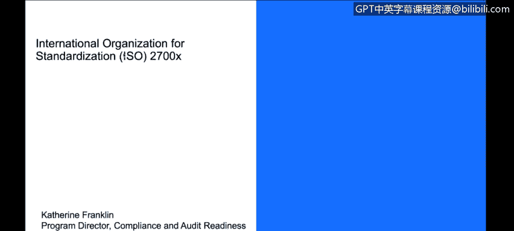
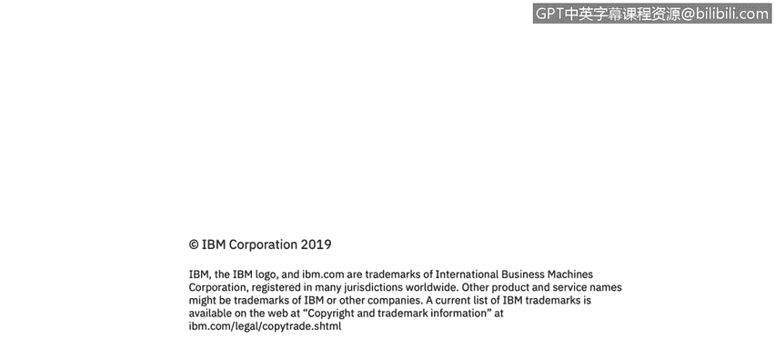

# IBM网络安全分析师专业证书课程3：《网络安全合规框架与系统管理》compliance-framework-system-administration - P8：7_国际标准化组织ISO 2700x.zh - GPT中英字幕课程资源 - BV1cj411z7Li

In this video， you will learn to。Describe the basics of the ISO 27001 standards。

ISO we're going to spend some time looking at ISO 27。

000 family of standards ISO of course has many different standards。

 but the ones in particular that we're interested in here are the ones that are applicable for cybersecurity this one particularly focuses on information assets。

 27001 is the most common one， it is an new information and security management standard。

It focuses on requirements for establishing and implementing。

 maintaining and improving your security management system。

 it's risk based so it's looking at the risk and the maturity level of your organization so great that you have password protection do you have password protection what is the complexity of your password protection right so as you increase the complexity standard associated with what you're implementing that's how you move up the maturity level。

There are others in the family。 There are many in the family。

 the ones that are relevant for our conversation today。 We look at 27018。

 which is focused on privacy and 27017， which is focused on cloud security。

 course that's my background in cloud。 We use a combination of these three security standards as part of our。

Comfort and assurance that we are able to meet requirements of things like GDPR。

We would hire external auditors who would come in and assess and provide us certifications in this space。

 so the certification process provides credibility to our clients that we are achieving the standards expected the advantage of an external auditor coming in and doing that assessment we can provide that report is then the clients aren't required to go and do individual assessments。

 they can look at the report， they can look at who performed it。

 they can look at the terms with that and they can say yeah。

 that's that's as good a standard as testing as I would have done and。

It can really help you because you can provide that one standard to many clients rather than have clients perform individual assessments。

There are some industries， some jurisdictions， some situations where the certification or having it is actually a legal or contractual requirement。

 so if you want to do business in certain geographies it'll either have to do an individual audit or you have to be able to provide it。

IO does develop standards， but they don't themselves issue the certification you find a。Authorized。

 qualified， accredited， certify her or auditor to come in and perform that assessment on your behalf。

And then you would have a certificate， typically you get a certificate and that certificate is something that you would put on your website and shout loud and proud because it demonstrates a lot of hard work。

 identifies a standard that is attract to your customers。

