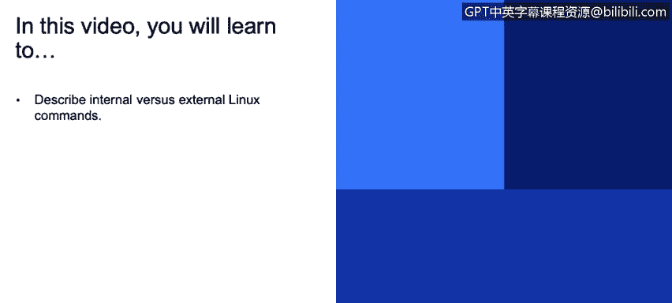
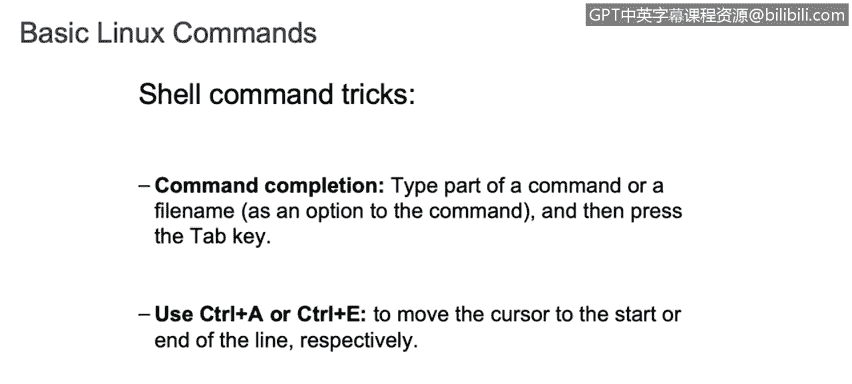
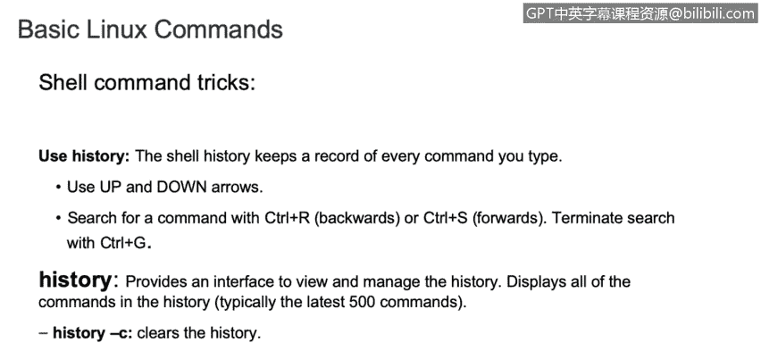
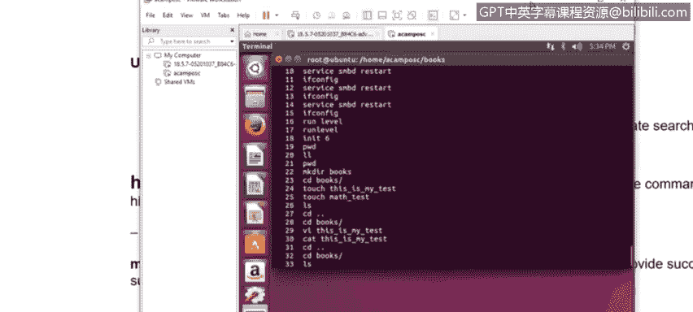
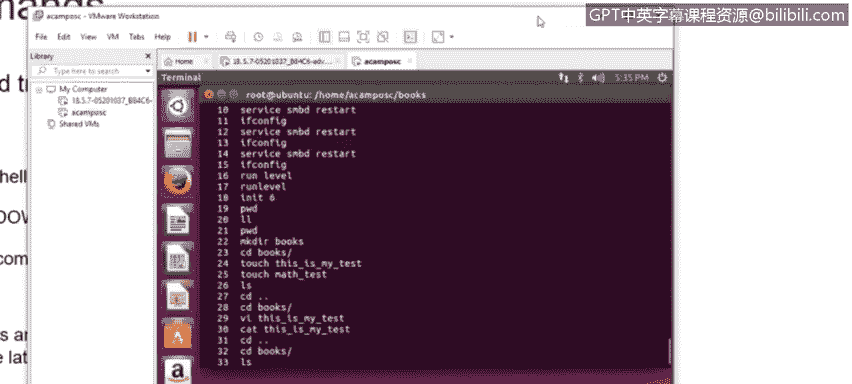
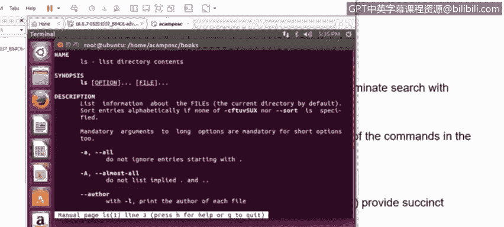

# IBM网络安全分析师专业证书课程3：《网络安全合规框架与系统管理》compliance-framework-system-administration - P91：36_01_linux-internal-and-external-commands.en_subtitled - GPT中英字幕课程资源 - BV1cj411z7Li

In this video， you will learn to。Describe internal versus external Linux commands We are going to talk about basic Linux commands。

And Linux distributions， internal comments。Builduiled into the shell program and our shell dependent。

 also called Bill in commands and determining。If a command is bill in command by using the type command。

So if you use the command type and then the commander， you want to check。

You will see a message if you see shell build in it means that it is an internal command。

 otherwise it will be an external command， so in conclusion internal commands are commands that are already loaded in the system and they will be executed at any time the system requires the command。

Now we have the external commands。That arguments commands that the system offers are totally shell independent and usually can be found in any Linux distribution。

And also， they mostly reside in the slash bin and USR slash bin as well。Now。

 before continue with the external commands， there are some。Tricks that we can use。In the C line。

 for example， we can use the tap key in order to。F fill the name。 And also。

 we can use control A or control A to move the cursor to a start or end to the file。 So， for example。

 if we can see here in my virtual machine。

I have here some files。On their home。A campus C books。I have some books here， math test。

 and this is my test。 As you can see， this is a long name。

 So if we want to see the information that is in this。Book。We can use tap to save some time。

So I wanna see the information that is in under。This file that is located under home。

 if I just type HO and then tap， it will just fill the entire path。For example。

 if I can continue with Achem。And then tap， it will fill up the。The， the rest of the， of the name。

See， so I can， I can， I can， We can use the tap。G。In order to save some time and type。Very quick。

 as well。Also， let's suppose that we made a mistake and we just want to go to the top so we can just click console A and we will be。

On the top here。 And we can do the changes， or we can just go back。To the end of the line。

 with control E。So this is basically some tricks that we have here。

Also。We can use history。To see what comments we already ran， for example， if Ill just click。

K story right here。We will be able to see all documents commentss that we run already so we just can take one and run it again。

Or we can just use this to。Investigate。Which commands were run during。

An operation system。Also， we can use up and down arrow to see the commands that we ran。

So we， we， we， we can save some time here as well。Also， we have。Demand。

Deman。Com in。That is used for the manual to see what a specific command do。 For example。

 I w to see what the。

I ask commandmanu。 So basically， we just。Dke Man and Ls。

And it will provide all information about this command。

And what are the flags that we can use with this domain as well？

