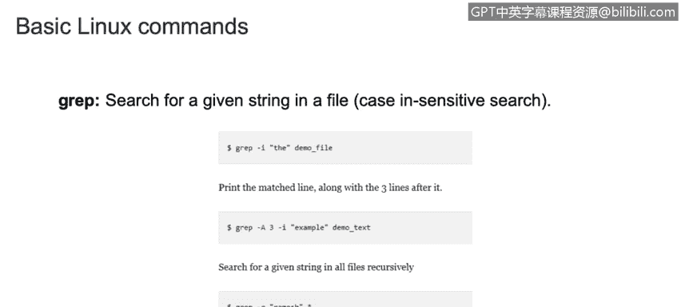
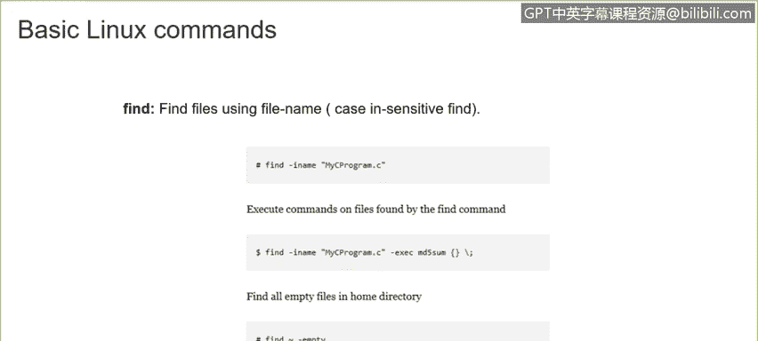
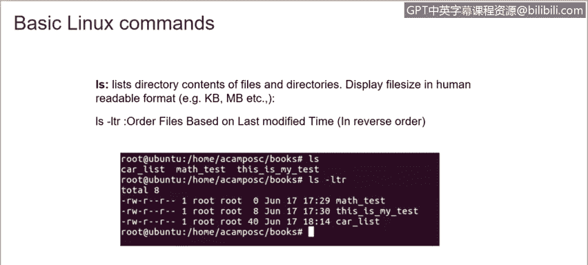
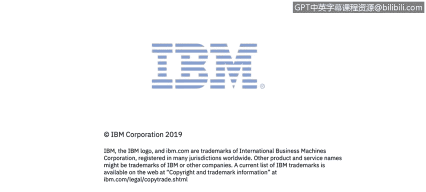

# IBM网络安全分析师专业证书课程3：《网络安全合规框架与系统管理》compliance-framework-system-administration - P92：37_02_linux-basic-commands-part-1.en_subtitled - GPT中英字幕课程资源 - BV1cj411z7Li

In this video， you will learn to。Define basic Linux commands and their uses。

Now we are going to start with basic Linux command that we can use on different distributions in Linux。

 We have the EU name that will show what operating system is being run。

For example， as we can see here， if we run the unitname command。

 we will be able to see that we are running Linux。But if we want to have some more details。

 we can also add a flag A， and it will provide additional information like current Linux kernel bin used system host name and the date as well。

Also， we have DC CDD command。That it is used to go to the different directories。So for example。

 let's see this picture here where we can see that we have a home。

And different directories like Alex， Jack， Eric， and those files also have more。Fileles in， in their。

So let's suppose that we want to go to Alex。So， we are in home。As this example， we have in home。

 So we just need to add D CD。And the name of the next。Direy。And we will be able to go to Alex。

If we are in home and we want to go to test。We just need to add Cd。

Then the name of the next directory that is Jack and then the next directory name that is test。

So in this way， using C， we can just move from different directories and subdirecties。

But what about if we are in test and we want to go back to Jack。

 so we just need to go to Cd space and two points and it will return back to the previous folder。

So in this case， we are in Alex。Home， Alex， and we are going to go back to home。

 So we just need to type Cd space point point and we will be back to home。Again。

 but sometimes we don't really know where we are。 So there isnt specific command that we can use to display information of the path that we are。

 So in this case， let's suppose that we don't know。Where we are。 So we just need to type PwD。

 and it will display the path where we are located。 In this case， we are in home jack test。

So using PWD will display the path where you are located。Then we have the。

Command that is used to create a new archive file。 If we want to create a new archive file。

 we just need to type tar and the flags that will tell us to create the archive file then we just need to add the name of the tar and the direction and the directory where we want to create that archive file If we want to extract that information。

 we just need to to。Type the command， and also theplex will indicate that we want to extract the information。

On that arc， on that file， if you just want to see what information is in there。

We just need to add the following flags。 that will be TV。F and the name of guitar， as well。

Then we have the G。Dis commandment is used for searches。

 for specific searches if we want to print the match line along the with the three lines after it。

 we just need to use grab。Also， I'm going show you here。Really quick， with my。Birtful machine。

 how we can use the grab。So in this example， let's suppose that we are on the home a campus books and we have the following books here。

 regardless match tests。

My test and this is my test。 So under the car list。We have this information， this is the book。

 this is information that we have under this file， and we want to let's suppose that we have a lot of more names here with dates。

It is a big list。So we want to just want to find out all the information about BMW。So。Using Gr。

 we can do that。 So grab that。IBMW。And the the name of the file that we are looking for。

 it will display the information。For all PMMW。Also， if we wanna look for old。The files that we have。

We can just use grab dash R BMW。And will' display all the information on all those。

Filees as well。Then we have the find command that is basically similar to the G command。

 but it will find files。With a specific name， so basically you just need to use the command find。

 then dash E name and the name that the file that you are looking for and it will display the path where it is located。

So also can use find to find specific。File with the amified。

 or maybe you can use defined to final a file with the extension， or also you can find empty files。

In a home directory， as well。

Then we have the LS command that lists all the directories contents of the files and directories and displayed file size in human readable format。

 also we have the LS LTR that is basically the same but it will display more information。

Like the less modified time and also the permissions that that specific file has。

It will be displayed in a reverse order。

Then we have the GC。That is used to compress files。

The command is GCp and then the name of the file that you want to compress。Also， you can uncompress。

The file。By using a flag， that is the。Dash the and the name of the。Of course。

 the name of the file that is already compressed。Here's an example。

 I just ran LS to see all the files that I have under books。And then I just sipp the card list。File。

As you can see here， it just added an extension that is G that represent a compressed file。

Then we have the un command that is used to extract all the information that is。on a compressed file。

 So we just need to use unsip and then the the name of the zip file that is compressed。

 and we will be getting the information from that specific file Also we can just be we just can see the information that is on that compressed file without unsping。

The file。 So we just need to use uns then。L dash L and the name of the zip file。

Then we have the shoot down。Command that is used to shoot down the server。Immediately。For example。

 we have。Shoot down dash H now that it will be power off immediately Decemberber。

But maybe we can we just want to shoot down the device but not yet。

 or we just want to shoot down the server in 10 minutes or 20 minutes。In that case。

 we just need to use shoot down thatt H。Plus 10 that will represent 10 minutes。20，20 minutes。

 or maybe you need to restore December server in one hour。And tell a minute。

So you just need to convert one hour and 30 minutes in。啊。And in minutes here。

And you will be res deserve in that time。If you want to shut down the device， but then reverot it。

We just need to use shootdown dash R， there will be a rebo in Decemberber。

And if you want to force to check the file system during the route， we just need to add the Fls。

Dash F。Or so it will be shaking。 will force to shake the file system during the re。

In this shootdown command。Any difference between shoot down dash R reboot and in E6 in order this truth there was。

 but in new or diss， they do the same internal process。

 So basically you can use shoot down dash R reboot or in E6 and it will be doing the same。

That is we're putting shoot on the device。

