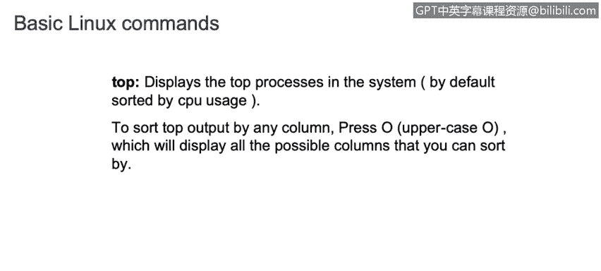
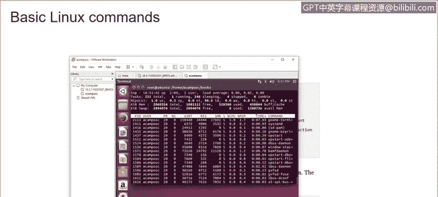
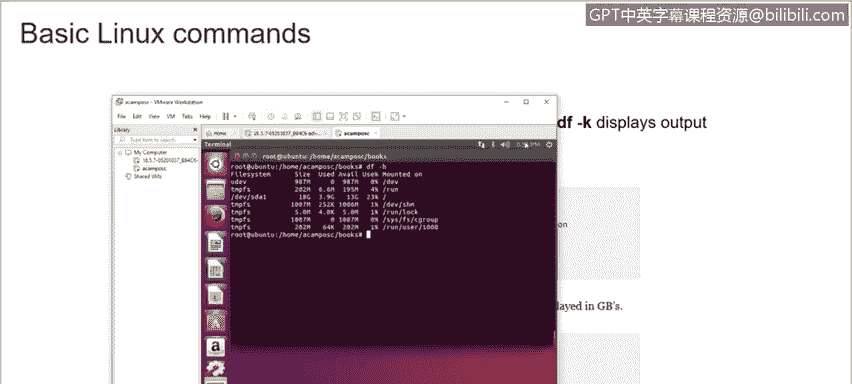

# IBM网络安全分析师专业证书课程3：《网络安全合规框架与系统管理》compliance-framework-system-administration - P93：38_03_linux-basic-commands-part-2.en_subtitled - GPT中英字幕课程资源 - BV1cj411z7Li

In this video， you will learn to。Define basic Linux commands and their uses。

Then we have the FTP。

Both FTP and secure FTP has similar commands to connect to a remote server and allow multiple files。

 So if you want to connect to a remote server。You just need to use the FTP and the IP of or host name of that remote server。

 and you can then。Start downloading the information that you want to extract from that device。

And we have the P command that is used for display information。

 display information about the processes that are running in the system。

 So if you want to currently you want to see what is the processor is running for the specific。

Service， you need to use the P dash EF。On more。5 more。

Or to view the current running process in a free structure。You can use each option。Like P， S dash E。

 F， H pipe more。Also， you can just use PS and it will display all the ideas of the different processes。

And you just need to use P， then the the idea of the process。

 and you will see all that information as well。Then we have the free command that is used to display all the information about the memory available in the system。

 So just running free， you will see all the total。Memory that you that your system has also the used。

 the free memory， but sometimes it's difficult to understand or interpret。Where are those by values。

 So we can just add。Dash G， the represent GBytes。 And you will see all this information。In giggaytes。

 So if you want to quickly check how many giggaytes， you just need to run free dash G。Also。

 you can use A if you want to see kilobytes or M if you want to see megabytes。As well。

So the recommend will display all the information about the memory used in your system。

Then we have the top command that display the top processes in the system。

 So if you want to see the information displayed by top command， you will see。

All the processes are running。On top of my system。 Also。

 you will be able to see the CPU usage and memory as well。

Now， if you want to display only the processes that belongs to a particular user。

 you can use dash U option and willll display the information of the processes that are running on that specific user。

 for example， if we run the same command here， of course it will be showing the same information since using the same user。

 but if we have in a big environment where we have a lot of users。

 we can just monitor for a specific user by using this command as well。

Now we have the DF command that will display the space usage in our environment。

 if we use the K dashK， it will display the output in bytes。But if we use the dash H。

 it will display the output in human readable form。So， for example， in our virtual machine。

We have year。

Our part in the F。H H， we'll see all。The information about the disk space usage。

In our environment。If we use the flag dash T， it will display what type of file system。

Is in use for every partition we have in our Linux distribution as well。

Then we have the kill command that is used to end a process that is running on our environment。

So if you want to kill a process it is really important to know first the ID of the process that is running。

 so using the PS dash EF will display the ID and the process as well so you just need to use kill 9 space and the ID of the process that you want to kill it's really important to be careful of this since as soon as you kill the process you won't come back again。

For example， in this case。In this case， we are trying to find out an ID for all the files that belongs to or processes that belong to BM。

 so we are just running the PS。Space dash E F。 And we are doing a grab for。

Beam to find out in this case， it display 7，2，4，3。 That is the Id of the process that we want to kill。

 So we just need to use kill。Space touch 9。 and then the idea of this process。And it will be killed。

