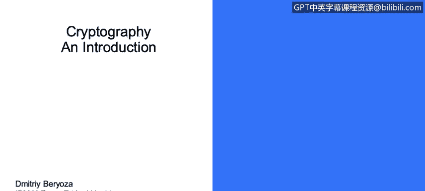
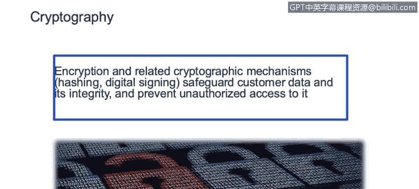

# IBM网络安全分析师专业证书课程3：《网络安全合规框架与系统管理》compliance-framework-system-administration - P97：42_02_cryptography-an-introduction.en_subtitled - GPT中英字幕课程资源 - BV1cj411z7Li

In this video， you will learn to。Define cryptography and encryption。

Describe the related Open web application Security project。

OW ASP top 10 project and Sands Institute top 25 cryptography weaknesses Hi everyone。

 my name is Dimitri Boza， I'm a member of 5Bm X force ethical hacking team penetrationration testing is a type of testing where you pretend to be an attacker an adversary a hacker。

And we try to break into the product and as part of our work after we do the testing and we find security vulnerabilities and software we pass them on to development teams and they use them to improve product quality and secured products。

 so today we'll talk about cryptography encryption and related cryptographic mechanisms such as hashing or digital signing they're used to safeguard customer data and its integrity。

And also prevent unauthorized access to it。Today we'll be talking about common mistakes that we see in applying cryptography in our products and we will not be talking about cryptography theory or algorithm implementation details。

 those are huge topics they subjects of whole university courses and some really ethic books。

There's also something called。Open web application， security project or WP。

And if you're not familiar with it， I highly recommend it if you're building applications that are web facing。

 which is probably something that most of us do these days。

 it's a very useful nonprofit organization， they publish a lot of recommendations for securing a product and they also publish something called top 10。

Common vulnerability list。And as you can see in the years prior。

 a sensitive data exposure that's related to data not being secured with encryption。

Has not only been featured on the top down list， but also has grown in prominence in the past few years。

So it's becoming more and more on。More important and more common。 Also。

 there's something called San stopped by five list。 I also。

stronglyngly recommend that you familiarize yourself with it because it lists top 25 most dangerous software errors。

And as you can see， there are at least four different types of errors that are related to cryptography thatre featured on that list。

And also to show that this is not a theoretical discussion， this is just a small sample of。

Cryptography related errors and vulnerabilities that were recently in the news and it really took me like just a couple of minutes to come up with this links and if you do a search I'm sure you'll come up with more so in this particular case in Twitter software。

There was a mistake made and。Passwords that should have been encrypted were actually exposed in plain text and another company Kaland Health Systems。

They lost control of their private business data and personal data of 443。

000 patients when a laptop was stolen， that means that that data was not。Encrypted on the hard disk。

So as you can see， these are very common types of issues and they're actively being exploited every day in attacks out there。

