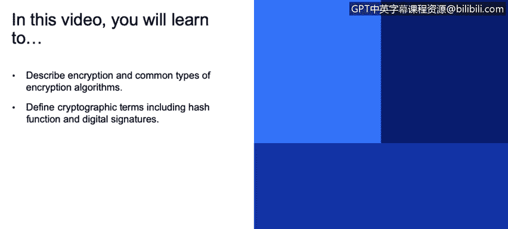
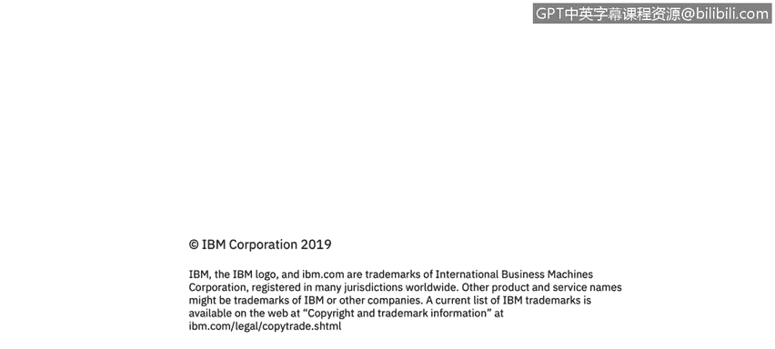

# IBM网络安全分析师专业证书课程3：《网络安全合规框架与系统管理》compliance-framework-system-administration - P98：43_01_cryptography-the-basics.en_subtitled - GPT中英字幕课程资源 - BV1cj411z7Li

In this video， you will learn to。Describe encryption and common types of encryption algorithms。

Dfinine cryptographic terms including hash function and digital signatures So to start let's just do a smaller refresher on the basics so encryption of course is a process of encoding data in such a way that unauthorized parties could not access it。

And it's important to say that encryption only provides confidentiality guarantee。

Somebody could still modify the data， the encrypted data and if it's just encryption algorithms that you were using。

 you may not notice that the notification was made and actually later on I'll talk about a specific type of attack that's related to that it is possible to modify crypto data encrypted data without decrypting it and still be able to abuse the application so it's also important to apply integrity and mechanisms。

To the encrypted data that you're using。Data can be encrypted in three general scenarios。Addressed。

 which is anything stored in files， databases。Backups on mobile devices。Data can be encrypted in use。

 So when your application is running， you're loading。

Data encrypted probably is' a good idea that it stays encrypted right at until the moment that it's used。

 so encrypted in use means that data is' in computer memory and also encryption and transit。

 so when data is being sent over the network，And。In this day and age。

 sensitive business and personal data should be encrypted at all times everywhere where at that point where that's。

Absolutely necessary。 And the importance of this。Has risen dramatically in previous years。

 because of， first of all， enormous volumes of sensitive information being collected and stored and accessible online。

 the dramatic increase in the number of breaches， if you just open the news。

 I'm sure every week you would see something related to a computer security breach and exposure of sensitive information。

And also， governments all over the world are reacting and they're introducing new legislation。

To deal these types of attacks and they will actually hold businesses liable if they're not encrypting sensitive data。

 so new legislation is another factor。There are different types of cryptographic algorithms the most。

The biggest two are symmetric key encryption and public key encryption。

 and as you can see from these diagrams， symmetric key encryption uses a private key。

Data is encrypted using it， becomes scrambled， and then when it's time to decrypt the data。

 the same key is used to reverse the process to get the plane tax back。It's fast。

 the algorithms we use today forsymmetric key encryption are pretty fast。

There is a difficulty associated with sharing of that key because very often you don't only need to。

Encrypted data， but you also need to send that encrypted data somewhere and。

You need to send the data safely and also the key safely。

 So that's a big problem that public key cryptography attempts to。Solve。Oh。

A number of algorithms that you probably heard about RSA Liiptic curve， Ty Elman。

And in publicly cryptography。There are actually a pair of。

Mathematically linked keys that are created， a public key and a private key。

 and the way this works is， let's say I want to send encrypted message to my colleague。

My colleague creates two keys， one of them is private and he keeps that very secure。

 but that one is public， which is he shares with the world and the way this works is I can take his public key。

 encrypt my message that I'm sending to him and he will only be able to decrypt that message with his private key that he keeps secret and that enables。

All kinds of people to send him messages and not be able to see messages that the other person sends because the only person that can decrypt those messages。

Has to be in possession of that private key。So。😊，It solves the problem of pre sharing the key。

 but these algorithms are generally slower than symmetric key encryption algorithms Another important concept I we'll talk about is hash functions。

 they map data of arbitrary size to a data of fixed size and they work as a check sum of sorts。

 so they provide integrity guarantee。But not the confidentiality。

 so they have to be used together with encryption algorithm。

So you'll probably have seen these algorithms before use them in your work， MD5， Shah1， Sha2， Shah3。

The original data in these scenarios is deliberately hard to reconstruct so you take let's say you take a file。

 you create a hash of that file and then，If that file is modified， let's say maliciously。

 and you take another hash of that file， the hash of the modified file will be very different from the original hash。

So that way， we can have a small check sum that verifies integrity of the huge。Data data block。

Hsh functionss are used for integrity checking， and they're also sometimes used for sensitive data storage such as passwords。

 And we'll talk a little bit about that。 Another important concept is digital signatures。

 It's a mathematical scheme for verifying authenticity of。Digital messages and documents。

And actually uses two of the concepts we've mentioned so far， hashing and public encryption。

 and the way it's done is， let's say， a message sent from one party to another。

 it is hashed and hash is signed with a private key。

And the receiving party can when the let's say the message or the file is received can verify the hash and also use the public key to verify that the hash was not altered。

 so it actually ensures three different things， ensures authentication。

 you can be sure that the party that sent the message is really the party that is claimed to have sent the message because only that party should be in possession of the private key。

It ensures repudiation no sorry， nonreudiation that means that the that party cannot deny that they ever sent the message because it again was signed with a private key that only in possession of that party or person and also ensures integrity。

 making sure that the message。Or the file was not modified in transit。

