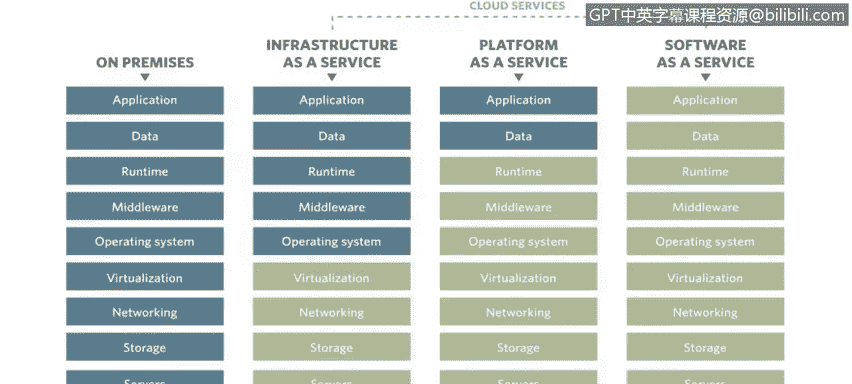

# IBM网络安全分析师专业证书课程4：《网络安全与数据库漏洞》｜network-security-database-vulnerabilities｜ - P100：41_05_securing-data-sources-by-type.en_subtitled - GPT中英字幕课程资源 - BV1RN411q7PY

Yes。In this video， you will learn to describe how to decide what security controls are needed to protect data against both outside actors and internal and other trusted actors。

Describe how security considerations change as you consider various hosting models such as on premiseise。

😊，Infrastructure as a service。Platform as a service and software as a service。

We talked a bit about perimeter defense， we talked about VPNs。

 one of the big things to take into account though is it's not simply your users and your employees connecting to your data sources and your data centers。

 it's also your business partners and other entities that you do business with oftentimes have direct access into your data centers and into your various data sources。

So the controls that are put in place and need to be put in place for each of these things really needs to be thought of and taken into account based on how your organization leverages those data sources to in your environment。

 kind of like my example with the bar of gold and the car keys。

 different data requires different levels of controls。

And different hardening of the operating system and databases that sits inside。

 but also you might think of not only monitoring， but also encrypting or tokenizing the data and encryption rest encryption motion is just the list goes on and on and on for different ways that you could secure the data and additionally。

You're talking about all these different data centers and different data types and all these different applications that are running on those different data types。

The one thing we haven't talked about yet is where the data sources are actually being hosted。

So this one right here。On prem is what most people think of as their organization's data centers。

 So a data center， you operate and have full control over everything happening inside of it。

 So in a data center， it doesn't matter if you're thinking of the application， the data itself。

Runtime environment such as like Java runtime， middleware software it's supporting all of that above it。

 the operating system is' sitting on， you have the ability to touch and work with any of it and even including the virtualization that the operation operating system may be running inside networking of that server storage of the server and just servers themselves like everything top to bottom。

 you have complete access to。Update， change， reconfigure however you see fit。

Infrastructure is a service。And the rest of these are known as cloud services defined in different ways。

 infrastructure service platform and service software as a service。

 oftentimes you'll see these written as IAAS， PAAS and S AAS so or SaS pass and infrastructure service infrastructure of service。

 What organizations will do is they will have the。Svers likely owned and ran and updated by other organizations such as a cloud provider。

 like IBM， Google， Amazon， etc cetera。 And they'll have one of us actually。Keep up the machine。

 make sure it's running and simply make sure that they have access to a certain amount of servers。

 a certain amount of processing， a certain amount of disk space， et cetera。 So we worry about this。

Like everything here provider managed， and the only thing they think about is the operating system updating that middleware。

 the runtime， data， the application。So in this scenario infrastructure service。

 they would have full access to the operating system and be able to update it。But for all of this。

 they would not have any access to it， possibly even insight into it。

 the same goes for platform and service and software to service， platform and service。

 the only thing they would have access to modify would be application or the data itself and they would be able to upload that and change that a lot of times this would be custom applications that you're just putting on cloud system to host it。

And then software a service you're probably familiar with。

 even if you don't realize it's defined like that， Gmail would be a software as a service because you don't have any ability to reconfigure the database or the operating system that Gmail is running on。

 same thing would be Salesforce， same thing would be Dropbox。

 all those would be software as a service that simply some sort of software that you interact with。

And that's it like you have no access whatsoever to reconfigure the application。

 update the application， update the operating systems running on。

You just have to let the provider handle everything。

And with that comes a lot of additional considerations for security and data security， especially。

 for example， in the on prem model， if I needed to install an agent on a server。

To monitor not only what an application is doing and everyone that's logging in S A P is doing on a given day to say Chris Logged in versus Sam Logged in versus Sarah Logged in。

And did X， Y， Z in the course of their day。Well， I can simply go install that。Now。

 on infrastructures service， I can install that as well， but。Depending on how it's set up。

 I may not actually be able to see。The underlying virtualization and server that that virtualized system is running on。

I may not be able to see who's logging into that system and what they're doing。

If I don't have access to install things if I need to on this layer of infrastructure service。

Same goes doubly for platform of service and software service。

 I don't have the ability to even install something on the operating system。

 so I need to come up with other ways to secure the platform of the service and the data in that and the software service and the data in that。

 an example。Would be。An example would be tokenization I could implement tokenization in platforms of service in that tokenized data sitting on that server run by a provider。

 the provider， even if one of their employees did something nefarious and copied the entire system。

 somewhere else that tokenized data is going to stay tokenized regardless wherever it's copied to。

Then all of a sudden， they may have copied the system。

 but unless they have access to my means of detokenizing or deencrypting that information。

Then they will not be able to make any sense of that information。

 it'll simply be gobbledy book for them。Or you may have formatverting format preserving。Tokenization。

 so maybe it instead of Chris W， it says John Smith， so you could still test with it or whatever。

But it's still not useful to someone that's looking for the actual sensitive data。Software service。

 same thing， you have to come up with different methods to work with software is a service。

 software service if it's connecting to your systems through API or something like that and you could think of tokenization。

 you there's just different methods， different considerations in place for each of these things。

 purely because of what they are and organizations not having access to the underlying systems。

Just because they're not。Managing their enterprise isn't managing。

 users aren't managing the different layers of the system。

Or not all。Such as the onprem model。

