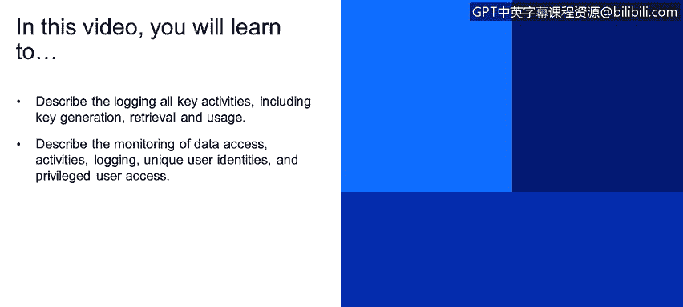
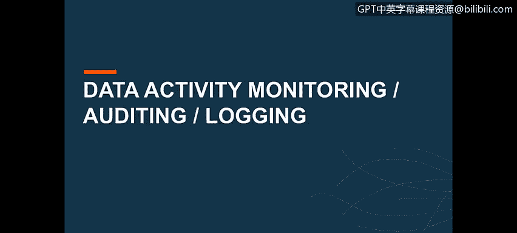
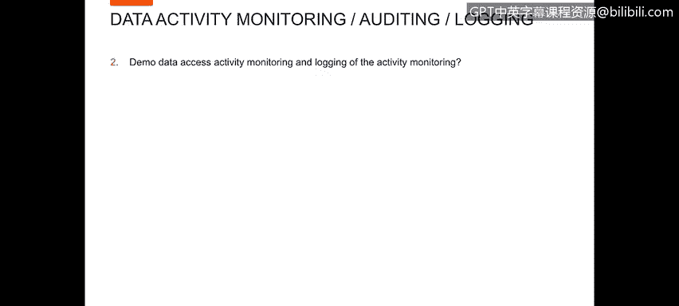
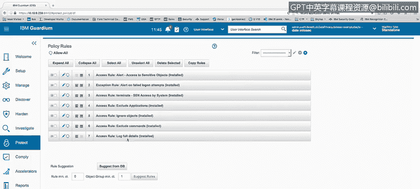
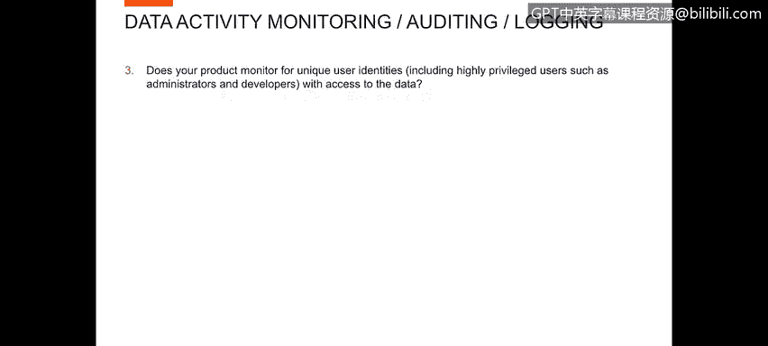
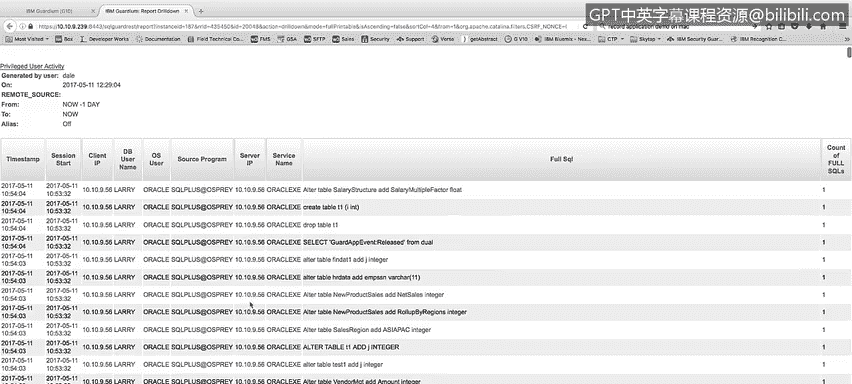
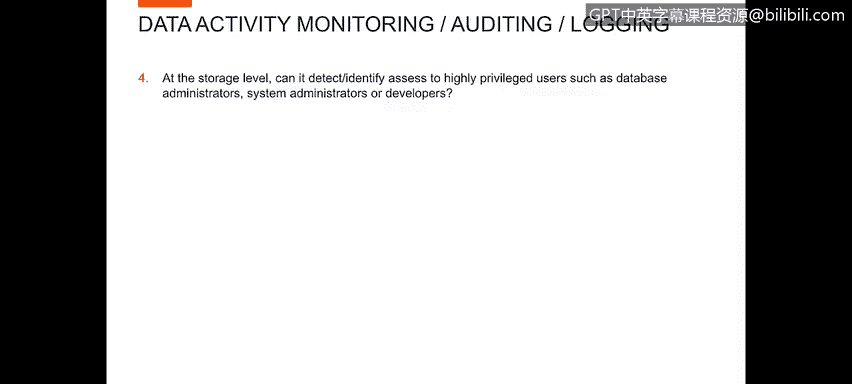
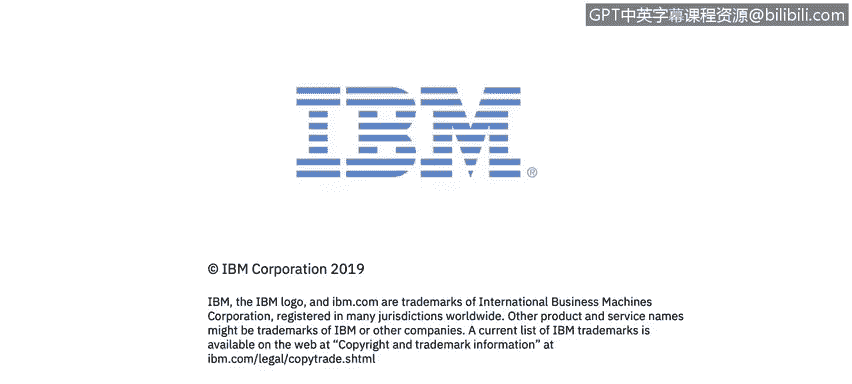

# IBM网络安全分析师专业证书课程4：《网络安全与数据库漏洞》｜network-security-database-vulnerabilities｜ - P102：43_01_data-monitoring.en_subtitled - GPT中英字幕课程资源 - BV1RN411q7PY

Yes。In this video， you will learn to。Describe logging all key activities， including key generation。

 retrieval and usage。Describe the monitoring of data access， activities， logging。

 unique user identities， and privileged user access。😊。

Hello， this is Dale Brocklegers with IBM Security。In this segment。

 I'm going to be talking about that activity monitoring， auditing， and logging。

There are a number of topics in this segment。 I won't go through each one individually in this list。

 but suffice it to say。There are 22 separate topics to discuss。

Let's start out with a demo of the data access activity monitoring and logging of the activity monitoring。

To performform this demo， we will look at the policy rules that I have established for logging。

Of the activity that Guard is going to see。Within this policy I have。Several， several rules。

 the first two of which are alert rules。First alert is going to alert whenever whenever access to sensitive objects takes place。

The second rule is going to create an alert whenever a failed log on attempts take place。

My third rule is a terminate rule， this rule is going to terminate a session。

Whenever the user system。Tries to access a table called SSN Social Security number。

The next three rules are what I call exclude rules。

 I'm excluding things like applications that I don't want to log certain objects， for example。

 system tables that I don't want to have in my logs。

 and then certain commands that I want to ignore as well and then finally my last rule is my rule for logging the information in this particular example。

 I'm logging everything that occurs outside of the information that's being excluded。

Now we want to look at the question， does your product monitor for unique user identities。

 including highly privileged users such as administrators and developers with access to the data？

To demonstrate this， I've created a privileged user activity report。Basically， in this report。

 any user that is not a known application user。That has a direct log on to the database。

 I am considering a privileged user。So you can see that I'm logging information for user Larry if I go to the export function。

Provide myself a full printable， downloadable report。I can scroll through this report。

 I can see user Larry， if I scroll down。

Father。You can see Larry did a lot of activity， I can see user Joeill。You see user JS task。

More work from user， Larry， etc cea， so any user， any privileged user。

I'm going to see their activity， what they perform。

 and in this particular report I'm showing the database username， operating system username。

 the source program that they use。The server IP that they're accessing the service name in Oracle。

 which is。The database that they're accessing， and then the full SQL statement that they ran。Next。

 we want to look at the question at the storage level， can it detect。

 identify access to highly privileged users such as database administrator， system administrators。

 or developers？This is very similar to the last use case。

 but we'll go in and look at a separate report to see highly privileged user activity。

In this case， I've got a report named admin High privileged user activity。

You've noticed the users in this report our system。And if I sort the report in the reverse order。

Like that system。GDP admin super user。Number of different amin users in the environment。

So you can see that we can do the same thing based on a。Group of privileged users。

 highly privileged users and report for those users。

