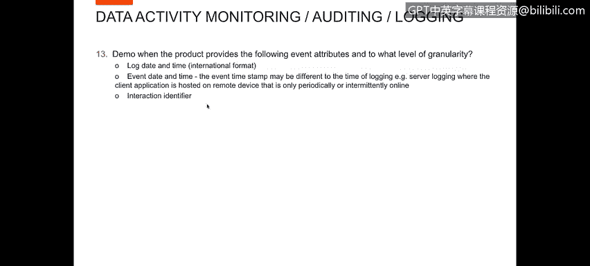
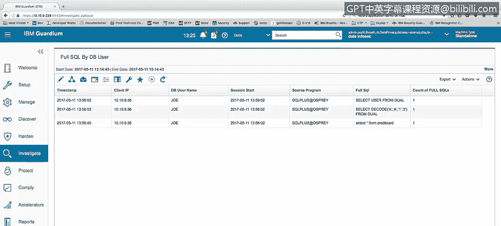
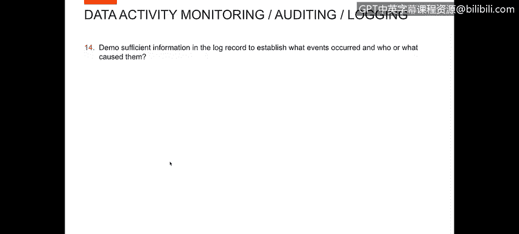
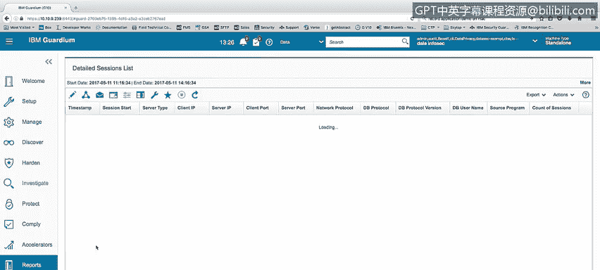
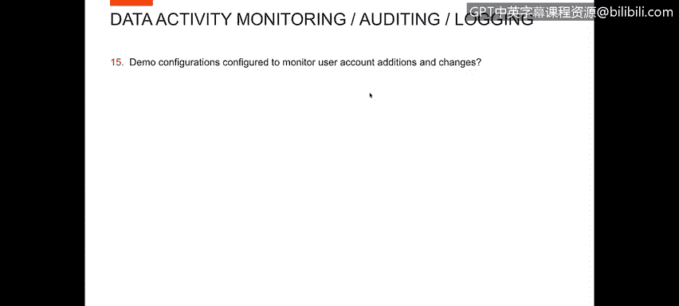
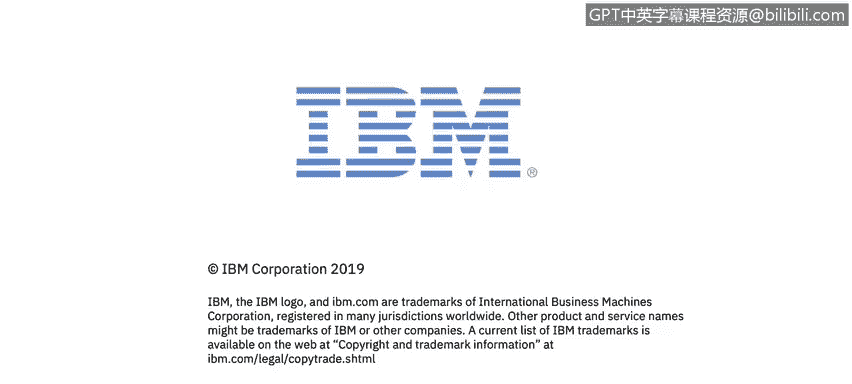

# IBM网络安全分析师专业证书课程4：《网络安全与数据库漏洞》｜network-security-database-vulnerabilities｜ - P105：46_04_attributes-to-include-in-logging.en_subtitled - GPT中英字幕课程资源 - BV1RN411q7PY

Yes。In this video， you will learn to describe event attributes and manage their granularity。😊。

Next， we want a demo。Following again attributes into what level of granularity we can go with them。

So part of this panel want to look at the。Attributes that we capture log date and time。

 event date and time。

It ceter interaction， identified。You didnt want I'd like to show you the attribute or entity list that we have。

Available for adding information to reports when builder reports under the client server。

 we have fields。Attributes such as timestamp date， timestamp time， weekday， client I， server I。

 network protocol， database protocol， database usingname source program。Service name。

Operating system user， et cetera。 You can see there's a。A large list of information there under the。

Fu， full SQL。 We have the。The full SQl and the time stamp that that SQl was executed。

Show our response time a number of records。Affected， et cea。So you can see。

Large number of attributes， all of the type of information that you would be interested in。

Session start， sessionession， start date time。E cetera， plant port， server port。

 UID chain information。E cetera， So a number of attributes that can be used to build。Various reports。

 Additionally， when we were looking at reports。In I go into one of the full SQL reports timestamp。

So it's the exact timet of when the SQL was executed on the server。It's mentioned by client by Sur。

Anyway。Timetamp of when that sQel was executed， the date， the hour and minute seconds。

 and then there's also a an additional time stamp for。Subsed。And you can go down to the subject and。

Again， the user the X is equal to7。When the session started。

 what source brought in the running full secret？So you can see that we have a number of elements I think you can get to all of the。

嗯。Level granularity with the date and time。

And the information on you that。Now let's look at the demo of sufficient information in the V record to establish what events occurred and who or what caused them。

For this， I'll look at a couple of the reports that I've created within Guardian。

 one report I want to look at is the detailed sessions list。

Within the detailed sessions list， we have our。Timetamp of the last activity within that session。

 session start time what kind of server， client I and server IP。

The ports that we're accessing the C the database on。Type of per all those GCP， beed， shared memory。

 etc。Some other information about TB protocol and version。The database user name。

 so who's accessing the database， what source program they're using？

For that session so this report gives you the session information of every person that's logged into every database that we' monitoring the date。

 time that they log in and started their session and what type of network connection they need。

Additionally， in the reports， if I look at。Let's just look at privilege user actually just to give an example。

Under privileged user activity， I've got some SQL activity listed here and shown in the timestamp。

 when that SQL statement took place， what session。It was under what time the session started。

My client I be who the database user is， Larry。Who the operating system system user was。

 what source program we're using， what server I either connecting to。

 what database is service name or database base name。Me to。

 And then the sQL statement that they were。 So you can see that you can see。The information。

 all the information about who is executing the statement， what statement is being executed。

 and you can see exact SQL statements and know exactly what they would do。

Now we want to look at demo configurations configured to monitor user account additions and changes。

To show this information， I created a report called Create Author Use Actions。

Any time that a altered user or a create user can。Was executed。I capture that command。

 and then this report is spent is showing the exact same information， timestamp session stock plan I。

Daabbase， user， etc。That executed that SQL statement。 So now I know every haltter user。

 every create user that has been run on all the systems that we' monitoring and what user ran now statements and when they do that。

Additionally， if you look at the create user statement。You'll notice that the。

The password that would have been entered in the identified by clause of discrete create user statement。

Is masked outlet within garden。 Garden does not store any passwords or any of that sensitive of information within its scatter。

