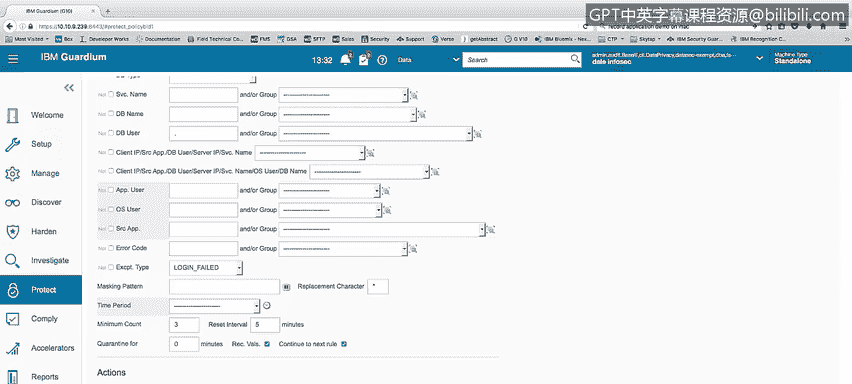
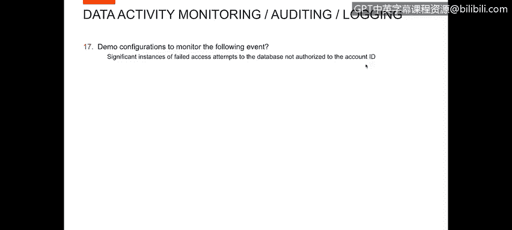

# IBM网络安全分析师专业证书课程4：《网络安全与数据库漏洞》｜network-security-database-vulnerabilities｜ - P106：47_05_failed-access-monitoring.en_subtitled - GPT中英字幕课程资源 - BV1RN411q7PY

Yes。In this video， you will learn to describe how to configure a system to monitor failed password and unauthorized access attempts。

Next， we want to show demo configurations to monitor the following against significant instances of failed pass through attempts。

And against multiple accounts with a short timeframe which mandate hacking attempts。

To show this activity， I've created a failed log on intense report that shows the user。

And the address， database address and the database protocol is used and how many failures have occurred。

 So in this case， in this instance， have user。And one field modern， Dale had five field moderns。

Additionally。We can set up an alert， we set up an alert， let me go back to mine。Alert policy。

Within my policy for alerts。If I look at the rules for my alert policy。

I set up an alert on failed log on attempts， so let me edit that。

That rule for that alert alert fell lot on attempts if I scroll down further。

My exception type is fail loggans。 What I've done here is I've said。

 if I fail three log ons within five minutes， I want to send them over。

So what happens is anytime that we。Run fill log on three times in a row。Within a five minute period。

 an alert can get sent out， which would be an indication of trying to break into the system。

Next， we want to demonstrate significant instances of failed access attempts to the database not authorized to the account ID。

To show this， I want to go into reports that I've created。And I've got a report。

Shows unauthorized access。So in this case， SQL unauthorized access user Larry。

And insufficient privileges。Ea code， Oracle 103，1 and and。At that。Occurred six times。

 so they had insufficient privileges to run an activity which occurred six times。

I also created an unauthorized access report that shows all the SQL statements that were run that failed。

 So using this report， you can， you can correlate information on this report with information in the port that showed access failures and。

Recognize what the user Larry was doing。

