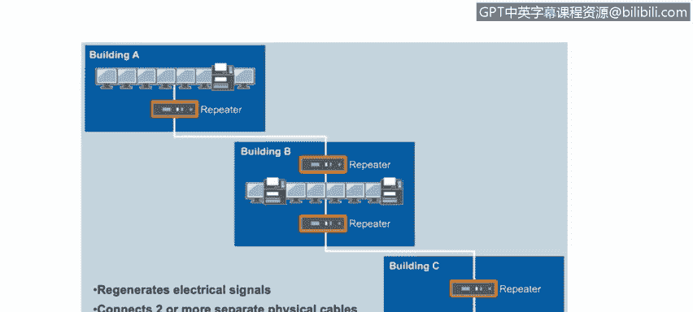
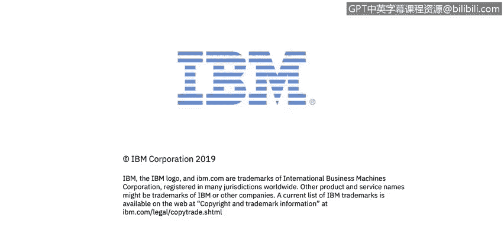

# IBM网络安全分析师专业证书课程4：《网络安全与数据库漏洞》｜network-security-database-vulnerabilities｜ - P10：9_以太网和局域网网络设备.zh - GPT中英字幕课程资源 - BV1RN411q7PY

That。In this video， you will learn to differentiate and understand the variety of network devices we have。

Understand how the virtual LANs or VLs work on a local area network。

Let's start by looking at something very basic。 The cabling that connects your network devices together。

 Two of the more common cables you will see in networking are the coaxial cable and the twisted pair cable。

 coaxial cables normally use an F type connector while twisted pair cables usually use an R J 45 connector T pair cableling shown here with an R J 45 connector are the most common cables used in local area networks。

 where the length of the cable doesn't need to exceed 100 m。

Twisted pair ethernet cables are rated for both speed and length using a cat rating system。 Cat 5。

 for example， is rated for transmission speeds of 100 Mbit per second for up to 100 m。

Cat 6 and Cat 6， A， on the other hand， are rated for network speeds of 1 and 10 gigab per second。

 respectively， over the same distance。

There are several common types of network device。 A repeater also called a hub， is a dumb device。

When a repeater receives a frame， it will forward that frame across all of its interfaces。

So the frame will be received by all of the endpoints that are connected to that device。

 And it's up to each endpoint to check to see if the frame sent to it is intended for it or not by evaluating the layer to Mac addresses on the frame。

 As we saw in the previous video A hub will regenerate the signal before sending it on。

 So the signal leaving the hub will be clean and full strength。 Since a repeater has no intelligence。

 It cannot check to see if it is safe to send a signal at any point in time。

 So collisions are inevitable。 when collisions are detected。

 The receiver will have to signal the sender to resend the packet， which， of course。

 slows down communication across the network。 It's very unlikely that you will see a dumb device like a repeater or a hub on a modern network。

 A more advanced type of network device a bridge。 A bridge is similar to a hub。

 but a bridge does not send the signal to all connected ports。

 but only to the port the destination computer is attached to by maintaining a Mac table。

Bridge knows which machine is attached to each port。

 A Mac table is not the same thing as an ap table。 The bridge looks at the layer 2 destination Mac address of the incoming frame and matches that to the connected port as assigned in the Mac table。

So a bridge is a device that can be set to add some intelligence to a local area network。To review。

 a bridge maintains a database called a Mac table and uses the Mac table to match the Mac address on the incoming frame to the port on the bridge where the matching destination computer is connected。

 All of the devices attached to a hub are in a single collision domain。

A bridge adds intelligence to the network by breaking up the collision domains。

 Each port on the bridge creates an independent collision domain。

 The more modern version of a bridge is called a switch。 While a bridge has some limitations。

 For example， a bridge is a half duplex device， Me that the data can only be sent in one direction at a time。

 So computers attached to a bridge can either receive or transmit at one time， but not both。

 Another in limitation to a bridge is that the endpoint devices connected to the ports on a bridge must share the available bandwidth。

 And finally， virtual lands or V lands are not possible。

 Swes are the most common network device in modern networks。

Switchches use full duplex communication so they can transmit and receive data at the same time on each port。

 Each port is dedicated to a single device， So bandwidth is no longer shared。

 and Vlans are now possible on a switch， which means that we can implement a logical segregation of broadcast domains in the same device。

 Vlans now provide a way to separate lands on the same switch。

 deviceses in one Vlan do not receive broadcast messages from devices that are on another VL。

 Vlans are basically a way to logically break down broadcast domains。 Swes do have some limitations。

 too， Of course，When there are multiple switches connected together as part of the same network。

 network loops are still a problem。 In such cases， protocols such as the Spning tree protocol can help out。

 Switches might not improve performance with multicasted broadcast traffic。

 and switches cannot connect geographically dispersed networks。

So this is a wrap up of local area networks。 Thank you very much。

